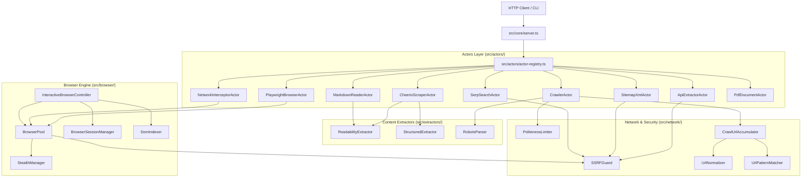

# Architecture Specification & System Blueprint

This document defines the root-to-leaf directory taxonomy, component responsibilities, dependency boundaries, data flow mechanisms, and maintenance guidelines for `protokol-7`.

---

## 1. Root Directory Taxonomy

```text
protokol-7/
├── .agents/                 # AI engineering skills library (Serebellum)
│   └── skills/              # Domain-specific procedures (naming, review, debugging)
├── rules/                   # Deterministic cognitive invariants (Amygdala & Basal Ganglia)
│   ├── trust-tiers.md       # Blast radius operational constraints (Tier 0 - Tier 3)
│   ├── failure-checklist.md # Verification checklist before code completion
│   ├── logging-discipline.md# Standard ASCII logging rules (zero emoji)
│   ├── naming-discipline.md # Technical naming convention rules
│   └── verification-pipeline.md # Automated five-tier verification contract
├── context/                 # Architectural contracts and system maps (Cortex)
│   ├── architecture-schema.md # Single source of truth file inventory
│   ├── connectome.md        # Generated endpoint-to-actor routing graph
│   └── code-standards.md    # TypeScript and testing conventions
├── docs/                    # Persistent records, engineering plans, and walkthroughs
│   ├── plans/               # Task implementation plans (<task>-plani.md)
│   ├── walkthroughs/        # Execution verifications (<task>-walkthrough.md)
│   ├── adr/                 # Architecture Decision Records (ADR 0001 - 0004)
│   └── git-commit-convention.md # Conventional Commits v1.0 specification
├── scripts/                 # Deterministic verification and system map generators
│   ├── verify-pipeline.mjs  # Five-stage project verification runner
│   ├── generate-connectome.mjs # AST/regex connectome system map generator
│   └── sca-check.mjs        # Live npm registry supply chain security validator
├── src/                     # Core application source code (Domain-driven structure)
│   ├── core/                # System runtime contracts, HTTP router, barrel entry
│   ├── actors/              # Specialized web scraping, crawling, and extraction actors
│   ├── browser/             # Playwright pool, session isolation, stealth, and DOM indexing
│   ├── extractors/          # Readability markdown distillation, table parsing, robots parser
│   └── network/             # SSRF perimeter protection, politeness limiter, URL normalizer
├── tests/                   # Pure Node.js test runner test suites (tsx --test)
├── flake.nix / flake.lock   # Declarative NixOS development environment (Nix Flake)
├── devenv.nix               # devenv.sh configuration for reproducible local setups
├── .envrc                   # direnv integration for automatic shell environment loading
├── biome.json               # Biome linter and formatter configuration
├── package.json             # Runtime dependencies and build scripts
└── TASKS.md                 # Project working memory (Hippocampus)
```

---

## 2. Core Domain Layers (`src/`)



### 2.1 Core Runtime (`src/core/`)
- **`types.ts`**: TypeScript interfaces defining `ActorTask`, `ActorResult`, `ScrapedPageResult`, `CrawlerResult`, `BrowserActionResult`.
- **`server.ts`**: Native Node.js HTTP router handling REST endpoints (`/health`, `/api/v1/actors`, `/api/v1/scrape`, `/api/v1/crawl`, `/api/v1/sitemap`, `/api/v1/reader`, `/api/v1/network/intercept`, `/api/v1/search`, `/api/v1/pdf`, `/api/v1/browser/action`, `/api/v1/browser/session/:id`).
- **`index.ts`**: Central domain barrel export aggregating actors, browser, extractors, and network modules.

### 2.2 Actors Layer (`src/actors/`)
- **`actor-registry.ts`**: Singleton registry instantiating and resolving actors by string identifier (`ActorType`).
- **`cheerio-scraper-actor.ts`**: High-speed static HTML extraction actor using Cheerio.
- **`playwright-browser-actor.ts`**: Dynamic DOM scraping actor using headless Chromium.
- **`api-extractor-actor.ts`**: REST API consumption actor supporting pagination and projection filtering.
- **`crawler-actor.ts`**: BFS web graph crawler with depth limits and robots.txt obedience.
- **`sitemap-xml-actor.ts`**: XML sitemap, sitemap index, and RSS/Atom feed recursive URL parser.
- **`markdown-reader-actor.ts`**: LLM document distillation actor with YAML frontmatter and table of contents.
- **`network-interceptor-actor.ts`**: Headless browser actor intercepting background XHR/Fetch JSON API responses.
- **`serp-search-actor.ts`**: DuckDuckGo organic search parser resolving redirects and rankings.
- **`pdf-document-actor.ts`**: Binary PDF document extractor extracting page text, metrics, and metadata.

### 2.3 Browser Engine (`src/browser/`)
- **`browser-pool.ts`**: Singleton Chromium lifecycle manager with idle timeout (60s), route-level SSRF interceptor, and asset blocking.
- **`browser-session-manager.ts`**: Multi-turn stateful browser session store with TTL tracking and tab management.
- **`interactive-browser-controller.ts`**: Command executor for interactive browser actions (`navigate`, `click`, `fill`, `screenshot`, `evaluate`).
- **`stealth-manager.ts`**: Anti-detection masking (`navigator.webdriver` evasion, dynamic viewport/user-agent rotation).
- **`dom-indexer.ts`**: DOM interactive element indexing assigning monotonic identifiers for targeted automation.

### 2.4 Extractors (`src/extractors/`)
- **`readability-extractor.ts`**: Three-stage content distillation pipeline via Readability and Turndown for GFM markdown.
- **`structured-extractor.ts`**: HTML table to GFM markdown converter and Schema.org JSON-LD extractor.
- **`robots-parser.ts`**: RFC 9309 compliant `robots.txt` directive parser with crawl-delay and user-agent matching.

### 2.5 Network & Security (`src/network/`)
- **`ssrf-guard.ts`**: IPv4/IPv6 private address validator, loopback blocker, cloud metadata guard (AWS/GCP/Azure), and DNS rebinding protector.
- **`politeness-limiter.ts`**: Per-origin token bucket rate limiter with exponential backoff and jitter for 429 mitigation.
- **`url-normalizer.ts`**: URL canonicalization engine (query parameter sorting, protocol standardizing, fragment removal).
- **`url-pattern-matcher.ts`**: Wildcard glob and regular expression matching engine for URL include/exclude filters.
- **`crawl-url-accumulator.ts`**: Deduplicated traversal queue tracking visited URLs, pending queues, and depth boundaries.

---

## 3. Architectural Invariants

1. **Deterministic Boundaries**:
   - Actors must never directly import internal private browser pool state; they must use `BrowserPool.acquireSession()` and release via `session.release()`.
   - All network-reaching actors must validate target URLs against `SSRFGuard.validateUrl()` prior to making HTTP requests or browser navigation.
2. **Zero Global Side-Effects**:
   - Importing any file from `src/` must be pure and free of side-effects. Server socket binding is strictly guarded behind `isMainModule` and `process.env.NODE_ENV !== "test"`.
3. **Reproducibility**:
   - Development environment is pinned via Nix Flake (`flake.nix`), locking Node.js 22, pnpm, and Chromium.
   - All tests run via pure Node.js test runner (`tsx --test`) with zero mock frameworks.
