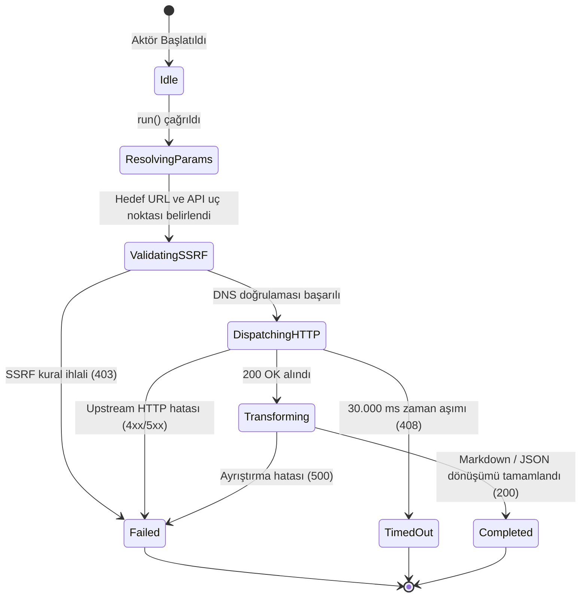

# Actor Wiki Specification & Template — protokol-7

Bu doküman, `protokol-7` mimarisindeki tüm aktörlerin teknik şartnamesinin yer aldığı `docs/actors/<ad>.md` dokümanlarının standart şablonunu ve teknik gereksinimlerini belirler.

Her aktör wiki dokümanı, yapay zeka ajanları (Antigravity, Claude, Cursor) ve sistem mimarları için kendi kendine yeten (self-contained), sıfır pazarlama dili (zero-fluff) ve sıfır emoji içeren teknik bir şartname niteliğindedir.

---

# [AKTOR_ADI] — Teknik Wiki ve Çalışma Şartnamesi

## 1. Metadata ve Sınıflandırma

| Alan | Değer |
|---|---|
| **Aktör Tanımlayıcı (Type)** | `<ad>` (örn: `wikipedia`, `arxiv`, `sec-edgar`) |
| **Kategori** | `web` \| `corpus` \| `documents` |
| **Sürüm** | `1.0.0` |
| **Birincil Sınıf** | `<AdPascalCase>Actor` (`src/actors/<kategori>/<ad>-actor.ts`) |
| **Protokol / Kaynak** | Upstream API veya veri formatı (örn: `Wikimedia REST API v1`, `OAI-PMH 2.0`, `OpenXML`) |
| **Hedef Çıktı Biçimi** | `GFM Markdown` \| `JSONL` \| `Structured Records` |
| **MCP Aracı** | `<ad>_query` (`src/mcp/protokol-mcp-server.ts`) |
| **Test Dosyası** | `tests/<ad>-actor.test.ts` |

---

## 2. Mekanizma ve Teknik Genel Bakış

Burada aktörün teknik çalışma prensibi 1-2 paragrafta açıklanır:
* Hangi upstream veri kaynaklarına veya dosya formatlarına bağlanır?
* Veriyi nasıl çeker, dönüştürür ve temizler (ör. HTML'den Turndown ile GFM Markdown, PDF'den unpdf ile metin katmanı çıkarma, XML'den XPath ile ayrıştırma)?
* Karşı tarafa giden HTTP başlıkları, User-Agent politikası ve istemci tanımlayıcıları nelerdir?

---

## 3. Mimari ve Bileşen Sınırları (Mermaid Flowchart)

```mermaid
flowchart TD
    subgraph Ingestion["İstemci & Tetikleme Katmanı"]
        MCP["MCP İstemcisi (Claude / Antigravity)"]
        REST["HTTP REST İstemcisi (/api/v1/...)"]
        Pipeline["Boru Hattı Yürütücüsü (PipelineRunner)"]
    end

    subgraph CentralMCP["Merkezi MCP Katmanı (src/mcp/)"]
        MCPServer["protokol-mcp-server.ts<br/>(<ad>_query)"]
        Manifest["actor-manifests.ts<br/>(Declarative Manifest)"]
    end

    subgraph ActorCore["Aktör Alan Katmanı (src/actors/<kategori>/)"]
        ActorCore["<ad>-actor.ts<br/>(<AdPascalCase>Actor)"]
        Extractors["Dönüştürücüler / Ayrıştırıcılar"]
    end

    subgraph SecurityPerimeter["Güvenlik ve Çevre Katmanı"]
        SSRF["SSRFGuard.validateUrlWithDns<br/>(DNS Pinning / RFC 1918 Blokajı)"]
        Fetch["safeRedirectFetch<br/>(Hop-by-hop Doğrulama / AbortController)"]
    end

    subgraph UpstreamTarget["Hedef Veri Kaynağı"]
        TargetAPI["Resmi Upstream REST / Dosya Kaynağı"]
    end

    MCP --> MCPServer
    MCPServer --> Manifest
    MCPServer --> ActorCore
    REST --> ActorCore
    Pipeline --> ActorCore
    ActorCore --> SSRF
    SSRF --> Fetch
    Fetch --> TargetAPI
    TargetAPI --> Extractors
    Extractors --> ActorCore
```

---

## 4. İstek Yaşam Döngüsü ve Sıra Şeması (Mermaid Sequence Diagram)

```mermaid
sequenceDiagram
    autonumber
    participant Client as Çağırıcı (MCP / REST / Test)
    participant Actor as <AdPascalCase>Actor
    participant SSRF as SSRFGuard (DNS Pinning)
    participant Net as safeRedirectFetch
    participant Upstream as Harici Kaynak / API

    Client->>Actor: run(task, context)
    Actor->>Actor: resolveParameters(targetUrl, options)
    Actor->>SSRF: validateUrlWithDns(targetUrl / endpoint)
    alt SSRF Engeli (RFC 1918 / Cloud Metadata)
        SSRF-->>Actor: { valid: false, reason }
        Actor-->>Client: ActorResult (status: "failed", statusCode: 403)
    else Güvenli IP Doğrulandı
        SSRF-->>Actor: { valid: true }
        Actor->>Net: safeRedirectFetch(endpoint, timeout: 30s)
        Net->>Upstream: HTTP GET / POST
        Upstream-->>Net: HTTP Yanıtı (200 OK)
        Net-->>Actor: Ham Yanıt Verisi
        Actor->>Actor: Ayrıştırma ve Normalizasyon (GFM Markdown / JSON)
        Actor-->>Client: ActorResult (status: "completed", statusCode: 200, executionDurationMs)
    end
```

---

## 5. Durum Makinesi (Mermaid State Diagram)



---

## 6. Güvenlik İnvariantları ve Çalışma Kuralları

1. **SSRF Koruması (Mandatory Invariant):**
   * İstek atılacak URL doğrudan dışarıdan sağlansa da, içsel olarak oluşturulsa da her iki aşamada `SSRFGuard.validateUrlWithDns` fonksiyonundan geçirilir.
   * `allowLocalNetwork` parametresi sadece `NODE_ENV === "test"` durumunda aktiftir; üretim ortamında yerel döngü (loopback) veya intranet adreslerine erişim engellenir.
2. **Hop-by-Hop Yönlendirme Denetimi:**
   * Doğrudan yerel `fetch()` kullanılmaz; `safeRedirectFetch` ile yönlendirmeler tek tek izlenip her adımda DNS IP kontrolü yapılır.
3. **Zaman Aşımı ve Kaynak Tahsisi:**
   * `DEFAULT_TIMEOUT_MS = 30_000` (30 saniye) kuralı geçerlidir.
   * Süre dolduğunda `AbortController` soketi derhal sonlandırarak bellek sızıntısını önler.
4. **Kullanıcı Aracısı (User-Agent):**
   * Tüm upstream çağrılarında `"User-Agent": "protokol-7/1.0 (+https://github.com/protokol-7; <ad>-actor)"` başlığı kullanılır.

---

## 7. Tip Sözleşmesi ve Girdi/Çıktı Şemaları

### Girdi Seçenekleri (`<AdPascalCase>ActorTaskOptions`)

```typescript
export interface <AdPascalCase>ActorTaskOptions {
  timeoutMs?: number;                     // Zaman aşımı süresi (ms). Varsayılan: 30000
  query?: string;                         // Arama veya sorgu terimi
  limit?: number;                         // Maksimum kayıt sayısı
  customHeaders?: Record<string, string>; // Ekstra HTTP başlıkları
}
```

### Çıktı Modeli (`<AdPascalCase>ActorResult`)

```typescript
export interface <AdPascalCase>ActorResult {
  sourceUrl: string;
  totalItems: number;
  items: Array<{
    id: string;
    title: string;
    content: string;
    metadata?: Record<string, unknown>;
  }>;
}
```

---

## 8. Aktör MCP Entegrasyonu

Aktörün MCP erişimi merkezi `src/mcp/protokol-mcp-server.ts` üzerinden ve `src/actors/actor-manifests.ts` bildirimsel şemasıyla yönetilir:

* **Araç Adı:** `<ad>_query`
* **Sunucu Kaynağı:** `src/mcp/protokol-mcp-server.ts`
* **Bildirim:** `src/actors/actor-manifests.ts`
* **İşleyici:** `<AdPascalCase>Actor`
* **Girdi Şeması:** Standart JSON Schema nesnesi

---

## 9. Hata Kodları ve İyileştirme Matrisi (Self-Healing)

| HTTP / Durum Kodu | Açıklama | Kök Neden | Kendi Kendine İyileştirme Yolu |
|---|---|---|---|
| `400 Bad Request` | Geçersiz parametre | Gerekli parametreler eksik veya biçim hatalı | Girdi şemasını doğrula ve eksik alanları ekle |
| `403 Forbidden` | SSRF ihlali | Hedef IP yasaklı özel blokta veya bulut metadata adresinde | Hedef adresi doğrula; testte `NODE_ENV=test` sağla |
| `404 Not Found` | Kaynak bulunamadı | İlgili hedef adres veya kayıt mevcut değil | Hedef URL'yi veya sorgu anahtarını kontrol et |
| `408 Request Timeout` | Zaman aşımı | Hedef sunucu 30 saniye içinde yanıt vermedi | `timeoutMs` değerini artır veya isteği tekrarla |
| `500 Internal Error` | Ayrıştırma hatası | Beklenmeyen API yanıtı veya bozuk gövde verisi | Ham içeriği ve ayrıştırıcı kuralını incele |

---

## 10. Kullanım Örnekleri

### 10.1 cURL ile HTTP REST Çağrısı
```bash
curl -X POST http://127.0.0.1:4000/api/v1/<ad> \
  -H "Content-Type: application/json" \
  -d '{"query": "machine learning", "limit": 5}'
```

### 10.2 MCP JSON-RPC 2.0 Çağrısı
```json
{
  "jsonrpc": "2.0",
  "id": "<ad>-req-1",
  "method": "tools/call",
  "params": {
    "name": "<ad>_query",
    "arguments": {
      "query": "machine learning",
      "limit": 5
    }
  }
}
```

### 10.3 Programatik TypeScript Kullanımı
```typescript
import { <AdPascalCase>Actor } from "./<ad>-actor";

const actor = new <AdPascalCase>Actor();
const result = await actor.run({
  taskId: "<ad>-task-1",
  actorType: "<ad>",
  options: {
    query: "machine learning",
    limit: 5,
  },
}, { startTime: Date.now() });

console.log(result.data?.items);
```

---

## 11. Test Süiti ve Doğrulama

Test süiti `tests/<ad>-actor.test.ts` dosyası aşağıdaki temel senaryoları kapsar:
1. Aktörün doğru `actorType` ve açıklama ile başlatılması.
2. `169.254.169.254` adresine yapılan SSRF girişimlerinin 403 ile engellenmesi.
3. Başarılı HTTP yanıtının ayrıştırılması ve şema uyumunun teyidi.
4. Merkezi MCP sunucusu entegrasyonu.
