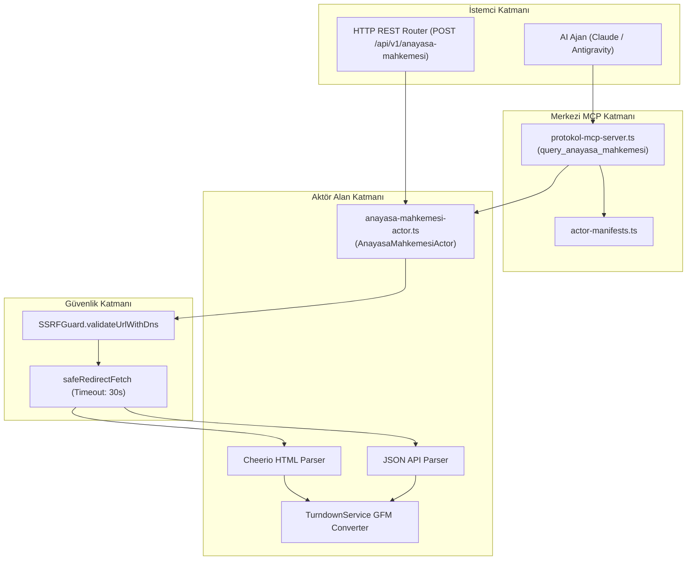

# Anayasa Mahkemesi Actor — Teknik Wiki ve Çalışma Şartnamesi

## 1. Metadata ve Sınıflandırma

| Alan | Değer |
|---|---|
| **Aktör Tanımlayıcı (Type)** | `anayasa-mahkemesi` |
| **Kategori** | `corpus` (`src/actors/corpus/anayasa-mahkemesi-actor.ts`) |
| **Sürüm** | `1.0.0` |
| **Birincil Sınıf** | `AnayasaMahkemesiActor` |
| **MCP Aracı** | `query_anayasa_mahkemesi` (`src/actors/actor-manifests.ts`) |
| **REST Uç Noktası** | `POST /api/v1/anayasa-mahkemesi`, `POST /anayasa-mahkemesi` |
| **Test Dosyası** | `tests/anayasa-mahkemesi-actor.test.ts` |
| **Örnek Yapılandırma** | `examples/actors/anayasa-mahkemesi.json` |

---

## 2. Mekanizma ve Teknik Genel Bakış

`AnayasaMahkemesiActor`, T.C. Anayasa Mahkemesi (AYM) Kararlar Bilgi Bankası üzerinden anayasal norm denetimi (iptal ve itiraz davaları), bireysel başvuru gerekçeli hak ihlali hükümleri, siyasi parti kapatma/mali denetim ve Yüce Divan yargılama metinlerini çıkaran kurumsal aktördür.

Aktör, hem REST JSON uç noktalarını hem de Cheerio ve Turndown destekli HTML detay sayfalarını ayrıştırır. Olaylar, ilgili hukuk, anayasal inceleme/gerekçe, hüküm fıkrası ve yargıçların karşı oy/farklı gerekçe yazılarını yapılandırılmış hiyerarşik formatta ve LLM ön-eğitimi için optimize edilmiş GFM Markdown olarak sunar.

---

## 3. Mimari ve Bileşen Sınırları



---

## 4. Eylemler ve Girdi Parametreleri

| Parametre | Tip | Zorunlu mu? | Açıklama |
|---|---|---|---|
| `action` | `string` | Hayır | `individual_application`, `norm_review`, `search`, `decision` (varsayılan: `search`). |
| `query` | `string` | Hayır | Arama anahtar kelimeleri. |
| `category` | `string` | Hayır | `individual`, `norm`, `party`, `yuce_divan`, `all`. |
| `applicationNumber`| `string` | Hayır | Bireysel başvuru numarası (örn. `2019/12345`). |
| `caseNumber` | `string` | Hayır | Norm denetimi esas numarası (örn. `2023/120`). |
| `decisionNumber`| `string` | Hayır | Karar numarası (örn. `2024/45`). |
| `decisionId` | `string` | Hayır | Tekil karar ID. |
| `right` | `string` | Hayır | İhlal edilen anayasal hak (örn. `adil_yargilanma`, `ifade_ozgurlugu`). |
| `outcome` | `string` | Hayır | Karar sonucu (örn. `ihlal`, `kabul_edilemezlik`, `iptal`, `ret`). |
| `year` | `number` | Hayır | Karar yılı. |
| `limit` | `number` | Hayır | Maksimum karar sayısı (varsayılan: 10). |
| `offset` | `number` | Hayır | Sayfalama başlangıcı (varsayılan: 0). |
| `targetUrl` | `string` | Hayır | Doğrudan AYM karar veya arama URL'i. |

---

## 5. Çıktı Şeması ve Veri Yapısı

```typescript
export interface AnayasaMahkemesiActorResult {
  action: AnayasaMahkemesiAction;
  queryUrl: string;
  totalResults: number;
  offset?: number;
  decisions: AnayasaMahkemesiDecisionItem[];
  decision?: AnayasaMahkemesiDecisionDetail;
  markdown?: string;
}
```
