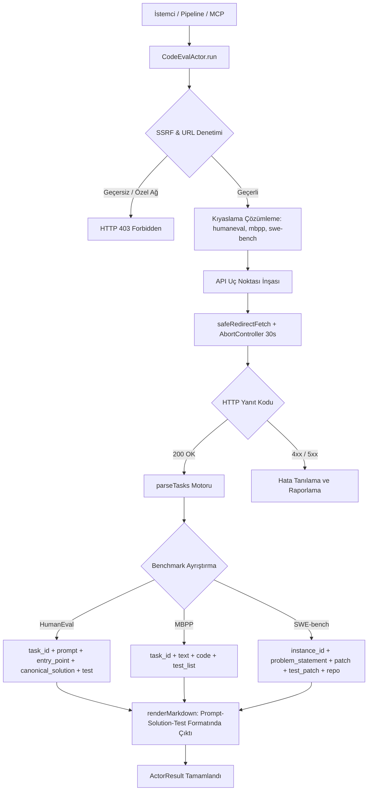
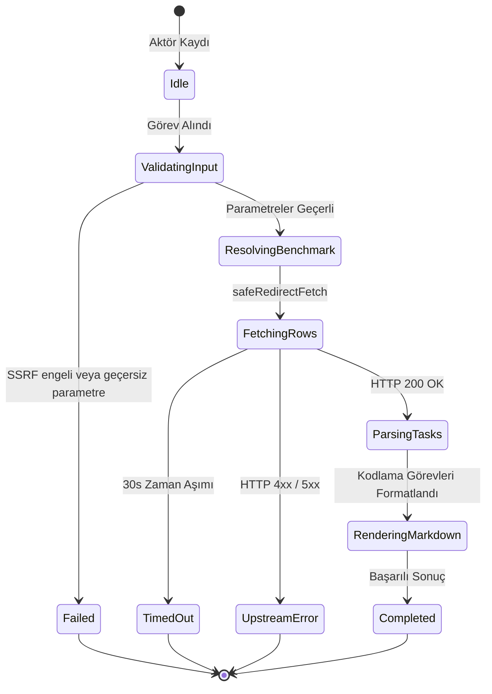

# Kodlama Değerlendirme ve Benchmark Çıkarıcı (`code-eval`)

Standart kodlama, programlama yeteneği ve yazılım mühendisliği kıyaslama veri setlerinden (HumanEval, MBPP, SWE-bench) problem tanımı, fonksiyon giriş noktası, kanonik çözüm ve doğrulama birim testlerini yapılandırılmış biçimde toplayan korpus aktörü.

---

## 1. Mimari Akış Şeması (Architecture Flowchart)



---

## 2. Sıra Diyagramı (Sequence Diagram)

```mermaid
sequenceDiagram
    autonumber
    participant Caller as Pipeline / MCP Caller
    participant Actor as CodeEvalActor
    participant SSRF as SSRFGuard
    participant Fetcher as SafeRedirectFetcher
    participant API as Datasets Server (Hugging Face)

    Caller->>Actor: run(task, context)
    Actor->>SSRF: validateUrlWithDns(targetUrl)
    SSRF-->>Actor: valid
    Actor->>Actor: resolveParameters(options)
    Actor->>Actor: buildEndpointUrl(resolved)
    Actor->>SSRF: validateUrlWithDns(endpoint)
    SSRF-->>Actor: valid
    Actor->>Fetcher: GET /rows (HumanEval, MBPP, SWE-bench)
    Fetcher->>API: HTTP GET (Bearer Token opsiyonel)
    API-->>Fetcher: 200 OK (JSON Rows Payload)
    Fetcher-->>Actor: Response Stream
    Actor->>Actor: parseTasks & renderMarkdown
    Actor-->>Caller: ActorResult<CodeEvalActorResult>
```

---

## 3. Durum Makinesi (State Machine)



---

## 4. Girdi Parametreleri (Input Options)

| Parametre | Tip | Zorunlu | Varsayılan | Açıklama |
|---|---|---|---|---|
| `benchmark` | `string` | Hayır | `"humaneval"` | Hedef kod kıyaslama kümesi (`"humaneval"`, `"mbpp"`, `"swe-bench"`). |
| `split` | `string` | Hayır | `"test"` | Veri seti dilimi (`"test"`, `"train"`). |
| `offset` | `number` | Hayır | `0` | Başlangıç satır ofseti. |
| `limit` | `number` | Hayır | `20` | Çekilecek maksimum görev sayısı (1-100). |
| `hfToken` | `string` | Hayır | `process.env.HF_TOKEN` | İsteğe bağlı Hugging Face kimlik doğrulama belirteci. |
| `targetUrl` | `string` | Hayır | – | Doğrudan dataset API veya depo bağlantısı. |
| `timeoutMs` | `number` | Hayır | `30000` | İstek zaman aşımı süresi (milisaniye). |

---

## 5. Çıktı Sözleşmesi (Output Contract)

```typescript
export interface CodeEvalItem {
  taskId: string;
  entryPoint?: string;
  prompt: string;
  canonicalSolution?: string;
  test?: string;
  language?: string;
  difficulty?: string;
  raw?: Record<string, unknown>;
}

export interface CodeEvalActorResult {
  benchmark: string;
  split: string;
  totalTasks: number;
  offset: number;
  limit: number;
  tasks: CodeEvalItem[];
  queryUrl: string;
  markdown?: string;
}
```

---

## 6. Güvenlik ve SSRF İnvariantları

1. **DNS Hop-by-Hop Doğrulama:** `SSRFGuard.validateUrlWithDns` kontrolü ile döngüsel ağlar (`127.0.0.1`), metadata servisleri (`169.254.169.254`) ve RFC 1918 adresleri engellenir.
2. **Kimlik Belirteci Güvenliği:** `hfToken` ve `HF_TOKEN` verileri günlük kayıtlarına veya Markdown çıktılarına yansıtılmaz.
3. **Zaman Aşımı Güvenliği:** `AbortController` 30 saniye sonra tetiklenerek açık ağ soketi kalması önlenir.

---

## 7. Desteklenen Kodlama Kıyaslama Kümeleri

- **HumanEval (`openai/openai_humaneval`):** OpenAI tarafından geliştirilen 164 özgün Python programlama problemi. Fonksiyon imzası/docstring (`prompt`), giriş noktası (`entry_point`), kanonik çözüm (`canonical_solution`) ve assertion testleri (`test`) çıkarılır.
- **MBPP (`google-research-datasets/mbpp`):** Google Research tarafından derlenen 974 temel Python programlama problemi. İngilizce problem tanımı (`text`), çözüm kodu (`code`) ve test dizisi (`test_list`) ayrıştırılır.
- **SWE-bench (`princeton-nlp/SWE-bench_Lite`):** Gerçek dünya GitHub repository issue'ları ve pull request çözümleri. Problem açıklaması (`problem_statement`), repo adı (`repo`), yama çözümü (`patch`) ve test yaması (`test_patch`) çıkarılır.

---

## 8. REST API Uç Noktası

- **Yol:** `POST /api/v1/code-eval` (Takma Ad: `POST /code-eval`)
- **İstek Gövdesi:**
  ```json
  {
    "benchmark": "humaneval",
    "split": "test",
    "offset": 0,
    "limit": 20
  }
  ```

---

## 9. MCP Araç Entegrasyonu

- **Araç Adı:** `query_code_eval`
- **Kullanım:** Claude Code veya Gemini Agent üzerinden doğrudan çağrılabilir:
  ```json
  {
    "name": "query_code_eval",
    "arguments": {
      "benchmark": "humaneval",
      "limit": 10
    }
  }
  ```

---

## 10. Kendi Kendini İyileştirme ve Hata Matrisi (Self-Healing Matrix)

| Hata Kodu / Durum | Olası Kök Neden | İyileştirme / Çözüm Yolu |
|---|---|---|
| `400 INVALID_BENCHMARK` | Desteklenmeyen kıyaslama adı girilmiş | Desteklenen kümelerden birini seç (`humaneval`, `mbpp`, `swe-bench`). |
| `404 NOT_FOUND` | Konfigürasyon veya split mevcut değil | `split` değerini (`test` veya `train`) kontrol et. |
| `429 RATE_LIMIT` | Hugging Face datasets-server hız sınırı aşıldı | `hfToken` sağla veya istek frekansını düşür. |
| `500 UPSTREAM_ERROR` | Hugging Face servis kesintisi | Yeniden deneme mekanizmasını tetikle. |

---

## 11. Performans ve Bellek Profili

- **Hızlı ve Düşük Bellekli Akış:** Büyük repo veya zip dosyaları indirilmez; yalnızca filtrelenmiş JSON veri dilimleri akıtılır (~5-15 MB RAM).
- **Deterministik Kod Bloğu Render:** 50 adet programlama görevinin kod blokları ve doğrulama testleri < 5 ms sürede GFM Markdown formatına çevrilir.
