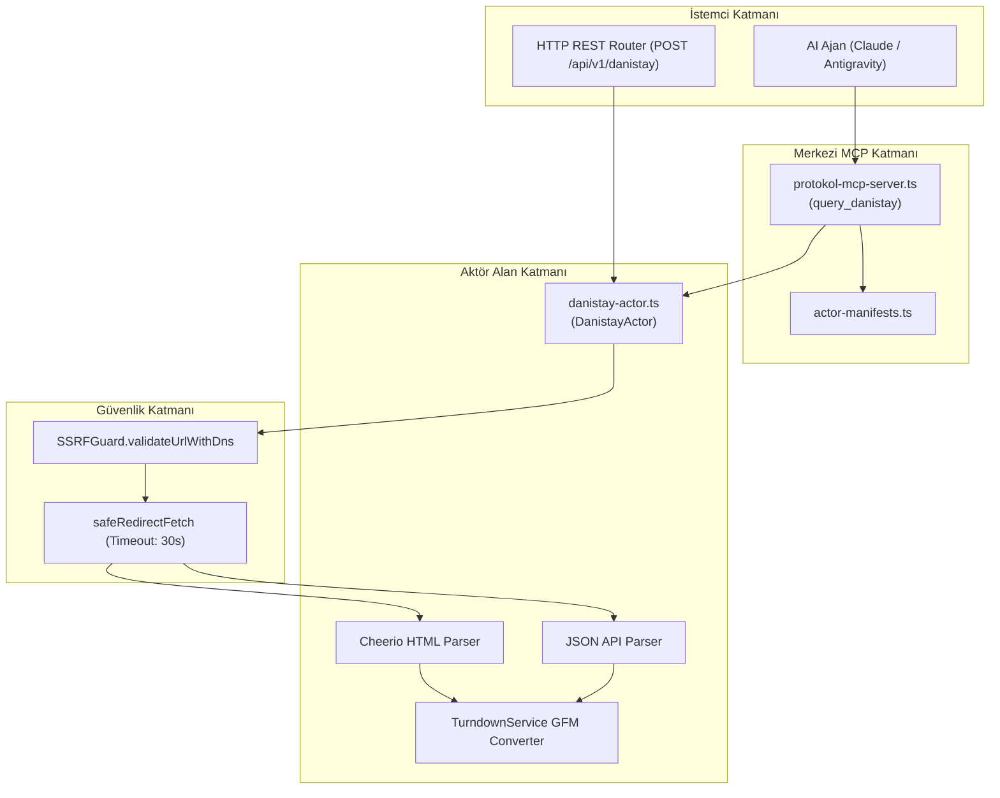

# Danıştay Actor — Teknik Wiki ve Çalışma Şartnamesi

## 1. Metadata ve Sınıflandırma

| Alan | Değer |
|---|---|
| **Aktör Tanımlayıcı (Type)** | `danistay` |
| **Kategori** | `corpus` (`src/actors/corpus/danistay-actor.ts`) |
| **Sürüm** | `1.0.0` |
| **Birincil Sınıf** | `DanistayActor` |
| **MCP Aracı** | `query_danistay` (`src/actors/actor-manifests.ts`) |
| **REST Uç Noktası** | `POST /api/v1/danistay`, `POST /danistay` |
| **Test Dosyası** | `tests/danistay-actor.test.ts` |
| **Örnek Yapılandırma** | `examples/actors/danistay.json` |

---

## 2. Mekanizma ve Teknik Genel Bakış

`DanistayActor`, T.C. Danıştay Başkanlığı Emsal Karar Arama Sistemi üzerinden idari dava daireleri (1-13. Daireler), İdari Dava Daireleri Kurulu (İDDK), Vergi Dava Daireleri Kurulu (VDDK) ve İçtihatları Birleştirme Kurulu (İBK) emsal kararlarını yapılandırılmış biçimde çıkaran aktördür.

Aktör, ilk derece ve bölge idare mahkemesi kararlarını, temyiz istemlerini, tetkik hakimi düşüncesini, Danıştay savcısı düşüncesini, maddi olayları, hukuki gerekçeyi, hüküm fıkrasını (onama, bozma, iptal, yürütmenin durdurulması) ve varsa karşı oyları ayrıştırarak GFM Markdown formatında sunar.

---

## 3. Mimari ve Bileşen Sınırları



---

## 4. Eylemler ve Girdi Parametreleri

| Parametre | Tip | Zorunlu mu? | Açıklama |
|---|---|---|---|
| `action` | `string` | Hayır | `search` veya `decision` (varsayılan: `search`). |
| `query` | `string` | Hayır | Karar gerekçesi veya arama anahtar kelimeleri. |
| `chamber` | `string` | Hayır | Danıştay dairesi veya kurulu (`iddk`, `vddk`, `ibk`, `1`, `2` ... `13`). |
| `caseNumber` | `string` | Hayır | Esas numarası (örn. `2021/1500`). |
| `decisionNumber`| `string` | Hayır | Karar numarası (örn. `2023/2400`). |
| `decisionId` | `string` | Hayır | Tekil Danıştay karar ID. |
| `year` | `number` | Hayır | Karar yılı. |
| `legalArea` | `string` | Hayır | `idare`, `vergi`, `all`. |
| `decisionType` | `string` | Hayır | `iptal`, `ret`, `onama`, `bozma`, `yurutmenin_durdurulmasi`. |
| `limit` | `number` | Hayır | Maksimum karar sayısı (varsayılan: 10). |
| `offset` | `number` | Hayır | Sayfalama başlangıcı (varsayılan: 0). |
| `targetUrl` | `string` | Hayır | Doğrudan Danıştay karar bağlantısı. |

---

## 5. Çıktı Şeması ve Veri Yapısı

```typescript
export interface DanistayActorResult {
  action: DanistayAction;
  queryUrl: string;
  totalResults: number;
  offset?: number;
  decisions: DanistayDecisionItem[];
  decision?: DanistayDecisionDetail;
  markdown?: string;
}
```
