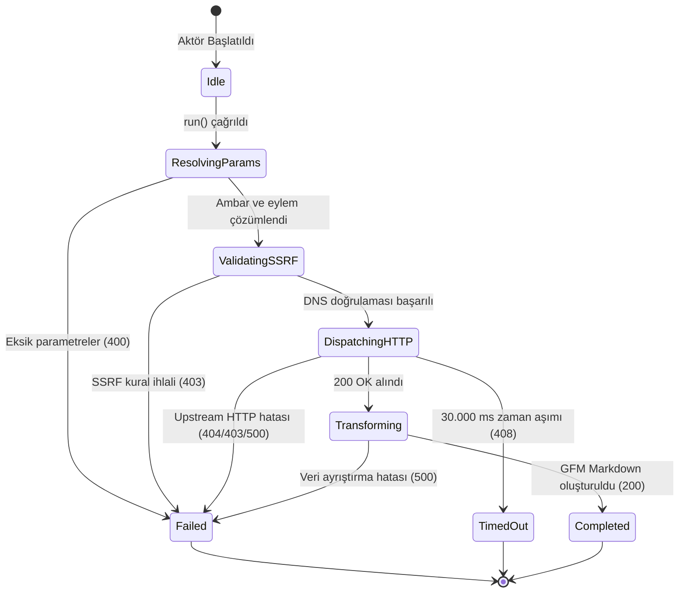

# GitHub — Teknik Wiki ve Çalışma Şartnamesi

## 1. Metadata ve Sınıflandırma

| Alan | Değer |
|---|---|
| **Aktör Tanımlayıcı (Type)** | `github` |
| **Kategori** | `corpus` |
| **Sürüm** | `1.0.0` |
| **Birincil Sınıf** | `GithubActor` (`src/actors/corpus/github-actor.ts`) |
| **Protokol / Kaynak** | GitHub REST API v3 (`https://api.github.com`) |
| **Hedef Çıktı Biçimi** | `GFM Markdown` \| `Structured JSON` |
| **MCP Aracı** | `query_github` (`src/mcp/protokol-mcp-server.ts`) |
| **Test Dosyası** | `tests/github-actor.test.ts` |

---

## 2. Mekanizma ve Teknik Genel Bakış

`GithubActor`, GitHub üzerindeki açık kaynaklı yazılım ambarlarının (repositories) yapılandırılmış metaverilerini, README dokümanlarını, hata ve özellik tartışmalarını (issues), kod inceleme süreçlerini (pull requests), sürüm notlarını (releases) ve dizin ağacını (git trees) toplayan bir LLM eğitim korpusu çıkarıcısıdır.

Aktör, upstream olarak resmi GitHub REST API v3 (`https://api.github.com`) protokolünü kullanır. Hedef URL veya opsiyonlar üzerinden repository sahibi (`owner`), ambar adı (`repo`) ve istenen eylem (`action`) çözümlenir:
- `repo`: Yıldızlar, çatallar, lisans, ana dil ve konu etiketleri dahil genel metaveri.
- `readme`: Deponun birincil README belgesi (Base64 kodlaması otomatik çözülür).
- `issues`: Sorun başlıkları, etiketler, durumlar ve tartışma gövdeleri.
- `pulls`: Çekme istekleri, durumlar, etiketler ve açıklamalar.
- `releases`: Sürüm etiketleri, yayın tarihleri ve sürüm notları.
- `tree`: Ambarın tüm dosya ve dizin hiyerarşik ağacı.

Yetkilendirme opsiyonel `token` parametresi veya sistem ortamındaki `GITHUB_TOKEN` değişkeni üzerinden `Bearer` yetkilendirmesiyle sağlanır (saatte 5000 istek kotası). Kimlik doğrulama verilmediğinde IP başına saatlik 60 istek sınırı geçerlidir. Çıktı doğrudan LLM eğitim ve çıkarımına hazır GFM (GitHub Flavored Markdown) formatında üretilir.

---

## 3. Mimari ve Bileşen Sınırları (Mermaid Flowchart)

```mermaid
flowchart TD
    subgraph Ingestion["İstemci & Tetikleme Katmanı"]
        MCP["MCP İstemcisi (Claude / Antigravity)"]
        REST["HTTP REST İstemcisi (/api/v1/github)"]
        Pipeline["Boru Hattı Yürütücüsü (PipelineRunner)"]
    end

    subgraph CentralMCP["Merkezi MCP Katmanı (src/mcp/)"]
        MCPServer["protokol-mcp-server.ts<br/>(query_github)"]
        Manifest["actor-manifests.ts<br/>(Declarative Manifest)"]
    end

    subgraph ActorCore["Aktör Alan Katmanı (src/actors/corpus/)"]
        ActorCore["github-actor.ts<br/>(GithubActor)"]
        MarkdownRenderer["renderMarkdown<br/>(GFM Parser / Base64 Decoder)"]
    end

    subgraph SecurityPerimeter["Güvenlik ve Çevre Katmanı"]
        SSRF["SSRFGuard.validateUrlWithDns<br/>(DNS Pinning / RFC 1918 Blokajı)"]
        Fetch["safeRedirectFetch<br/>(Hop-by-hop Doğrulama / AbortController)"]
    end

    subgraph UpstreamTarget["Hedef Veri Kaynağı"]
        TargetAPI["GitHub REST API v3 (api.github.com)"]
    end

    MCP --> MCPServer
    MCPServer --> Manifest
    MCPServer --> ActorCore
    REST --> ActorCore
    Pipeline --> ActorCore
    ActorCore --> SSRF
    SSRF --> Fetch
    Fetch --> TargetAPI
    TargetAPI --> MarkdownRenderer
    MarkdownRenderer --> ActorCore
```

---

## 4. İstek Yaşam Döngüsü ve Sıra Şeması (Mermaid Sequence Diagram)

```mermaid
sequenceDiagram
    autonumber
    participant Client as Çağırıcı (MCP / REST / Test)
    participant Actor as GithubActor
    participant SSRF as SSRFGuard (DNS Pinning)
    participant Net as safeRedirectFetch
    participant GitHub as GitHub REST API (api.github.com)

    Client->>Actor: run(task, context)
    Actor->>Actor: resolveRepoAndAction(targetUrl, options)
    alt Eksik Tanımlayıcı (owner veya repo yok)
        Actor-->>Client: ActorResult (status: "failed", statusCode: 400)
    else Ambar Koordinatları Başarılı
        Actor->>Actor: buildEndpointUrl(action, limit, state)
        Actor->>SSRF: validateUrlWithDns(endpoint)
        alt SSRF Engeli (RFC 1918 / Cloud Metadata)
            SSRF-->>Actor: { valid: false, reason }
            Actor-->>Client: ActorResult (status: "failed", statusCode: 403)
        else Güvenli IP Doğrulandı
            SSRF-->>Actor: { valid: true }
            Actor->>Net: safeRedirectFetch(endpoint, headers: { User-Agent, Authorization })
            Net->>GitHub: GET /repos/:owner/:repo/:action
            GitHub-->>Net: HTTP Yanıtı (200 OK / JSON)
            Net-->>Actor: Ham Yanıt Verisi
            Actor->>Actor: renderMarkdown() & Base64 Decode
            Actor-->>Client: ActorResult (status: "completed", statusCode: 200, markdown, data)
        end
    end
```

---

## 5. Durum Makinesi (Mermaid State Diagram)



---

## 6. Güvenlik İnvariantları ve Çalışma Kuralları

1. **SSRF Koruması (Mandatory Invariant):**
   * İstek atılacak URL doğrudan dışarıdan sağlansa da, içsel olarak oluşturulsa da her iki aşamada `SSRFGuard.validateUrlWithDns` fonksiyonundan geçirilir.
   * `allowLocalNetwork` parametresi sadece `NODE_ENV === "test"` durumunda aktiftir; üretim ortamında yerel döngü (loopback) veya intranet adreslerine erişim engellenir.
2. **Hop-by-Hop Yönlendirme Denetimi:**
   * Doğrudan yerel `fetch()` kullanılmaz; `safeRedirectFetch` ile yönlendirmeler tek tek izlenip her adımda DNS IP kontrolü yapılır.
3. **Zaman Aşımı ve Kaynak Tahsisi:**
   * `DEFAULT_TIMEOUT_MS = 30_000` (30 saniye) kuralı geçerlidir.
   * Süre dolduğunda `AbortController` soketi derhal sonlandırarak bellek sızıntısını önler.
4. **Kullanıcı Aracısı ve Yetkilendirme:**
   * Tüm upstream çağrılarında `"User-Agent": "Mozilla/5.0 (compatible; Protokol7Scraper/1.0; +https://protokol-7.local)"` başlığı kullanılır.
   * İsteğe bağlı `token` veya ortam değişkeni `GITHUB_TOKEN` var ise `Authorization: Bearer <token>` başlığı eklenir.

---

## 7. Tip Sözleşmesi ve Girdi/Çıktı Şemaları

### Girdi Seçenekleri (`GithubActorTaskOptions`)

```typescript
export interface GithubActorTaskOptions {
  owner?: string;
  repo?: string;
  action?: "repo" | "readme" | "issues" | "pulls" | "releases" | "tree";
  state?: "open" | "closed" | "all";
  limit?: number;
  token?: string;
  timeoutMs?: number;
}
```

### Çıktı Modeli (`GithubActorResult`)

```typescript
export interface GithubActorResult {
  owner: string;
  repo: string;
  action: string;
  data: Record<string, unknown> | Array<Record<string, unknown>>;
  queryUrl: string;
  markdown: string;
}
```

---

## 8. Aktör MCP Entegrasyonu

Aktörün MCP erişimi merkezi `src/mcp/protokol-mcp-server.ts` üzerinden ve `src/actors/actor-manifests.ts` bildirimsel şemasıyla yönetilir:

* **Araç Adı:** `query_github`
* **Sunucu Kaynağı:** `src/mcp/protokol-mcp-server.ts`
* **Bildirim:** `src/actors/actor-manifests.ts`
* **İşleyici:** `GithubActor`
* **Girdi Şeması:** Standart JSON Schema nesnesi

---

## 9. Hata Kodları ve İyileştirme Matrisi (Self-Healing)

| HTTP / Durum Kodu | Açıklama | Kök Neden | Kendi Kendine İyileştirme Yolu |
|---|---|---|---|
| `400 Bad Request` | Eksik ambar bilgisi | `owner` ve `repo` parametreleri sağlanmadı | `owner` ve `repo` alanlarını veya geçerli bir `targetUrl` tanımla |
| `403 Forbidden` | SSRF ihlali veya Kota aşımı | Hedef IP engellendi veya GitHub saatlik istek kotası doldu | URL güvenliğini teyit et veya geçerli bir `token` (PAT) sağla |
| `404 Not Found` | Ambar veya kaynak bulunamadı | Ambar gizli, silinmiş veya adı yanlış girilmiş | Repository adını ve erişim izinlerini kontrol et |
| `408 Request Timeout` | Zaman aşımı | GitHub API 30 saniye içinde yanıt vermedi | `timeoutMs` süresini artır veya isteği tekrarla |
| `500 Internal Error` | Sistem veya ayrıştırma hatası | Beklenmeyen API yanıt yapısı | Ham API yanıtını ve ayrıştırıcıyı incele |

---

## 10. Kullanım Örnekleri

### 10.1 cURL ile HTTP REST Çağrısı
```bash
curl -X POST http://127.0.0.1:4000/api/v1/github \
  -H "Content-Type: application/json" \
  -d '{"owner": "torvalds", "repo": "linux", "action": "readme"}'
```

### 10.2 MCP JSON-RPC 2.0 Çağrısı
```json
{
  "jsonrpc": "2.0",
  "id": "github-req-1",
  "method": "tools/call",
  "params": {
    "name": "query_github",
    "arguments": {
      "owner": "torvalds",
      "repo": "linux",
      "action": "repo"
    }
  }
}
```

### 10.3 Programatik TypeScript Kullanımı
```typescript
import { GithubActor } from "./github-actor";

const actor = new GithubActor();
const result = await actor.run({
  taskId: "github-task-1",
  actorType: "github",
  options: {
    githubOptions: {
      owner: "torvalds",
      repo: "linux",
      action: "issues",
      limit: 10,
    },
  },
}, { startTime: Date.now() });

console.log(result.data?.markdown);
```

---

## 11. Test Süiti ve Doğrulama

Test süiti `tests/github-actor.test.ts` dosyası aşağıdaki senaryoları kapsar:
1. Aktörün `github` tipi ve teknik açıklamasıyla başlatılması.
2. `targetUrl` ve opsiyonlardan `owner`, `repo` ve `action` çözümlemesi.
3. Tüm alt eylemler (`repo`, `readme`, `issues`, `pulls`, `releases`, `tree`) için API URL inşası.
4. Eksik parametre durumunda 400 hatası üretimi.
5. `169.254.169.254` adresine yönelik SSRF girişimlerinin 403 ile engellenmesi.
6. Base64 kodlu README dosyasının çekilmesi ve UTF-8 metne dönüştürülmesi.
7. Ambar metaverilerinin GFM Markdown formatında render edilmesi.
8. Sorun kayıtları, çekme istekleri ve sürümlerin Markdown dökümü.
9. Upstream HTTP hatalarının (404/500) yönetilmesi.
