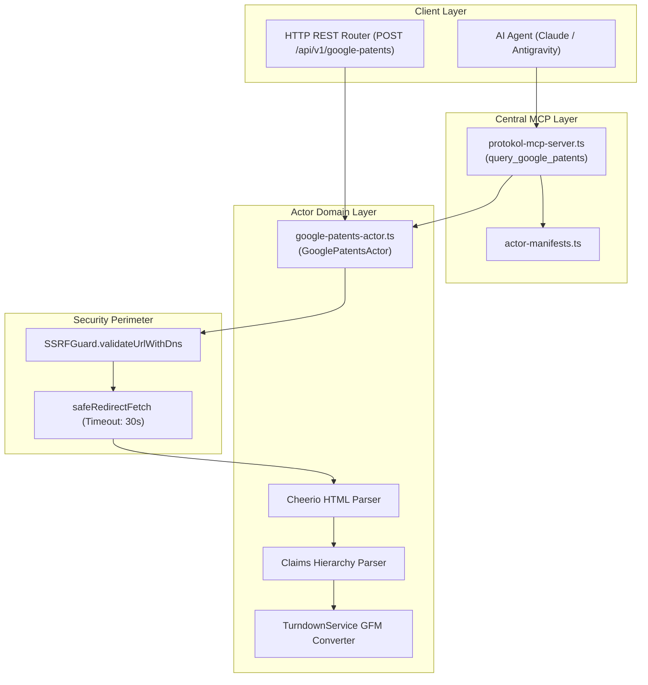

# Google Patents Actor — Technical Wiki and Specification

## 1. Metadata and Classification

| Field | Value |
|---|---|
| **Actor Type** | `google-patents` |
| **Category** | `corpus` (`src/actors/corpus/google-patents-actor.ts`) |
| **Version** | `1.0.0` |
| **Primary Class** | `GooglePatentsActor` |
| **MCP Tool** | `query_google_patents` (`src/actors/actor-manifests.ts`) |
| **REST Endpoint** | `POST /api/v1/google-patents`, `POST /google-patents` |
| **Test Suite** | `tests/google-patents-actor.test.ts` |
| **Example Config**| `examples/actors/google-patents.json` |

---

## 2. Mechanism and Technical Overview

`GooglePatentsActor` extracts worldwide patent publications, claims hierarchy (independent and dependent claims), detailed engineering descriptions, cooperative and international patent classifications (CPC/IPC), and prior art citations from Google Patents and USPTO/EPO public databases.

The actor supports three primary operational modes:
1. `patent`: Comprehensive patent dossier retrieval, parsing title, abstract, filing/priority/publication dates, inventors, assignees, classifications, numbered claims, and Turndown-converted Markdown description.
2. `claims`: High-speed patent claims parser designed for patent engineering analysis, automatically distinguishing between independent claims and dependent claim references.
3. `search`: Free-text or boolean keyword search with inventor, assignee, country/jurisdiction, and priority date filters.

---

## 3. Architecture and Component Boundaries



---

## 4. Actions and Input Parameters

| Parameter | Type | Required? | Description |
|---|---|---|---|
| `action` | `string` | No | `patent`, `search`, or `claims` (default: `patent`). |
| `patentId` | `string` | No | Patent number (e.g. `US10123456B2`, `EP3123456A1`, `WO2020123456A1`). |
| `query` | `string` | No | Free-text search or patent boolean query. |
| `inventor` | `string` | No | Inventor name filter. |
| `assignee` | `string` | No | Assignee / applicant company filter. |
| `country` | `string` | No | Patent office jurisdiction (`US`, `EP`, `WO`, `TR`, `JP`, etc.). |
| `status` | `string` | No | `grant`, `application`, `all`. |
| `before` | `string` | No | Priority date upper bound (`YYYYMMDD`). |
| `after` | `string` | No | Priority date lower bound (`YYYYMMDD`). |
| `limit` | `number` | No | Maximum patents to return (default: 10). |
| `targetUrl` | `string` | No | Direct Google Patents URL. |

---

## 5. Output Schema and Data Structure

```typescript
export interface GooglePatentsActorResult {
  action: GooglePatentsAction;
  queryUrl: string;
  totalResults: number;
  patent?: GooglePatentItem;
  claims?: GooglePatentClaimItem[];
  patents?: GooglePatentItem[];
  markdown?: string;
}
```
