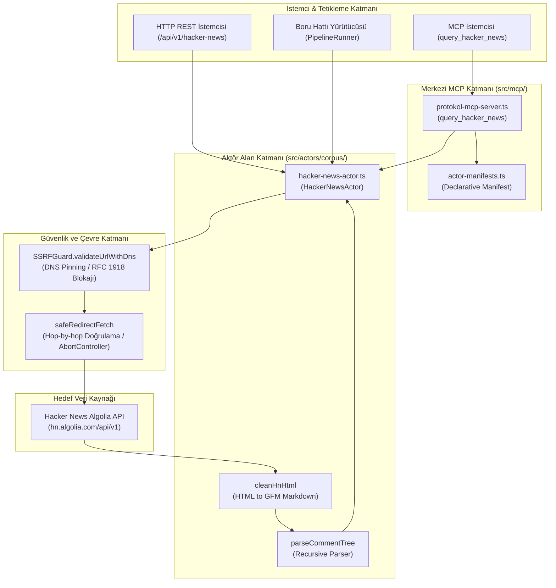
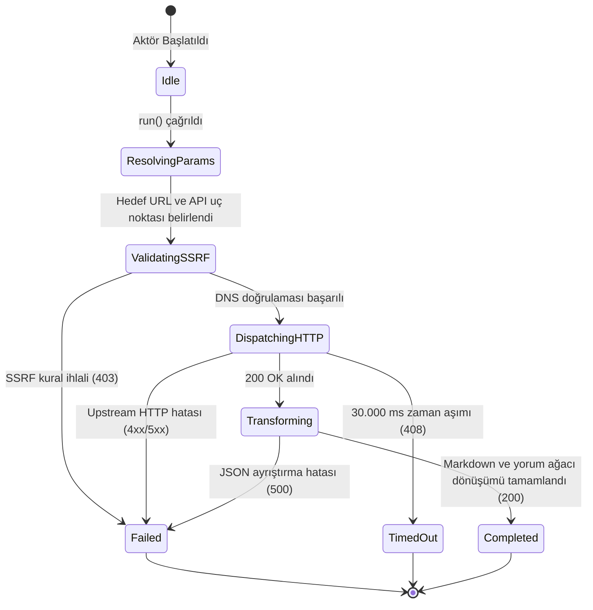

# hacker-news — Teknik Wiki ve Çalışma Şartnamesi

## 1. Metadata ve Sınıflandırma

| Alan | Değer |
|---|---|
| **Aktör Tanımlayıcı (Type)** | `hacker-news` |
| **Kategori** | `corpus` |
| **Sürüm** | `1.0.0` |
| **Birincil Sınıf** | `HackerNewsActor` (`src/actors/corpus/hacker-news-actor.ts`) |
| **Protokol / Kaynak** | `Hacker News Algolia API v1` (`https://hn.algolia.com/api/v1`) & Firebase REST |
| **Hedef Çıktı Biçimi** | `GFM Markdown` \| `JSONL` \| `HackerNewsStoryItem[]` |
| **MCP Aracı** | `query_hacker_news` (`src/mcp/protokol-mcp-server.ts`) |
| **Test Dosyası** | `tests/hacker-news-actor.test.ts` |

---

## 2. Mekanizma ve Teknik Genel Bakış

`HackerNewsActor`, Y Combinator Hacker News platformundaki yazılım mühendisliği tartışmalarını, mimari incelemelerini (post-mortem), topluluk yanıtlarını ve iç içe geçmiş yorum ağaçlarını LLM ön eğitim ve muhakeme (reasoning) veri seti formatında ayıklayan uzmanlaşmış bir veri aktörüdür.

* **Algolia HN REST API Entegrasyonu:** Tek tek yorum ID'lerini yinelemeli olarak çeken Firebase API yerine, tüm iç içe yorum ağacını (nested comments tree) tek bir HTTP çağrısıyla döndüren resmi Algolia Hacker News API (`/items/:id`) uç noktasını kullanır.
* **HTML Temizleme ve Markdown Dönüşümü (`cleanHnHtml`):** Hacker News yorum gövdelerindeki ham HTML etiketlerini (`<p>`, `<i>`, `<a>`, `<pre><code>`) ve HTML varlıklarını (`&#x27;`, `&gt;`, `&amp;`) güvenli ve deterministik biçimde GitHub Flavored Markdown (GFM) biçimine dönüştürür.
* **Hiyerarşik Yorum Ağacı (`parseCommentTree`):** Derinliği sınırsız olabilen Hacker News yorum ağacını özyinelemeli (recursive) olarak dolaşır ve her yorumu hiyerarşik Markdown alıntı blokları (`> > ...`) olarak görselleştirir.

---

## 3. Mimari ve Bileşen Sınırları (Mermaid Flowchart)



---

## 4. İstek Yaşam Döngüsü ve Sıra Şeması (Mermaid Sequence Diagram)

```mermaid
sequenceDiagram
    autonumber
    participant Client as Çağırıcı (MCP / REST / Test)
    participant Actor as HackerNewsActor
    participant SSRF as SSRFGuard (DNS Pinning)
    participant Net as safeRedirectFetch
    participant Upstream as Hacker News Algolia API

    Client->>Actor: run(task, context)
    Actor->>Actor: resolveParameters(targetUrl, options)
    Actor->>SSRF: validateUrlWithDns(targetUrl / endpoint)
    alt SSRF Engeli (RFC 1918 / Cloud Metadata)
        SSRF-->>Actor: { valid: false, reason }
        Actor-->>Client: ActorResult (status: "failed", statusCode: 403)
    else Güvenli IP Doğrulandı
        SSRF-->>Actor: { valid: true }
        Actor->>Net: safeRedirectFetch(endpoint, timeout: 30s)
        Net->>Upstream: HTTP GET /items/:id veya /search
        Upstream-->>Net: HTTP Yanıtı (200 OK JSON)
        Net-->>Actor: Ham JSON Yanıtı
        Actor->>Actor: cleanHnHtml() ve parseCommentTree()
        Actor->>Actor: renderMarkdown()
        Actor-->>Client: ActorResult (status: "completed", statusCode: 200, executionDurationMs)
    end
```

---

## 5. Durum Makinesi (Mermaid State Diagram)



---

## 6. Güvenlik İnvariantları ve Çalışma Kuralları

1. **SSRF Koruması (Mandatory Invariant):**
   * İstek atılacak URL doğrudan dışarıdan sağlansa da, içsel olarak oluşturulsa da iki aşamada `SSRFGuard.validateUrlWithDns` fonksiyonundan geçirilir.
   * `allowLocalNetwork` parametresi sadece `NODE_ENV === "test"` durumunda aktiftir; üretim ortamında yerel ağlara erişim engellenir.
2. **Hop-by-Hop Yönlendirme Denetimi:**
   * Doğrudan yerel `fetch()` kullanılmaz; `safeRedirectFetch` ile yönlendirmeler tek tek izlenip her adımda DNS IP kontrolü yapılır.
3. **Zaman Aşımı ve Kaynak Tahsisi:**
   * `DEFAULT_TIMEOUT_MS = 30_000` (30 saniye) kuralı geçerlidir.
   * Süre dolduğunda `AbortController` soketi sonlandırır.
4. **Kullanıcı Aracısı (User-Agent):**
   * Tüm upstream çağrılarında `"User-Agent": "Mozilla/5.0 (compatible; Protokol7Scraper/1.0; +https://protokol-7.local)"` başlığı kullanılır.

---

## 7. Tip Sözleşmesi ve Girdi/Çıktı Şemaları

### Girdi Seçenekleri (`HackerNewsActorTaskOptions`)

```typescript
export interface HackerNewsActorTaskOptions {
  action?: "top" | "best" | "new" | "ask" | "show" | "story" | "search";
  storyId?: number;
  query?: string;
  limit?: number;
  maxComments?: number;
  timeoutMs?: number;
}
```

### Çıktı Modeli (`HackerNewsActorResult`)

```typescript
export interface HackerNewsCommentItem {
  id: number;
  author?: string;
  text?: string;
  time?: number;
  parentId?: number;
  children?: HackerNewsCommentItem[];
}

export interface HackerNewsStoryItem {
  id: number;
  title: string;
  url?: string;
  author?: string;
  points?: number;
  commentsCount?: number;
  time?: number;
  text?: string;
  comments?: HackerNewsCommentItem[];
}

export interface HackerNewsActorResult {
  action: string;
  totalStories: number;
  stories: HackerNewsStoryItem[];
  queryUrl: string;
  markdown: string;
}
```

---

## 8. Aktör MCP Entegrasyonu

Aktörün MCP erişimi merkezi `src/mcp/protokol-mcp-server.ts` üzerinden ve `src/actors/actor-manifests.ts` bildirimsel şemasıyla yönetilir:

* **Araç Adı:** `query_hacker_news`
* **Sunucu Kaynağı:** `src/mcp/protokol-mcp-server.ts`
* **Bildirim:** `src/actors/actor-manifests.ts`
* **İşleyici:** `HackerNewsActor`

---

## 9. Hata Kodları ve İyileştirme Matrisi (Self-Healing)

| HTTP / Durum Kodu | Açıklama | Kök Neden | Kendi Kendine İyileştirme Yolu |
|---|---|---|---|
| `400 Bad Request` | Geçersiz parametre | Gerekli parametreler eksik veya biçim hatalı | Girdi şemasını doğrula ve `action`/`storyId` alanlarını kontrol et |
| `403 Forbidden` | SSRF ihlali | Hedef IP yasaklı özel blokta veya bulut metadata adresinde | Hedef adresi doğrula; testte `NODE_ENV=test` sağla |
| `404 Not Found` | Başlık veya öğe bulunamadı | Belirtilen `storyId` Hacker News veritabanında mevcut değil | Başlık ID'sini ve Algolia indeksini kontrol et |
| `408 Request Timeout` | Zaman aşımı | Hedef sunucu 30 saniye içinde yanıt vermedi | `timeoutMs` değerini artır veya isteği tekrarla |
| `500 Internal Error` | Ayrıştırma hatası | Beklenmeyen API yanıtı veya bozuk gövde verisi | Ham içeriği ve ayrıştırıcı kuralını incele |

---

## 10. Kullanım Örnekleri

### 10.1 cURL ile HTTP REST Çağrısı
```bash
curl -X POST http://127.0.0.1:4000/api/v1/hacker-news \
  -H "Content-Type: application/json" \
  -d '{"action": "story", "storyId": 38870197, "maxComments": 20}'
```

### 10.2 MCP JSON-RPC 2.0 Çağrısı
```json
{
  "jsonrpc": "2.0",
  "id": "hn-req-1",
  "method": "tools/call",
  "params": {
    "name": "query_hacker_news",
    "arguments": {
      "action": "search",
      "query": "raft consensus distributed systems",
      "limit": 5
    }
  }
}
```

### 10.3 Programatik TypeScript Kullanımı
```typescript
import { HackerNewsActor } from "./hacker-news-actor";

const actor = new HackerNewsActor();
const result = await actor.run({
  taskId: "hn-task-1",
  actorType: "hacker-news",
  options: {
    action: "top",
    limit: 10,
  },
}, { startTime: Date.now() });

console.log(result.data?.markdown);
```

---

## 11. Test Süiti ve Doğrulama

Test süiti `tests/hacker-news-actor.test.ts` dosyası aşağıdaki temel senaryoları kapsar:
1. Aktörün doğru `actorType` ve açıklama ile başlatılması.
2. `169.254.169.254` adresine yapılan SSRF girişimlerinin 403 ile engellenmesi.
3. Parametrelerin ve eylemlerin URL ve seçeneklerden çözümlenmesi (`story`, `search`, `top`, `ask`, `show`, `new`).
4. Algolia JSON yanıtlarının ayrıştırılması ve GFM Markdown çıktısının doğrulanması.
5. İç içe yorum ağaçlarının özyinelemeli olarak taranması ve HTML temizliğinin (`cleanHnHtml`) denetlenmesi.
6. Harici API 404/500 hatalarının zarifçe ele alınması.
