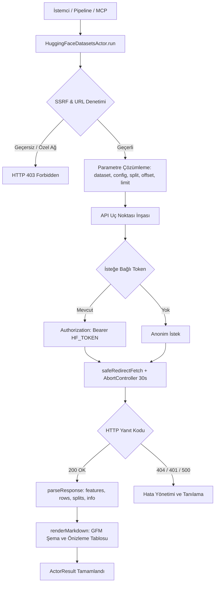
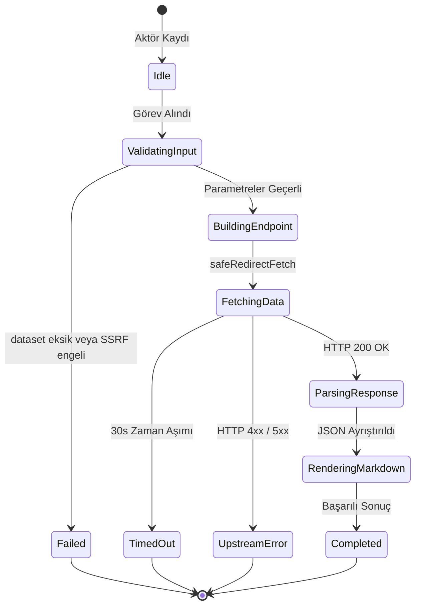

# Hugging Face Datasets Harvester (`huggingface-datasets`)

Hugging Face Serverless Datasets API (`https://datasets-server.huggingface.co`) üzerinden açık ve özel yapay zeka eğitim veri setlerini (`rows`, `splits`, `info`, `size`) akıtarak yapılandırılmış JSON kayıtlarına ve deterministik GFM Markdown tablolarına dönüştüren korpus aktörü.

---

## 1. Mimari Akış Şeması (Architecture Flowchart)



---

## 2. Sıra Diyagramı (Sequence Diagram)

```mermaid
sequenceDiagram
    autonumber
    participant Caller as Pipeline / MCP Caller
    participant Actor as HuggingFaceDatasetsActor
    participant SSRF as SSRFGuard
    participant Fetcher as SafeRedirectFetcher
    participant API as Datasets Server (Hugging Face)

    Caller->>Actor: run(task, context)
    Actor->>SSRF: validateUrlWithDns(targetUrl)
    SSRF-->>Actor: valid / invalid
    Actor->>Actor: resolveParameters(options)
    Actor->>Actor: buildEndpointUrl(resolved)
    Actor->>SSRF: validateUrlWithDns(endpoint)
    SSRF-->>Actor: valid
    Actor->>Fetcher: GET /rows, /splits veya /info
    Fetcher->>API: HTTP GET (Bearer Token opsiyonel)
    API-->>Fetcher: 200 OK (JSON Payload)
    Fetcher-->>Actor: Response Stream
    Actor->>Actor: parseResponse & renderRowsMarkdown
    Actor-->>Caller: ActorResult<HuggingFaceDatasetsActorResult>
```

---

## 3. Durum Makinesi (State Machine)



---

## 4. Girdi Parametreleri (Input Options)

| Parametre | Tip | Zorunlu | Varsayılan | Açıklama |
|---|---|---|---|---|
| `dataset` | `string` | Evet | – | Hugging Face veri kümesi tanımlayıcısı (ör. `openai/gsm8k`, `tatsu-lab/alpaca`). |
| `action` | `string` | Hayır | `"rows"` | Eylem modu: `"rows"`, `"splits"`, `"info"`, `"size"`. |
| `config` | `string` | Hayır | `"default"` | Veri kümesi konfigürasyonu veya alt küme adı (ör. `"main"`). |
| `split` | `string` | Hayır | `"train"` | Veri kümesi dilimi (ör. `"train"`, `"test"`, `"validation"`). |
| `offset` | `number` | Hayır | `0` | Akıtılacak satırların başlangıç ofseti. |
| `limit` | `number` | Hayır | `20` | Döndürülecek maksimum satır adedi (1 ile 100 arası). |
| `hfToken` | `string` | Hayır | `process.env.HF_TOKEN` | Özel (gated/private) veri setleri için User Access Token. |
| `targetUrl` | `string` | Hayır | – | Doğrudan Hugging Face dataset web sayfası veya API URL'i. |
| `timeoutMs` | `number` | Hayır | `30000` | Ağ isteği zaman aşımı sınırı (milisaniye). |

---

## 5. Çıktı Sözleşmesi (Output Contract)

```typescript
export interface HuggingFaceDatasetsActorResult {
  dataset: string;
  action: string;
  config?: string;
  split?: string;
  totalRows?: number;
  offset?: number;
  limit?: number;
  features?: HuggingFaceDatasetsFeatureItem[];
  splits?: HuggingFaceDatasetsSplitItem[];
  rows?: Array<Record<string, unknown>>;
  info?: {
    description?: string;
    homepage?: string;
    license?: string;
    citation?: string;
  };
  queryUrl: string;
  markdown?: string;
}
```

---

## 6. Güvenlik ve SSRF İnvariantları

1. **DNS Hop-by-Hop Doğrulama:** Tüm URL'ler `SSRFGuard.validateUrlWithDns` süzgecinden geçirilir; bulut metadata (`169.254.169.254`), döngüsel adresler (`127.0.0.1`, `localhost`) ve özel RFC 1918 IPv4/IPv6 blokları reddedilir.
2. **Belirteç Gizliliği (Secret Sanitization):** Gönderilen `HF_TOKEN` asla çıktı loglarına, Markdown metinlerine veya hata mesajlarına yansıtılmaz.
3. **Zaman Aşımı Güvencesi:** `AbortController` sinyali 30 saniye sonra tetiklenerek ağ soket sızıntısı ve kilitlenme engellenir.

---

## 7. Upstream API Spesifikasyonları

- **Rows Uç Noktası:** `https://datasets-server.huggingface.co/rows?dataset={dataset}&config={config}&split={split}&offset={offset}&length={length}`
- **Splits Uç Noktası:** `https://datasets-server.huggingface.co/splits?dataset={dataset}`
- **Info Uç Noktası:** `https://datasets-server.huggingface.co/info?dataset={dataset}`
- **Size Uç Noktası:** `https://datasets-server.huggingface.co/size?dataset={dataset}`

---

## 8. REST API Uç Noktası

- **Yol:** `POST /api/v1/huggingface-datasets` (Takma Ad: `POST /huggingface-datasets`)
- **İstek Gövdesi:**
  ```json
  {
    "dataset": "openai/gsm8k",
    "config": "main",
    "split": "train",
    "action": "rows",
    "offset": 0,
    "limit": 20
  }
  ```

---

## 9. MCP Araç Entegrasyonu

- **Araç Adı:** `query_huggingface_datasets`
- **Kullanım:** Claude Code veya Gemini Agent üzerinden doğrudan çağrılabilir:
  ```json
  {
    "name": "query_huggingface_datasets",
    "arguments": {
      "dataset": "openai/gsm8k",
      "action": "rows",
      "limit": 10
    }
  }
  ```

---

## 10. Kendi Kendini İyileştirme ve Hata Matrisi (Self-Healing Matrix)

| Hata Kodu / Durum | Olası Kök Neden | İyileştirme / Çözüm Yolu |
|---|---|---|
| `400 MISSING_REQUIRED_PARAMETER` | `dataset` parametresi boş bırakılmış | İstemciye `openai/gsm8k` benzeri bir veri seti kimliği girmesini bildir. |
| `401 / 403 FORBIDDEN` | Veri seti gated (ör. Llama modelleri) veya token geçersiz | Geçerli bir `hfToken` veya ortam değişkeni `HF_TOKEN` tanımla. |
| `404 NOT_FOUND` | Veri seti mevcut değil veya datasets-server henüz indekslememiş | Veri seti adını ve konfigürasyonunu kontrol et. |
| `429 RATE_LIMIT` | Hugging Face anonim istek sınırı aşıldı | `HF_TOKEN` ekle ve üstel geri çekilme (`backoff`) uygula. |
| `500 UPSTREAM_ERROR` | Datasets Server geçici arızası | `retryOptions` ile isteği 3 kez yeniden dene. |

---

## 11. Performans ve Bellek Profili

- **Ağ Verimliliği:** Parquet dosyalarını tamamen indirmek yerine datasets-server önbelleğindeki JSONL dilimlerini çeker; bellek tüketimi 10-20 MB bandında kalır.
- **GFM Render Performansı:** 100 satırlık dilimlerin Markdown tablosuna dönüştürülmesi < 5 ms sürer.
