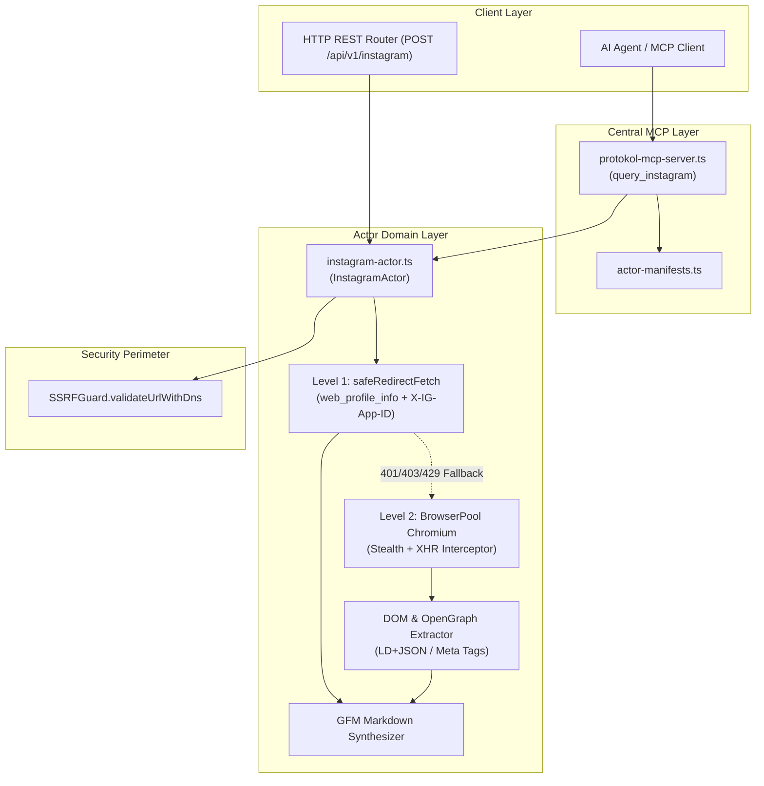

# Instagram Actor — Technical Wiki and Specification

## 1. Metadata and Classification

| Field | Value |
|---|---|
| **Actor Type** | `instagram` |
| **Category** | `corpus` (`src/actors/corpus/instagram-actor.ts`) |
| **Version** | `1.0.0` |
| **Primary Class** | `InstagramActor` |
| **MCP Tool** | `query_instagram` (`src/actors/actor-manifests.ts`) |
| **REST Endpoint** | `POST /api/v1/instagram`, `POST /instagram` |
| **Test Suite** | `tests/instagram-actor.test.ts` |
| **Example Config**| `examples/actors/instagram.json` |

---

## 2. Mechanism and Technical Overview

`InstagramActor` extracts public Instagram profiles, posts, reels, carousel child slides, engagement metrics, and hashtags. It employs a dual-engine architecture designed to bypass standard rate limiting and login barriers:

1. **Level 1 (Fast HTTP API Engine):**
   Directly queries Instagram's web endpoint (`/api/v1/users/web_profile_info/?username={username}`) using the official Web App ID header (`X-IG-App-ID: 936619743392459`) and browser user-agent. Delivers response payloads within 200–500 ms without headless browser overhead.
2. **Level 2 (Headless Chromium Stealth Engine):**
   Falls back to `BrowserPool.acquireSession` when encountering HTTP 401 (login wall), 403 (blocked), or 429 (rate-limited). Injects optional session cookies (`sessionid`), intercepts background XHR/Fetch network responses, and extracts `<script type="application/ld+json">` and OpenGraph meta tags from the DOM.

The actor supports four operational actions:
- `profile`: Extracts biography, follower/following/post counts, verification status, external links, and recent media timeline previews.
- `post`: Extracts shortcode, media type (`image`, `video`, `carousel`), high-res display URLs, video streaming URLs, like/comment counts, captions, hashtags, and tagged users.
- `recent_posts`: Extracts a list of recent media items from a target profile.
- `hashtag`: Extracts post counts, top posts, and recent posts for a given hashtag.

---

## 3. Architecture and Component Boundaries



---

## 4. Input Configuration Schema

| Field | Type | Required | Description |
|---|---|---|---|
| `action` | `string` | No | Operational mode: `profile`, `post`, `recent_posts`, or `hashtag` (default: `profile`). |
| `username` | `string` | No | Target handle (e.g. `natgeo`). |
| `shortcode` | `string` | No | Post or Reel shortcode (e.g. `C_abc123`). |
| `hashtag` | `string` | No | Hashtag name without `#` prefix (e.g. `nature`). |
| `targetUrl` | `string` | No | Direct Instagram URL (profile, post, reel, or hashtag explore link). |
| `limit` | `number` | No | Maximum media records to return (default: 12). |
| `useBrowser` | `boolean` | No | Forces Level 2 headless Chromium pool execution (default: `false`). |
| `sessionCookies` | `array` | No | Optional array of cookies (`{ name, value, domain }`) to authenticate requests. |
| `extractMarkdown` | `boolean` | No | Synthesizes LLM-ready GFM markdown (default: `true`). |
| `extractComments` | `boolean` | No | Extracts individual post comments with user handles and like counts (default: `false`). |
| `commentsLimit` | `number` | No | Maximum comments to extract per post (default: 20). |
| `timeoutMs` | `number` | No | Request timeout in milliseconds (default: 30000). |

---

## 5. Output Data Schema

```typescript
export interface InstagramCommentRecord {
  id: string;
  username: string;
  text: string;
  createdAtTimestamp?: number;
  likeCount?: number;
  authorProfilePicUrl?: string;
  authorIsVerified?: boolean;
}

export interface InstagramMediaRecord {
  id: string;
  shortcode: string;
  url: string;
  mediaType: "image" | "video" | "carousel";
  caption: string;
  likeCount: number;
  commentCount: number;
  takenAtTimestamp: number;
  displayUrl: string;
  videoUrl?: string;
  videoViewCount?: number;
  hashtags: string[];
  mentions: string[];
  children?: InstagramMediaChild[];
  comments?: InstagramCommentRecord[];
  location?: { id: string; name: string; slug?: string };
  owner?: { id: string; username: string; fullName?: string; isVerified?: boolean; profilePicUrl?: string };
}

export interface InstagramActorResult {
  action: "profile" | "post" | "recent_posts" | "hashtag";
  query: string;
  profile?: InstagramProfileRecord;
  posts?: InstagramMediaRecord[];
  hashtag?: InstagramHashtagRecord;
  markdown: string;
  engineUsed: "http" | "browser";
}
```
