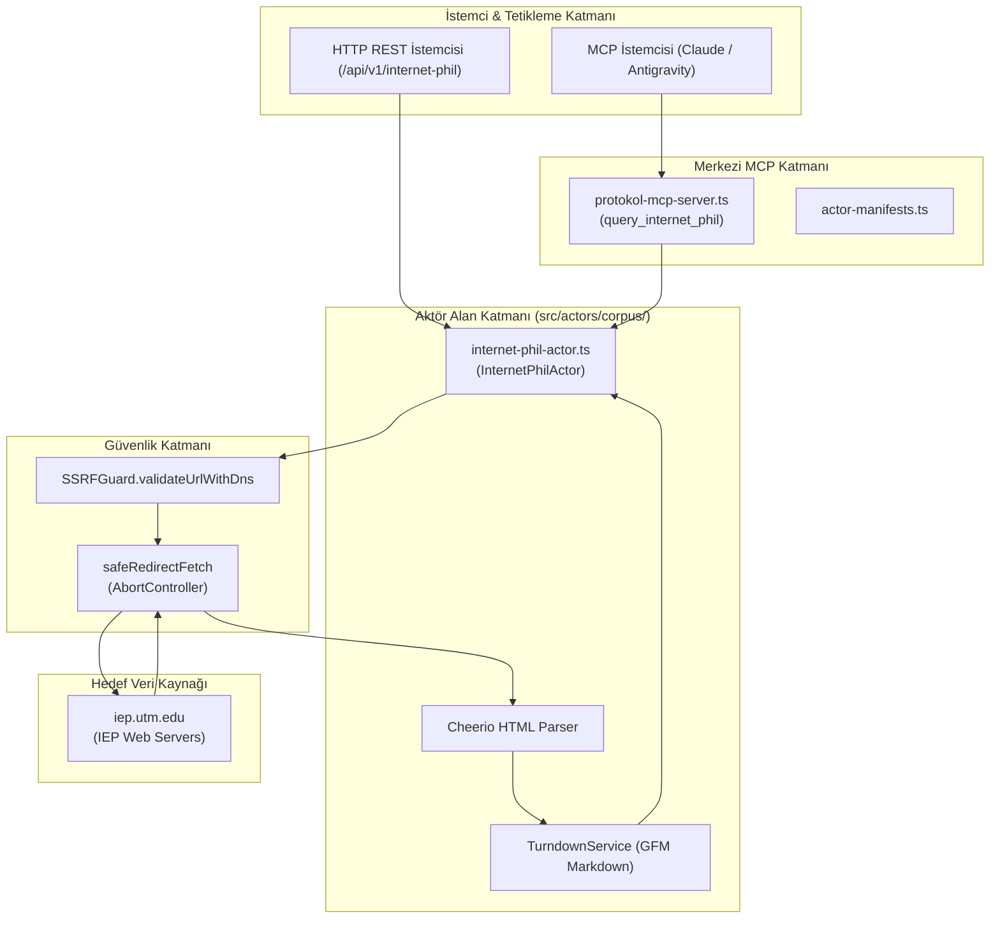
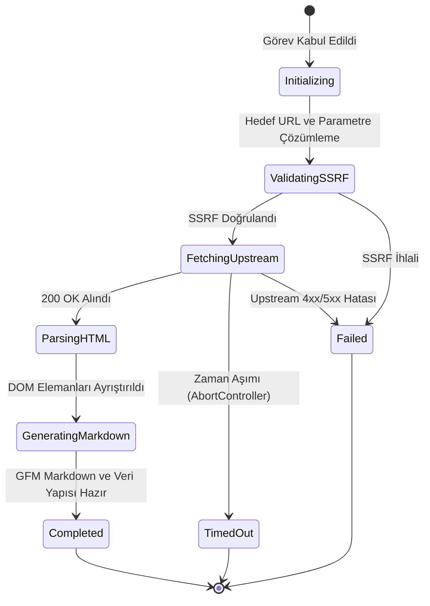

# internet-phil — Teknik Wiki ve Çalışma Şartnamesi

## 1. Metadata ve Sınıflandırma

| Alan | Değer |
|---|---|
| **Aktör Tanımlayıcı (Type)** | `internet-phil` |
| **Kategori** | `corpus` |
| **Sürüm** | `1.0.0` |
| **Birincil Sınıf** | `InternetPhilActor` (`src/actors/corpus/internet-phil-actor.ts`) |
| **Protokol / Kaynak** | HTTP / HTML Scraping (`iep.utm.edu`) |
| **Hedef Çıktı Biçimi** | `GFM Markdown` & Structured Articles |
| **MCP Aracı** | `query_internet_phil` (`src/mcp/protokol-mcp-server.ts`) |
| **Test Dosyası** | `tests/internet-phil-actor.test.ts` |

---

## 2. Mekanizma ve Teknik Genel Bakış

`InternetPhilActor`, akademik felsefe camiası tarafından akredite edilen ve hakemli felsefi rehberler sunan Internet Encyclopedia of Philosophy (IEP) üzerindeki felsefe makalelerini, ontoloji ve epistemoloji rehberlerini, mantıksal çıkarsama metinlerini ve kaynakçaları toplayan bir korpus aktörüdür.

Desteklenen eylemler:
1. `entry`: Belirtilen bir makale slug'ı (ör. `goedel`, `prop-log`, `ethics`) veya URL üzerinden ilgili makaleyi (`https://iep.utm.edu/<slug>/`) çeker; başlık, yazar bilgisi, içindekiler tablosu (`#toc_container`), bölüm başlıkları ve metinleri, kaynakça/okuma listelerini ayrıştırıp GFM Markdown çıktısı üretir.
2. `search`: Arama uç noktası (`https://iep.utm.edu/?s=<query>`) üzerinden arama yaparak eşleşen maddeleri ve özetleri listeler.

Tüm ağ çağrıları `SSRFGuard.validateUrlWithDns` ve `safeRedirectFetch` ile güvence altına alınmıştır.

---

## 3. Mimari ve Bileşen Sınırları



---

## 4. Sıralı İşlem Akışı (Sequence Diagram)

```mermaid
sequenceDiagram
    autonumber
    participant Client as İstemci (REST / MCP)
    participant Server as REST Sunucu / MCP Sunucu
    participant Actor as InternetPhilActor
    participant Guard as SSRFGuard
    participant Fetcher as safeRedirectFetch
    participant Upstream as iep.utm.edu

    Client->>Server: POST /api/v1/internet-phil (slug: "goedel")
    Server->>Actor: run(task, context)
    Actor->>Guard: validateUrlWithDns(endpoint)
    Guard-->>Actor: valid: true
    Actor->>Fetcher: safeRedirectFetch(endpoint)
    Fetcher->>Upstream: GET /goedel/
    Upstream-->>Fetcher: 200 OK (HTML)
    Fetcher-->>Actor: HTML Yanıtı
    Actor->>Actor: Cheerio ayrıştırma (başlık, yazar, TOC, bölümler, kaynakça)
    Actor->>Actor: TurndownService GFM Markdown üretimi
    Actor-->>Server: ActorResult (completed, status 200, data)
    Server-->>Client: 200 OK JSON (entry, markdown)
```

---

## 5. Durum Geçiş Modeli (State Diagram)



---

## 6. Güvenlik İnvariantları ve Kısıtlar

1. **SSRF Koruması:** `iep.utm.edu` ve doğrudan sağlanan URL'ler hop-by-hop doğrulanır.
2. **Zaman Aşımı ve Kaynak Kontrolü:** 30.000 ms zaman aşımı ile askıda kalan ağ bağlantıları kesilir.
3. **Temiz Metin Katmanı:** Reklamlar, sosyal medya butonları (`.sharedaddy`), gereksiz gezinme menüleri ve komut dosyaları DOM'dan silinerek LLM eğitimi için saf metin elde edilir.
