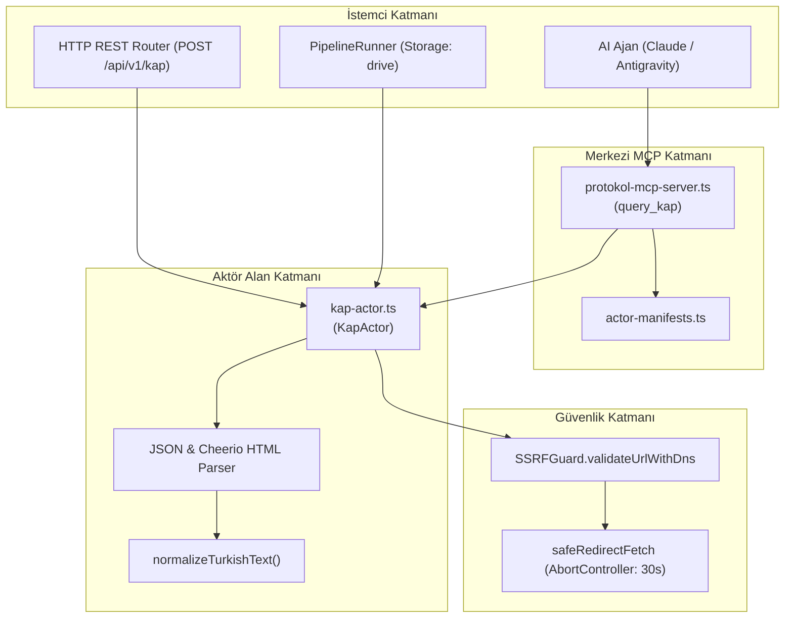
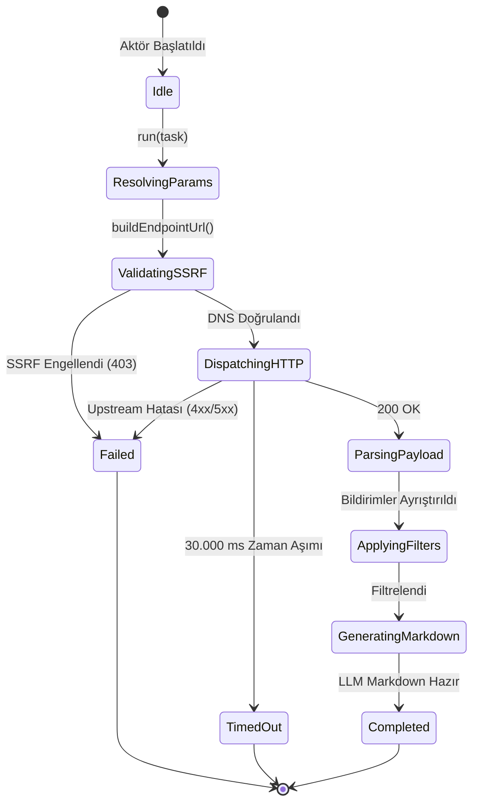

# Kamuoyu Aydınlatma Platformu (KAP) Actor — Teknik Wiki ve Çalışma Şartnamesi

## 1. Metadata ve Sınıflandırma

| Alan | Değer |
|---|---|
| **Aktör Tanımlayıcı (Type)** | `kap` |
| **Kategori** | `corpus` (`src/actors/corpus/kap-actor.ts`) |
| **Sürüm** | `1.0.0` |
| **Birincil Sınıf** | `KapActor` |
| **MCP Aracı** | `query_kap` (`src/mcp/protokol-mcp-server.ts`) |
| **REST Uç Noktası** | `POST /api/v1/kap`, `POST /kap` |
| **Test Dosyası** | `tests/kap-actor.test.ts` |
| **Örnek Pipeline** | `examples/pipelines/yerel-finans-kap.yaml` (Google Drive) |

---

## 2. Mekanizma ve Teknik Genel Bakış

`KapActor`, Borsa İstanbul (BIST) bünyesindeki halka açık şirketlerin Kamuoyu Aydınlatma Platformu (KAP) üzerindeki özel durum açıklamalarını (ÖDA), finansal raporlarını, yönetim kurulu kararlarını, genel kurul bildirimlerini ve bağımsız denetim raporlarını yapılandırılmış veri ve LLM eğitimine hazır GFM Markdown formatında çıkaran aktördür.

Hem KAP JSON bildirim servislerini hem de HTML günlük bülten ve şirket bazlı bildirim tablolarını ayrıştırabilir. `companyTicker` (ör. `THYAO`, `ASELS`, `GARAN`, `KCHOL`), `disclosureType` (`oda`, `fr`, `dg`, `gk`), `fromDate`, `toDate` ve anahtar kelime sorgu filtrelerini destekler.

---

## 3. Mimari ve Bileşen Sınırları (Mermaid Flowchart)



---

## 4. İstek Yaşam Döngüsü ve Sıra Şeması (Mermaid Sequence Diagram)

```mermaid
sequenceDiagram
    autonumber
    participant Caller as Çağırıcı (REST / MCP / Pipeline)
    participant Actor as KapActor
    participant SSRF as SSRFGuard
    participant Net as safeRedirectFetch
    participant Store as GoogleDriveStorage

    Caller->>Actor: run(task, context)
    Actor->>Actor: buildEndpointUrl(targetUrl, options)
    Actor->>SSRF: validateUrlWithDns(endpoint, { allowLocalNetwork })
    alt SSRF Engeli
        SSRF-->>Actor: { valid: false, reason }
        Actor-->>Caller: 403 Forbidden
    else Güvenli Hedef
        SSRF-->>Actor: { valid: true }
        Actor->>Net: safeRedirectFetch(endpoint, signal, timeoutMs: 30s)
        alt Upstream Hatası (4xx/5xx)
            Net-->>Actor: HTTP Error
            Actor-->>Caller: Failed Status (statusCode)
        else Başarılı Yanıt (200 OK)
            Net-->>Actor: Raw Data (JSON or HTML)
            Actor->>Actor: parseResponse() -> Disclosures
            Actor->>Actor: applyFilters(companyTicker, disclosureType, query)
            Actor->>Actor: renderMarkdownSummary()
            alt Pipeline Drive Aktif
                Actor->>Store: uploadBuffer(driveFolderId, disclosures.jsonl)
            end
            Actor-->>Caller: 200 OK (KapActorResult)
        end
    end
```

---

## 5. Durum Makinesi (Mermaid State Diagram)



---

## 6. Güvenlik ve Uyumluluk İnvariantları

1. **SSRF Koruması:** `SSRFGuard.validateUrlWithDns` hem başlangıç URL'i hem de türetilen KAP API hedef uç noktası için zorunludur.
2. **Zaman Aşımı ve Kaynak Tahsisi:** Varsayılan 30.000 ms `AbortController` işletilir.
3. **Kullanıcı Aracısı:** `Mozilla/5.0 (compatible; Protokol7Scraper/1.0; +https://protokol-7.local)` standart başlığı ile iletilir.
4. **Türkçe Karakter Normalizasyonu:** Diacritics stripping ve Unicode normalization ile regex enjeksiyonları veya sessiz filtre kaçakları engellenir.
