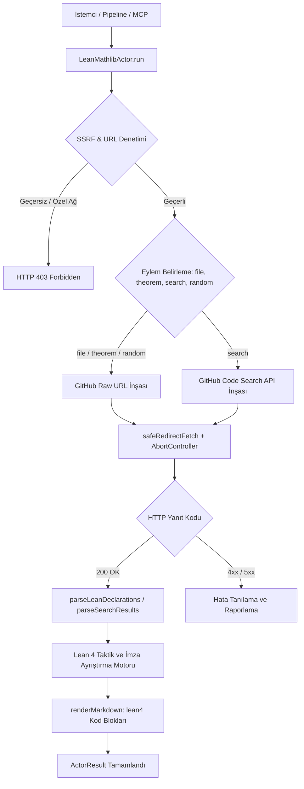
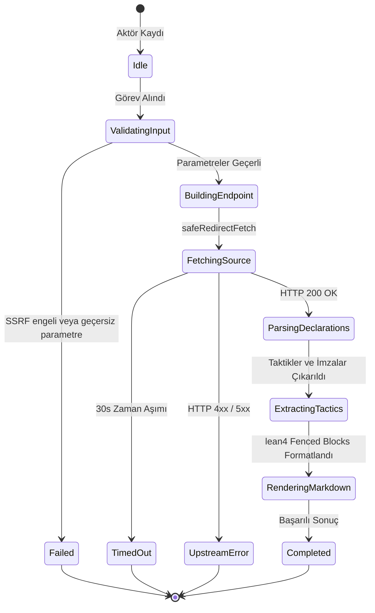

# Lean 4 ve Mathlib Formel Doğrulama Çıkarıcı (`lean-mathlib`)

Lean 4 ve Mathlib4 açık kaynak matematik kütüphanelerinden bilgisayar tarafından doğrulanabilir (machine-verified) teorem tanımları, lemmalar, aksiyomlar, tip imzaları ve taktik adımlarını (`rw`, `simp`, `exact`, `apply`, `induction`) yapılandırılmış olarak toplayan korpus aktörü.

---

## 1. Mimari Akış Şeması (Architecture Flowchart)



---

## 2. Sıra Diyagramı (Sequence Diagram)

```mermaid
sequenceDiagram
    autonumber
    participant Caller as Pipeline / MCP Caller
    participant Actor as LeanMathlibActor
    participant SSRF as SSRFGuard
    participant Fetcher as SafeRedirectFetcher
    participant API as GitHub Raw / Code Search API

    Caller->>Actor: run(task, context)
    Actor->>SSRF: validateUrlWithDns(targetUrl)
    SSRF-->>Actor: valid
    Actor->>Actor: resolveParameters(options)
    Actor->>Actor: buildEndpointUrl(resolved)
    Actor->>SSRF: validateUrlWithDns(endpoint)
    SSRF-->>Actor: valid
    Actor->>Fetcher: GET .lean dosya veya arama
    Fetcher->>API: HTTP GET (Bearer Token opsiyonel)
    API-->>Fetcher: 200 OK (Source Text / JSON)
    Fetcher-->>Actor: Response Stream
    Actor->>Actor: parseLeanDeclarations & extractTactics
    Actor->>Actor: renderMarkdown
    Actor-->>Caller: ActorResult<LeanMathlibActorResult>
```

---

## 3. Durum Makinesi (State Machine)



---

## 4. Girdi Parametreleri (Input Options)

| Parametre | Tip | Zorunlu | Varsayılan | Açıklama |
|---|---|---|---|---|
| `action` | `string` | Hayır | `"file"` | Çıkarma kipi: `"file"` (dosya incelemesi), `"theorem"`, `"search"`, `"random"`. |
| `repo` | `string` | Hayır | `"leanprover-community/mathlib4"` | Hedef GitHub ambarı. |
| `path` | `string` | Hayır | `"Mathlib/Data/Nat/Basic.lean"` | Ambar içi `.lean` dosya yolu. |
| `theorem` | `string` | Hayır | – | Ayıklanacak spesifik teorem/lemma adı. |
| `query` | `string` | Hayır | – | Arama anahtar sözcüğü (`action="search"` durumunda). |
| `limit` | `number` | Hayır | `20` | Çıkarılacak maksimum bildirim sayısı (1-100). |
| `githubToken` | `string` | Hayır | `process.env.GITHUB_TOKEN` | İsteğe bağlı GitHub Personal Access Token. |
| `targetUrl` | `string` | Hayır | – | Doğrudan dosya indirme veya test uç noktası. |
| `timeoutMs` | `number` | Hayır | `30000` | İstek zaman aşımı süresi (milisaniye). |

---

## 5. Çıktı Sözleşmesi (Output Contract)

```typescript
export interface LeanMathlibItem {
  name: string;
  kind: "theorem" | "lemma" | "def" | "axiom" | "instance" | string;
  docstring?: string;
  signature: string;
  proof?: string;
  tactics?: string[];
  code: string;
  file?: string;
  repo: string;
  url: string;
}

export interface LeanMathlibActorResult {
  action: string;
  repo: string;
  totalDeclarations: number;
  items: LeanMathlibItem[];
  queryUrl: string;
  markdown?: string;
}
```

---

## 6. Güvenlik ve SSRF İnvariantları

1. **DNS Hop-by-Hop Doğrulama:** `SSRFGuard.validateUrlWithDns` kontrolü ile döngüsel ağlar (`127.0.0.1`), metadata servisleri (`169.254.169.254`) ve RFC 1918 adresleri engellenir.
2. **Kimlik Belirteci Güvenliği:** `githubToken` bilgisi log veya Markdown çıktılarında maskelenir.
3. **Zaman Aşımı Güvenliği:** `AbortController` 30 saniye sonra tetiklenerek açık ağ soketi kalması önlenir.

---

## 7. Lean 4 Bildirim ve Taktik Ayrıştırma Motoru

- **Docstring Ayrıştırma:** `/-- ... -/` blokları doğrudan ilgili bildirimin dokümantasyonu olarak bağlanır.
- **Bildirim Türleri:** `theorem`, `lemma`, `def`, `axiom`, `instance` anahtar sözcükleri tespit edilir.
- **Taktik Çıkarımı:** `:= by` bloğu altındaki her satır (`rw [...]`, `simp`, `exact`, `apply`, `induction`) bağımsız bir kanıt adımı olarak `tactics[]` dizisine aktarılır.

---

## 8. REST API Uç Noktası

- **Yol:** `POST /api/v1/lean-mathlib` (Takma Ad: `POST /lean-mathlib`)
- **İstek Gövdesi:**
  ```json
  {
    "action": "file",
    "repo": "leanprover-community/mathlib4",
    "path": "Mathlib/Data/Nat/Basic.lean",
    "limit": 20
  }
  ```

---

## 9. MCP Araç Entegrasyonu

- **Araç Adı:** `query_lean_mathlib`
- **Kullanım:** Claude Code veya Gemini Agent üzerinden doğrudan çağrılabilir:
  ```json
  {
    "name": "query_lean_mathlib",
    "arguments": {
      "path": "Mathlib/Algebra/Group/Basic.lean",
      "limit": 10
    }
  }
  ```

---

## 10. Kendi Kendini İyileştirme ve Hata Matrisi (Self-Healing Matrix)

| Hata Kodu / Durum | Olası Kök Neden | İyileştirme / Çözüm Yolu |
|---|---|---|
| `404 NOT_FOUND` | Belirtilen `.lean` dosya yolu ambarda mevcut değil | Mathlib4 dosya yolunu doğrula (ör. `Mathlib/Data/Nat/Basic.lean`). |
| `403 RATE_LIMIT` | GitHub API saatlik istek sınırı aşıldı | `githubToken` parametresi sağlayarak kota limitini artır. |
| `500 UPSTREAM_ERROR` | GitHub kesintisi veya geçersiz yanıt | Yeniden deneme mekanizmasını tetikle. |

---

## 11. Performans ve Bellek Profili

- **Hafif Ayrıştırıcı:** Büyük derleyici veya harici AST motoru yerine doğrudan durumlu regex ayrıştırıcı kullanılır; CPU ve bellek yükü düşüktür (< 15 MB).
- **Deterministik Markdown:** 50 adet formel teorem ve kanıt adımları < 10 ms sürede GFM formatına dönüştürülür.
