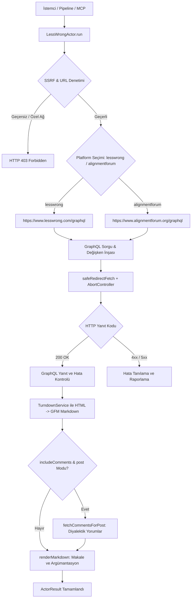
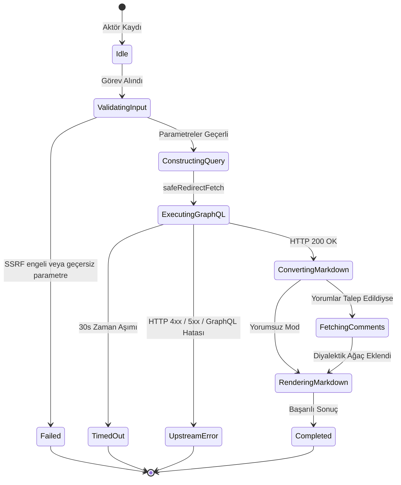

# Epistemik Rasyonalite ve Yapay Zeka Hizalaması Çıkarıcı (`lesswrong`)

LessWrong ve Alignment Forum platformlarının GraphQL API'leri üzerinden Bayesyen epistemoloji, karar teorisi, bilişsel önyargılar, analitik felsefe ve yapay zeka güvenliği/hizalaması (AI alignment) makaleleri ile diyalektik argümantasyon yorum ağaçlarını yapılandırılmış olarak toplayan korpus aktörü.

---

## 1. Mimari Akış Şeması (Architecture Flowchart)



---

## 2. Sıra Diyagramı (Sequence Diagram)

```mermaid
sequenceDiagram
    autonumber
    participant Caller as Pipeline / MCP Caller
    participant Actor as LessWrongActor
    participant SSRF as SSRFGuard
    participant Fetcher as SafeRedirectFetcher
    participant API as LessWrong / Alignment Forum GraphQL API

    Caller->>Actor: run(task, context)
    Actor->>SSRF: validateUrlWithDns(targetUrl)
    SSRF-->>Actor: valid
    Actor->>Actor: resolveParameters(options)
    Actor->>Actor: buildEndpointUrl(platform)
    Actor->>SSRF: validateUrlWithDns(endpoint)
    SSRF-->>Actor: valid
    Actor->>Actor: buildGraphQLPayload(action, terms)
    Actor->>Fetcher: POST /graphql (JSON Query Body)
    Fetcher->>API: HTTP POST
    API-->>Fetcher: 200 OK (GraphQL JSON)
    Fetcher-->>Actor: Response Stream
    Actor->>Actor: parseGraphQLResponse & turndownMarkdown
    opt includeComments ve action=post
        Actor->>Fetcher: POST /graphql (Comments Query)
        Fetcher->>API: HTTP POST (Comments)
        API-->>Fetcher: 200 OK (Comments JSON)
        Fetcher-->>Actor: Comments Payload
    end
    Actor->>Actor: renderMarkdown
    Actor-->>Caller: ActorResult<LessWrongActorResult>
```

---

## 3. Durum Makinesi (State Machine)



---

## 4. Girdi Parametreleri (Input Options)

| Parametre | Tip | Zorunlu | Varsayılan | Açıklama |
|---|---|---|---|---|
| `action` | `string` | Hayır | `"posts"` | Çıkarma kipi: `"posts"` (liste), `"post"` (tekil makale), `"comments"`, `"search"`. |
| `platform` | `string` | Hayır | `"lesswrong"` | Hedef platform: `"lesswrong"` veya `"alignmentforum"`. |
| `postId` | `string` | Hayır | – | Hedef gönderi kimliği (`action="post"` veya `"comments"` için). |
| `slug` | `string` | Hayır | – | Gönderi URL başlık kısaltması. |
| `query` | `string` | Hayır | – | Anahtar kelime arama sorgusu (`action="search"` için). |
| `view` | `string` | Hayır | `"curated"` | Gönderi sıralaması: `"curated"` (küratör onaylı), `"top"`, `"new"`. |
| `limit` | `number` | Hayır | `10` | Çıkarılacak maksimum makale/yorum adedi (1-50). |
| `includeComments` | `boolean` | Hayır | `true` | Tekil makale modunda en yüksek puanlı yorumları dahil etme. |
| `maxComments` | `number` | Hayır | `10` | Makale başına çekilecek maksimum yorum adedi (1-50). |
| `targetUrl` | `string` | Hayır | – | Doğrudan LessWrong veya AlignmentForum URL'si. |
| `timeoutMs` | `number` | Hayır | `30000` | İstek zaman aşımı süresi (milisaniye). |

---

## 5. Çıktı Sözleşmesi (Output Contract)

```typescript
export interface LessWrongComment {
  id: string;
  postId?: string;
  parentCommentId?: string;
  author: string;
  postedAt: string;
  score: number;
  contentMarkdown: string;
}

export interface LessWrongPost {
  id: string;
  title: string;
  slug: string;
  url: string;
  author: string;
  postedAt: string;
  score: number;
  voteCount?: number;
  commentCount?: number;
  contentMarkdown?: string;
  comments?: LessWrongComment[];
}

export interface LessWrongActorResult {
  action: string;
  platform: string;
  totalResults: number;
  posts: LessWrongPost[];
  comments?: LessWrongComment[];
  queryUrl: string;
  markdown?: string;
}
```

---

## 6. Güvenlik ve SSRF İnvariantları

1. **DNS Hop-by-Hop Doğrulama:** `SSRFGuard.validateUrlWithDns` kontrolü ile döngüsel ağlar (`127.0.0.1`), metadata servisleri (`169.254.169.254`) ve RFC 1918 adresleri engellenir.
2. **Kullanıcı Aracısı (User-Agent):** `protokol-7/1.0 (LessWrong Epistemic Harvester)` kimliği ile GraphQL uç noktalarına erişilir.
3. **Zaman Aşımı Güvenliği:** `AbortController` 30 saniye sonra tetiklenerek açık ağ soketi kalması önlenir.

---

## 7. HTML'den Markdown'a Temiz Dönüştürme

- **TurndownService Entegrasyonu:** HTML içeriği (`htmlBody`), ATX stili başlıklar (`#`, `##`) ve çitli kod blokları (` ``` `) ile temiz GFM Markdown'a dönüştürülür.
- **Diyalektik Argümantasyon:** Yorumlar alıntı (`>`) blokları ve hiyerarşik yapı ile yazar ve puan bilgileri korunarak Markdown metnine eklenir.

---

## 8. REST API Uç Noktası

- **Yol:** `POST /api/v1/lesswrong` (Takma Ad: `POST /lesswrong`)
- **İstek Gövdesi:**
  ```json
  {
    "action": "posts",
    "platform": "lesswrong",
    "view": "curated",
    "limit": 10
  }
  ```

---

## 9. MCP Araç Entegrasyonu

- **Araç Adı:** `query_lesswrong`
- **Kullanım:** Claude Code veya Gemini Agent üzerinden doğrudan çağrılabilir:
  ```json
  {
    "name": "query_lesswrong",
    "arguments": {
      "action": "posts",
      "platform": "alignmentforum",
      "limit": 5
    }
  }
  ```

---

## 10. Kendi Kendini İyileştirme ve Hata Matrisi (Self-Healing Matrix)

| Hata Kodu / Durum | Olası Kök Neden | İyileştirme / Çözüm Yolu |
|---|---|---|
| `400 GRAPHQL_ERROR` | Geçersiz sorgu veya bilinmeyen view alanı | `view` değerini kontrol et (`curated`, `top`, `new`). |
| `404 NOT_FOUND` | Belirtilen `postId` veya `slug` bulunamadı | Gönderi kimliğini veya URL slug'ını doğrula. |
| `429 RATE_LIMIT` | GraphQL API istek sınırı aşıldı | İstek aralığını artır veya `limit` parametresini düşür. |
| `500 UPSTREAM_ERROR` | LessWrong sunucu kesintisi | Yeniden deneme mekanizmasını tetikle. |

---

## 11. Performans ve Bellek Profili

- **Hafif ve Hızlı:** GraphQL sorguları yalnızca ihtiyaç duyulan alanları (`results._id`, `title`, `htmlBody`, `user`) çeker.
- **Bellek Tüketimi:** Ortalama bir makale ve yorum yükü ~50-200 KB olup tepe bellek kullanımı < 15 MB düzeyindedir.
