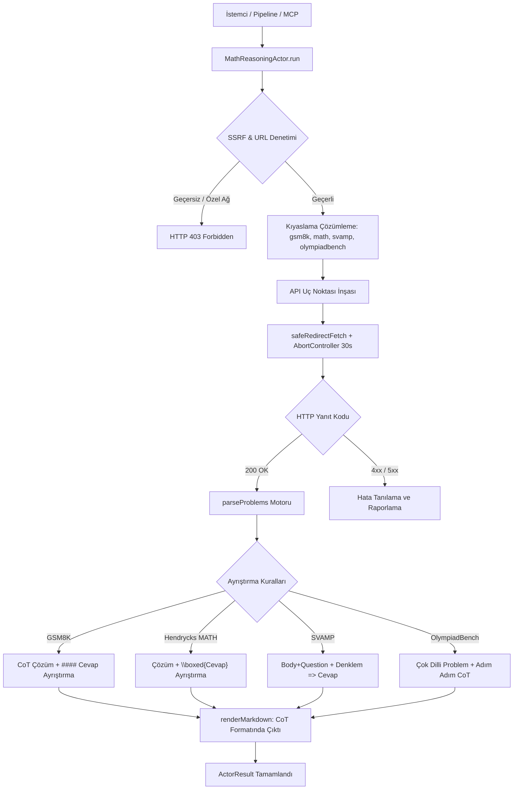
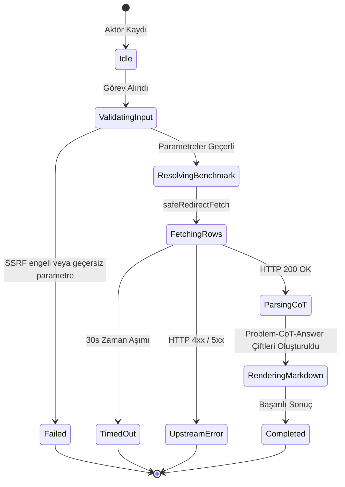

# Matematiksel Muhakeme ve CoT Çıkarıcı (`math-reasoning`)

Matematiksel problem çözme, çok adımlı düşünce zinciri (Chain-of-Thought - CoT), LaTeX denklemleri ve kesin cevap ayrıştırması gerçekleştiren (GSM8K, Hendrycks MATH, SVAMP, OlympiadBench) korpus aktörü.

---

## 1. Mimari Akış Şeması (Architecture Flowchart)



---

## 2. Sıra Diyagramı (Sequence Diagram)

```mermaid
sequenceDiagram
    autonumber
    participant Caller as Pipeline / MCP Caller
    participant Actor as MathReasoningActor
    participant SSRF as SSRFGuard
    participant Fetcher as SafeRedirectFetcher
    participant API as Datasets Server (Hugging Face)

    Caller->>Actor: run(task, context)
    Actor->>SSRF: validateUrlWithDns(targetUrl)
    SSRF-->>Actor: valid
    Actor->>Actor: resolveParameters(options)
    Actor->>Actor: buildEndpointUrl(resolved)
    Actor->>SSRF: validateUrlWithDns(endpoint)
    SSRF-->>Actor: valid
    Actor->>Fetcher: GET /rows (GSM8K, MATH, SVAMP, etc.)
    Fetcher->>API: HTTP GET (Bearer Token opsiyonel)
    API-->>Fetcher: 200 OK (JSON Rows Payload)
    Fetcher-->>Actor: Response Payload
    Actor->>Actor: parseProblems & renderMarkdown
    Actor-->>Caller: ActorResult<MathReasoningActorResult>
```

---

## 3. Durum Makinesi (State Machine)



---

## 4. Girdi Parametreleri (Input Options)

| Parametre | Tip | Zorunlu | Varsayılan | Açıklama |
|---|---|---|---|---|
| `benchmark` | `string` | Hayır | `"gsm8k"` | Hedef matematik kıyaslama kümesi (`"gsm8k"`, `"math"`, `"svamp"`, `"olympiadbench"`). |
| `subject` | `string` | Hayır | – | Alt konu veya kategori (ör. Hendrycks MATH için `"algebra"`, `"geometry"`). |
| `split` | `string` | Hayır | `"train"` | Veri seti dilimi (`"train"`, `"test"`). |
| `offset` | `number` | Hayır | `0` | Başlangıç satır ofseti. |
| `limit` | `number` | Hayır | `20` | Çekilecek maksimum soru-cevap çifti adedi (1-100). |
| `hfToken` | `string` | Hayır | `process.env.HF_TOKEN` | İsteğe bağlı Hugging Face kimlik doğrulama belirteci. |
| `targetUrl` | `string` | Hayır | – | Doğrudan dataset API veya depo bağlantısı. |
| `timeoutMs` | `number` | Hayır | `30000` | İstek zaman aşımı süresi (milisaniye). |

---

## 5. Çıktı Sözleşmesi (Output Contract)

```typescript
export interface MathReasoningItem {
  problem: string;
  reasoning: string;
  answer: string;
  subject?: string;
  level?: string;
  solutionSteps?: string[];
  latexExpressions?: string[];
  raw?: Record<string, unknown>;
}

export interface MathReasoningActorResult {
  benchmark: string;
  subject?: string;
  split: string;
  totalProblems: number;
  offset: number;
  limit: number;
  problems: MathReasoningItem[];
  queryUrl: string;
  markdown?: string;
}
```

---

## 6. Güvenlik ve SSRF İnvariantları

1. **DNS Hop-by-Hop Doğrulama:** `SSRFGuard.validateUrlWithDns` kontrolü ile döngüsel ağlar (`127.0.0.1`), metadata servisleri (`169.254.169.254`) ve RFC 1918 adresleri engellenir.
2. **Kimlik Belirteci Güvenliği:** `hfToken` ve `HF_TOKEN` verileri sistem günlüklerinden ve Markdown tablolarından arındırılır.
3. **Zaman Aşımı Güvenliği:** `AbortController` 30 saniye sonra tetiklenerek açık soket kalması önlenir.

---

## 7. Desteklenen Matematiksel Kıyaslama Kümeleri

- **GSM8K (`openai/gsm8k`):** İlkokul seviyesi çok adımlı matematik problemleri. Çözüm içerisindeki `#### <answer>` deseni ayrıştırılarak `reasoning` ve `answer` ayrıştırılır.
- **Hendrycks MATH (`EleutherAI/hendrycks_math`):** Lise yarışma seviyesi ileri matematik. Çözüm içerisindeki `\boxed{...}` LaTeX deseni ayrıştırılarak nihai cevap ve adımlar oluşturulur.
- **SVAMP (`ChilleD/SVAMP`):** Basit kelime problemleri varyasyonları. Soru gövdesi ve alt soru birleştirilir, denklem ve sayısal cevap ayrıştırılır.
- **OlympiadBench (`HuggingFaceH4/OlympiadBench`):** Uluslararası olimpiyat düzeyinde iki dilli matematik ve fizik problemleri.

---

## 8. REST API Uç Noktası

- **Yol:** `POST /api/v1/math-reasoning` (Takma Ad: `POST /math-reasoning`)
- **İstek Gövdesi:**
  ```json
  {
    "benchmark": "gsm8k",
    "split": "train",
    "offset": 0,
    "limit": 20
  }
  ```

---

## 9. MCP Araç Entegrasyonu

- **Araç Adı:** `query_math_reasoning`
- **Kullanım:** Claude Code veya Gemini Agent üzerinden doğrudan çağrılabilir:
  ```json
  {
    "name": "query_math_reasoning",
    "arguments": {
      "benchmark": "math",
      "subject": "algebra",
      "limit": 10
    }
  }
  ```

---

## 10. Kendi Kendini İyileştirme ve Hata Matrisi (Self-Healing Matrix)

| Hata Kodu / Durum | Olası Kök Neden | İyileştirme / Çözüm Yolu |
|---|---|---|
| `400 INVALID_BENCHMARK` | Desteklenmeyen bir kıyaslama adı girilmiş | Desteklenen kümelerden birini seç (`gsm8k`, `math`, `svamp`, `olympiadbench`). |
| `404 NOT_FOUND` | Konfigürasyon veya split mevcut değil | `split` değerini (`train` veya `test`) kontrol et. |
| `429 RATE_LIMIT` | Hugging Face datasets-server hız sınırı aşıldı | `hfToken` sağla veya istek aralığını artır. |
| `500 UPSTREAM_ERROR` | Hugging Face servis kesintisi | Yeniden deneme mekanizmasını tetikle. |

---

## 11. Performans ve Bellek Profili

- **Düşük Ağ ve Bellek Ayak İzi:** Parquet arşivlerinin tamamı indirilmez; yalnızca istenen ofset ve satır aralığı akıtılır (~5-15 MB RAM).
- **Deterministik CoT Render Hızı:** 50 adet matematik probleminin düşünce adımları ve LaTeX blokları < 4 ms sürede Markdown'a dönüştürülür.
