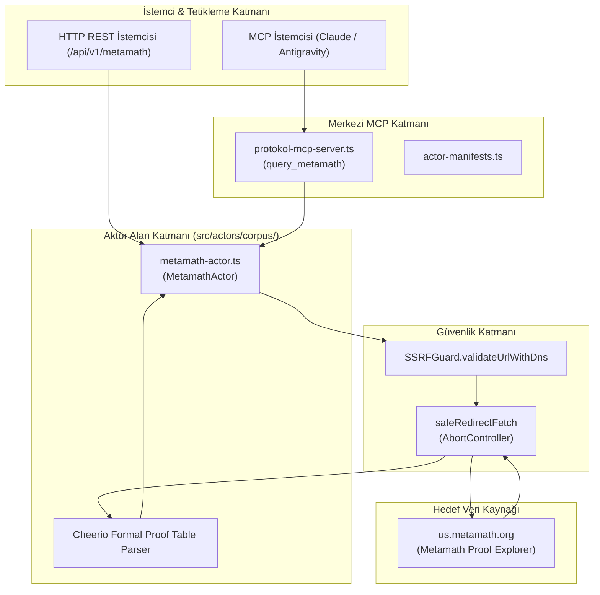
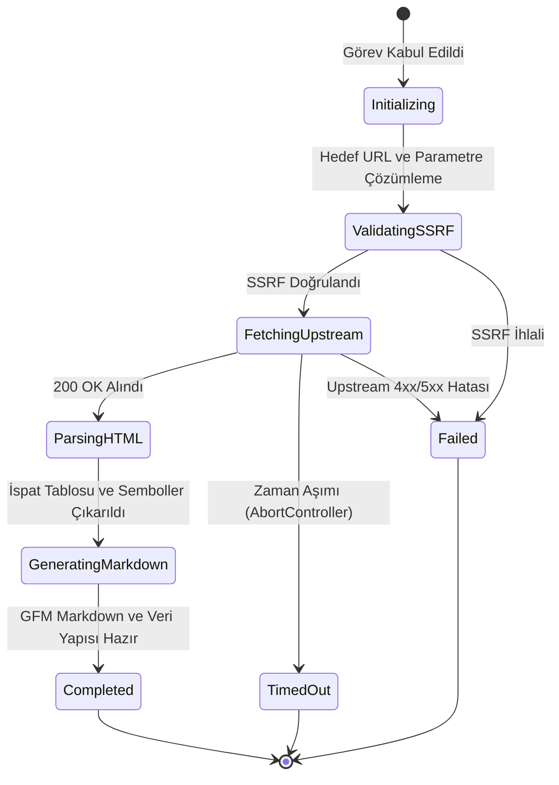

# metamath — Teknik Wiki ve Çalışma Şartnamesi

## 1. Metadata ve Sınıflandırma

| Alan | Değer |
|---|---|
| **Aktör Tanımlayıcı (Type)** | `metamath` |
| **Kategori** | `corpus` |
| **Sürüm** | `1.0.0` |
| **Birincil Sınıf** | `MetamathActor` (`src/actors/corpus/metamath-actor.ts`) |
| **Protokol / Kaynak** | HTTP / HTML Scraping (`us.metamath.org`) |
| **Hedef Çıktı Biçimi** | `GFM Markdown` & Formal Proof Tables |
| **MCP Aracı** | `query_metamath` (`src/mcp/protokol-mcp-server.ts`) |
| **Test Dosyası** | `tests/metamath-actor.test.ts` |

---

## 2. Mekanizma ve Teknik Genel Bakış

`MetamathActor`, bilgisayar tarafından doğrulanabilir biçimsel matematik (formal mathematics) alanında öncü olan Metamath Proof Explorer veritabanları (`set.mm`, `iset.mm`, `ql.mm`) üzerindeki 40.000'den fazla biçimsel teoremi, aksiyomları, hipotezleri ve adım adım doğrulama zincirlerini toplayan bir korpus aktörüdür.

Metamath, Zermelo-Fraenkel küme kuramı (ZFC) ve klasik mantık üzerine inşa edilmiş saf sembolik çıkarım adımları içerir. Bu veri, LLM'lerin Chain-of-Thought muhakemesi, biçimsel teorem kanıtlama ve sembolik akıl yürütme kabiliyetleri için emsalsiz bir kaynaktır.

Desteklenen eylemler:
1. `theorem`: Belirtilen bir teorem sembolü (ör. `mpc2`, `pythag`, `dtru`) için açıklama metnini, temel hipotezleri (`$e`, `$d`), sonuç önermesini (`Assertion`) ve adım adım doğrulama tablosunu (Step, Hyp, Ref, Expression) çekerek yapılandırılmış nesne ve GFM Markdown tablosu olarak sunar.
2. `search`: Teorem isimleri ve sembolleri üzerinde arama yapar (`mmfind.html`).
3. `axiom`: Biçimsel aksiyom tanımlarını (ör. `ax-1`, `ax-mp`) ayrıştırır.

---

## 3. Mimari ve Bileşen Sınırları



---

## 4. Sıralı İşlem Akışı (Sequence Diagram)

```mermaid
sequenceDiagram
    autonumber
    participant Client as İstemci (REST / MCP)
    participant Server as REST Sunucu / MCP Sunucu
    participant Actor as MetamathActor
    participant Guard as SSRFGuard
    participant Fetcher as safeRedirectFetch
    participant Upstream as us.metamath.org

    Client->>Server: POST /api/v1/metamath (theorem: "mpc2", database: "set.mm")
    Server->>Actor: run(task, context)
    Actor->>Guard: validateUrlWithDns(endpoint)
    Guard-->>Actor: valid: true
    Actor->>Fetcher: safeRedirectFetch(endpoint)
    Fetcher->>Upstream: GET /mpeuni/mpc2.html
    Upstream-->>Fetcher: 200 OK (HTML)
    Fetcher-->>Actor: HTML Yanıtı
    Actor->>Actor: Cheerio ayrıştırma (açıklama, hipotezler, assertion, proof steps, cross-refs)
    Actor-->>Server: ActorResult (completed, status 200, data)
    Server-->>Client: 200 OK JSON (theorem, markdown)
```

---

## 5. Durum Geçiş Modeli (State Diagram)



---

## 6. Güvenlik İnvariantları ve Kısıtlar

1. **SSRF Koruması:** `us.metamath.org` ve doğrudan sağlanan URL'ler hop-by-hop doğrulanır.
2. **Sembolik Bütünlük:** Turnstile (`⊢`), mantıksal bağlaçlar (`→`, `∧`, `∨`, `¬`) ve küme sembolleri (`∈`, `⊆`) Unicode karakterleri korunarak aktarılır.
3. **Zaman Aşımı ve Kaynak Kontrolü:** 30.000 ms zaman aşımı ile askıda kalan ağ bağlantıları kesilir.
