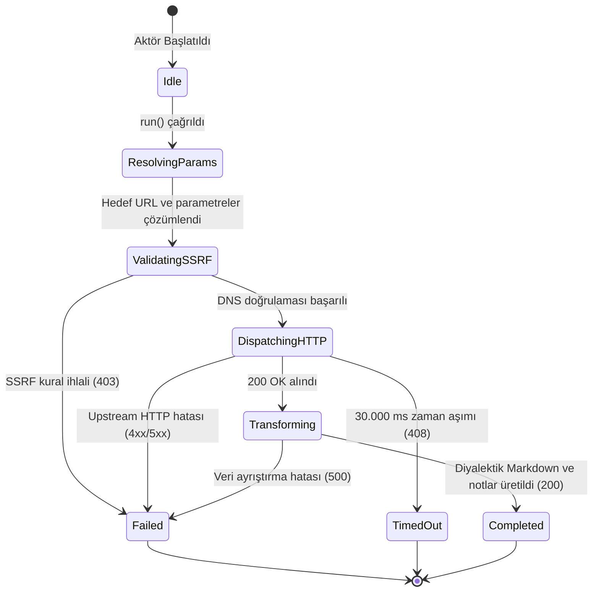

# OpenReview — Teknik Wiki ve Çalışma Şartnamesi

## 1. Metadata ve Sınıflandırma

| Alan | Değer |
|---|---|
| **Aktör Tanımlayıcı (Type)** | `openreview` |
| **Kategori** | `corpus` |
| **Sürüm** | `1.0.0` |
| **Birincil Sınıf** | `OpenReviewActor` (`src/actors/corpus/openreview-actor.ts`) |
| **Protokol / Kaynak** | OpenReview REST API v2 / v1 (`https://api2.openreview.net`, `https://api.openreview.net`) |
| **Hedef Çıktı Biçimi** | `GFM Markdown` \| `Structured JSON` |
| **MCP Aracı** | `query_openreview` (`src/mcp/protokol-mcp-server.ts`) |
| **Test Dosyası** | `tests/openreview-actor.test.ts` |

---

## 2. Mekanizma ve Teknik Genel Bakış

`OpenReviewActor`, OpenReview akademik hakemlik platformu (ICLR, NeurIPS, ICML) üzerindeki yayın başvurularını, resmi hakem değerlendirmelerini, puanlama ve güven metriklerini, yazar yanıtlarını (rebuttals), alan yöneticisi (meta-reviewer) özetlerini ve nihai kabul/ret kararlarını toplayan bir LLM eğitim korpusu çıkarıcısıdır.

Aktör, resmi OpenReview API v2 (`https://api2.openreview.net`) ve API v1 (`https://api.openreview.net`) uç noktalarını sorgular. Üç temel eylemi destekler:
- `submissions`: Belirtilen konferans veya venue koduna (ör. `ICLR.cc/2024/Conference`) ait tüm makale başvurularını veya arama sorgusu ile eşleşen bildirileri listeler.
- `forum`: Belirli bir makale `forumId` tanımlayıcısına bağlı tüm hakemlik ağacını (makale künyesi, özet, hakem incelemeleri, güven puanları, yazar yanıtları ve nihai karar) diyalektik bir yapıda çeker.
- `note`: Tekil bir not veya hakem değerlendirmesini ID üzerinden getirir.

Çıktı, hem makine tarafından işlenebilir yapılandırılmış JSON nesneleri (`OpenReviewNoteItem[]`) hem de LLM'lerin bilimsel muhakeme, karşıt görüş değerlendirmesi ve argümantasyon eğitimine hazır GFM (GitHub Flavored Markdown) formatında üretilir.

---

## 3. Mimari ve Bileşen Sınırları (Mermaid Flowchart)

```mermaid
flowchart TD
    subgraph Ingestion["İstemci & Tetikleme Katmanı"]
        MCP["MCP İstemcisi (Claude / Antigravity)"]
        REST["HTTP REST İstemcisi (/api/v1/openreview)"]
        Pipeline["Boru Hattı Yürütücüsü (PipelineRunner)"]
    end

    subgraph CentralMCP["Merkezi MCP Katmanı (src/mcp/)"]
        MCPServer["protokol-mcp-server.ts<br/>(query_openreview)"]
        Manifest["actor-manifests.ts<br/>(Declarative Manifest)"]
    end

    subgraph ActorCore["Aktör Alan Katmanı (src/actors/corpus/)"]
        ActorCore["openreview-actor.ts<br/>(OpenReviewActor)"]
        Parser["parseNotes<br/>(v1/v2 Content Wrapper Normalizer)"]
        MarkdownRenderer["renderMarkdown<br/>(Dialectic GFM Engine)"]
    end

    subgraph SecurityPerimeter["Güvenlik ve Çevre Katmanı"]
        SSRF["SSRFGuard.validateUrlWithDns<br/>(DNS Pinning / RFC 1918 Blokajı)"]
        Fetch["safeRedirectFetch<br/>(Hop-by-hop Doğrulama / AbortController)"]
    end

    subgraph UpstreamTarget["Hedef Veri Kaynağı"]
        TargetAPI["OpenReview REST API (api2.openreview.net)"]
    end

    MCP --> MCPServer
    MCPServer --> Manifest
    MCPServer --> ActorCore
    REST --> ActorCore
    Pipeline --> ActorCore
    ActorCore --> SSRF
    SSRF --> Fetch
    Fetch --> TargetAPI
    TargetAPI --> Parser
    Parser --> MarkdownRenderer
    MarkdownRenderer --> ActorCore
```

---

## 4. İstek Yaşam Döngüsü ve Sıra Şeması (Mermaid Sequence Diagram)

```mermaid
sequenceDiagram
    autonumber
    participant Client as Çağırıcı (MCP / REST / Test)
    participant Actor as OpenReviewActor
    participant SSRF as SSRFGuard (DNS Pinning)
    participant Net as safeRedirectFetch
    participant OpenReview as OpenReview API (api2.openreview.net)

    Client->>Actor: run(task, context)
    Actor->>Actor: resolveParameters(targetUrl, options)
    Actor->>Actor: buildEndpointUrl(action, venue, forumId, query, limit)
    Actor->>SSRF: validateUrlWithDns(endpoint)
    alt SSRF Engeli (RFC 1918 / Cloud Metadata)
        SSRF-->>Actor: { valid: false, reason }
        Actor-->>Client: ActorResult (status: "failed", statusCode: 403)
    else Güvenli IP Doğrulandı
        SSRF-->>Actor: { valid: true }
        Actor->>Net: safeRedirectFetch(endpoint, headers: { User-Agent })
        Net->>OpenReview: GET /notes?...
        OpenReview-->>Net: HTTP Yanıtı (200 OK / JSON)
        Net-->>Actor: Ham Yanıt Verisi
        Actor->>Actor: parseNotes() & normalizasyon (v1/v2)
        Actor->>Actor: renderMarkdown() (Diyalektik Hakem/Yazar Hiyerarşisi)
        Actor-->>Client: ActorResult (status: "completed", statusCode: 200, markdown, notes)
    end
```

---

## 5. Durum Makinesi (Mermaid State Diagram)



---

## 6. Güvenlik İnvariantları ve Çalışma Kuralları

1. **SSRF Koruması (Mandatory Invariant):**
   * İstek atılacak URL doğrudan dışarıdan sağlansa da, içsel olarak oluşturulsa da her iki aşamada `SSRFGuard.validateUrlWithDns` fonksiyonundan geçirilir.
   * `allowLocalNetwork` parametresi sadece `NODE_ENV === "test"` durumunda aktiftir; üretim ortamında intranet ve bulut metadata adreslerine erişim engellenir.
2. **Hop-by-Hop Yönlendirme Denetimi:**
   * Doğrudan yerel `fetch()` kullanılmaz; `safeRedirectFetch` ile yönlendirmeler tek tek izlenip her adımda DNS IP kontrolü yapılır.
3. **Zaman Aşımı ve Kaynak Tahsisi:**
   * `DEFAULT_TIMEOUT_MS = 30_000` (30 saniye) kuralı geçerlidir.
   * Süre dolduğunda `AbortController` soketi derhal sonlandırır.
4. **Kullanıcı Aracısı:**
   * Tüm upstream çağrılarında `"User-Agent": "Mozilla/5.0 (compatible; Protokol7Scraper/1.0; +https://protokol-7.local)"` başlığı kullanılır.

---

## 7. Tip Sözleşmesi ve Girdi/Çıktı Şemaları

### Girdi Seçenekleri (`OpenReviewActorTaskOptions`)

```typescript
export interface OpenReviewActorTaskOptions {
  action?: "submissions" | "forum" | "note";
  venue?: string;
  forumId?: string;
  noteId?: string;
  query?: string;
  limit?: number;
  targetUrl?: string;
  timeoutMs?: number;
}
```

### Not Modeli (`OpenReviewNoteItem`)

```typescript
export interface OpenReviewNoteItem {
  id: string;
  forum?: string;
  replyto?: string;
  invitation?: string;
  title?: string;
  authors?: string[];
  abstract?: string;
  venue?: string;
  year?: number;
  pdfUrl?: string;
  rating?: string;
  confidence?: string;
  decision?: string;
  comment?: string;
  content?: Record<string, unknown>;
  createdAt?: string | number;
}
```

### Çıktı Modeli (`OpenReviewActorResult`)

```typescript
export interface OpenReviewActorResult {
  action: string;
  venue?: string;
  forumId?: string;
  totalCount: number;
  notes: OpenReviewNoteItem[];
  queryUrl: string;
  markdown?: string;
}
```

---

## 8. Aktör MCP Entegrasyonu

Aktörün MCP erişimi merkezi `src/mcp/protokol-mcp-server.ts` üzerinden ve `src/actors/actor-manifests.ts` bildirimsel şemasıyla yönetilir:

* **Araç Adı:** `query_openreview`
* **Sunucu Kaynağı:** `src/mcp/protokol-mcp-server.ts`
* **Bildirim:** `src/actors/actor-manifests.ts`
* **İşleyici:** `OpenReviewActor`
* **Girdi Şeması:** Standart JSON Schema nesnesi

---

## 9. Hata Kodları ve İyileştirme Matrisi (Self-Healing)

| HTTP / Durum Kodu | Açıklama | Kök Neden | Kendi Kendine İyileştirme Yolu |
|---|---|---|---|
| `400 Bad Request` | Geçersiz parametre | Desteklenmeyen eylem veya geçersiz forum ID | `action`, `venue` veya `forumId` alanlarını kontrol et |
| `403 Forbidden` | SSRF ihlali | Hedef IP yasaklı özel blokta veya bulut metadata adresinde | Hedef adresi doğrula; testte `NODE_ENV=test` sağla |
| `404 Not Found` | Forum veya makale bulunamadı | Belirtilen `forumId` veya `venue` OpenReview'da mevcut değil | Konferans kodunu veya forum ID'sini teyit et |
| `408 Request Timeout` | Zaman aşımı | OpenReview API 30 saniye içinde yanıt vermedi | `timeoutMs` süresini artır veya isteği tekrarla |
| `500 Internal Error` | Ayrıştırma hatası | Beklenmeyen API yanıt yapısı | Ham JSON yanıtını ve `parseNotes` metodunu incele |

---

## 10. Kullanım Örnekleri

### 10.1 cURL ile HTTP REST Çağrısı
```bash
curl -X POST http://127.0.0.1:4000/api/v1/openreview \
  -H "Content-Type: application/json" \
  -d '{"action": "submissions", "venue": "ICLR.cc/2024/Conference", "limit": 10}'
```

### 10.2 MCP JSON-RPC 2.0 Çağrısı
```json
{
  "jsonrpc": "2.0",
  "id": "openreview-req-1",
  "method": "tools/call",
  "params": {
    "name": "query_openreview",
    "arguments": {
      "action": "forum",
      "forumId": "XYZ123abc"
    }
  }
}
```

### 10.3 Programatik TypeScript Kullanımı
```typescript
import { OpenReviewActor } from "./openreview-actor";

const actor = new OpenReviewActor();
const result = await actor.run({
  taskId: "openreview-task-1",
  actorType: "openreview",
  targetUrl: "",
  options: {
    openreviewOptions: {
      action: "forum",
      forumId: "XYZ123abc",
    },
  },
}, { startTime: Date.now() });

console.log(result.data?.markdown);
```

---

## 11. Test Süiti ve Doğrulama

Test süiti `tests/openreview-actor.test.ts` dosyası aşağıdaki senaryoları kapsar:
1. Aktörün `openreview` tipi ve teknik açıklamasıyla başlatılması.
2. `targetUrl` ve opsiyonlardan parametre ve eylem çözümlemesi (`forum`, `submissions`, `note`).
3. Konferans, forum ve arama sorgusu için doğru upstream API URL'si inşası.
4. `169.254.169.254` adresine yönelik SSRF girişimlerinin 403 ile engellenmesi.
5. v1 ve v2 `value` sarmalı OpenReview notlarının ve makale listelerinin çözümlenmesi.
6. Kök makale, hakem puanları, güven metrikleri ve yazar yanıtlarını içeren diyalektik Markdown üretimi.
7. Upstream HTTP hatalarının (500) yönetilmesi.
