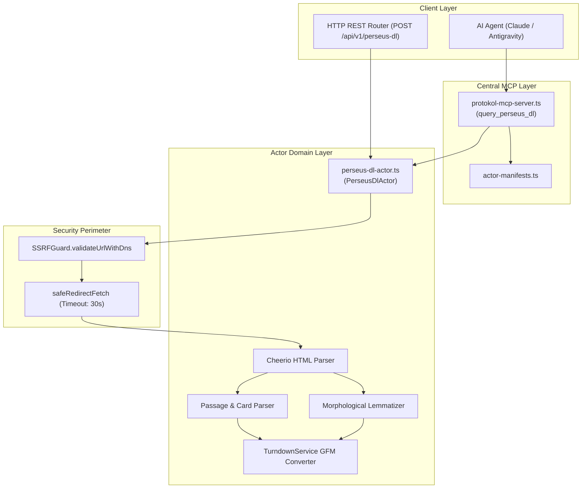

# Tufts Perseus Digital Library Actor — Technical Wiki and Specification

## 1. Metadata and Classification

| Field | Value |
|---|---|
| **Actor Type** | `perseus-dl` |
| **Category** | `corpus` (`src/actors/corpus/perseus-dl-actor.ts`) |
| **Version** | `1.0.0` |
| **Primary Class** | `PerseusDlActor` |
| **MCP Tool** | `query_perseus_dl` (`src/actors/actor-manifests.ts`) |
| **REST Endpoint** | `POST /api/v1/perseus-dl`, `POST /perseus-dl` |
| **Test Suite** | `tests/perseus-dl-actor.test.ts` |
| **Example Config**| `examples/actors/perseus-dl.json` |

---

## 2. Mechanism and Technical Overview

`PerseusDlActor` extracts classical literature, philological treatises, bilingual parallel editions, and morphological lemmatization data from the Tufts Perseus Hopper digital library (`www.perseus.tufts.edu`).

The actor supports three primary operational modes:
1. `text`: Extracts classical Greek, Latin, Hebrew, or Arabic passages indexed by Perseus document ID or Canonical Text Services (CTS) URN. Parses original text, card/line divisions, and parallel translations.
2. `morph`: Queries the Perseus Hopper morphological analysis engine (`/hopper/morph`) to analyze grammatical forms of classical words (lemma, part of speech, case, number, gender, tense, voice, mood, person).
3. `search`: Traverses catalog search results (`/hopper/searchresults`) to locate classical authors, works, and editions across the Perseus corpus.

---

## 3. Architecture and Component Boundaries



---

## 4. Actions and Input Parameters

| Parameter | Type | Required? | Description |
|---|---|---|---|
| `action` | `string` | No | `text`, `morph`, or `search` (default: `text`). |
| `doc` | `string` | No | Perseus document ID or CTS-URN (e.g. `Perseus:text:1999.01.0133:book=1:card=1`). |
| `subReference` | `string` | No | Sub-reference or card specification (e.g. `book=1:card=1`). |
| `word` | `string` | No | Word lemma to analyze morphologically (e.g. `logos`, `arma`). |
| `language` | `string` | No | Classical language (`greek`, `latin`, `hebrew`, `arabic`). |
| `query` | `string` | No | Catalog search query. |
| `limit` | `number` | No | Maximum search items to return (default: 20). |
| `targetUrl` | `string` | No | Direct Perseus Hopper URL. |

---

## 5. Output Schema and Data Structure

```typescript
export interface PerseusDlActorResult {
  action: PerseusDlAction;
  queryUrl: string;
  totalResults: number;
  passage?: PerseusTextPassage;
  morphAnalysis?: PerseusMorphAnalysis[];
  searchResults?: PerseusSearchResultItem[];
  markdown?: string;
}
```
