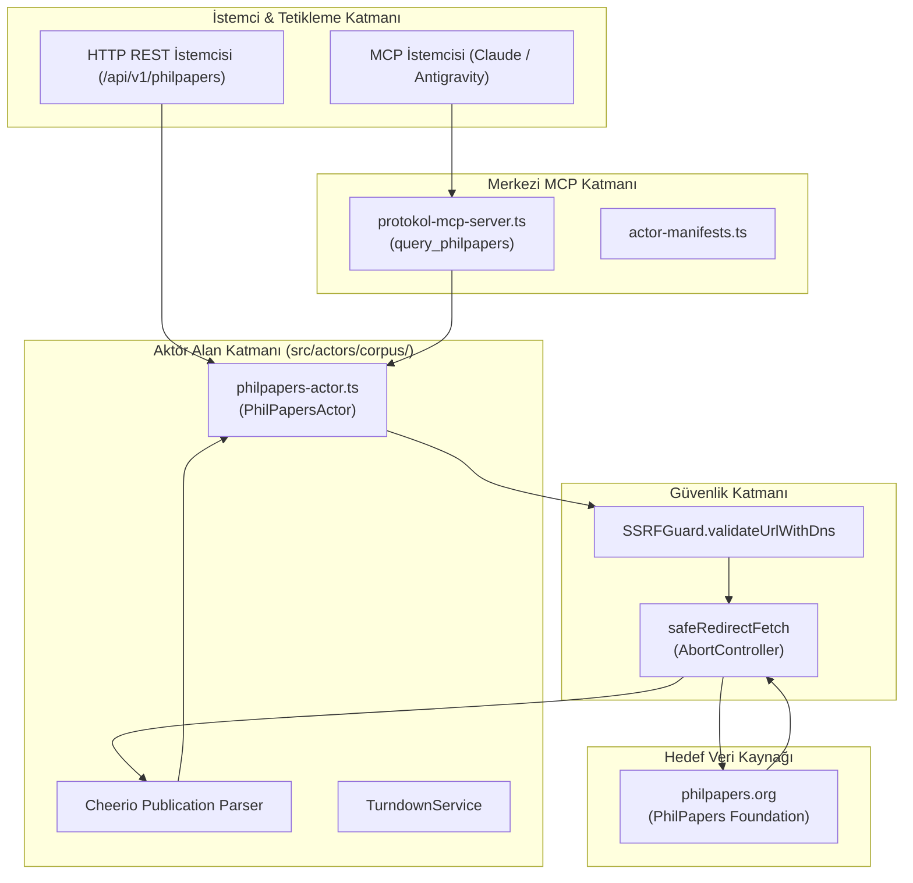
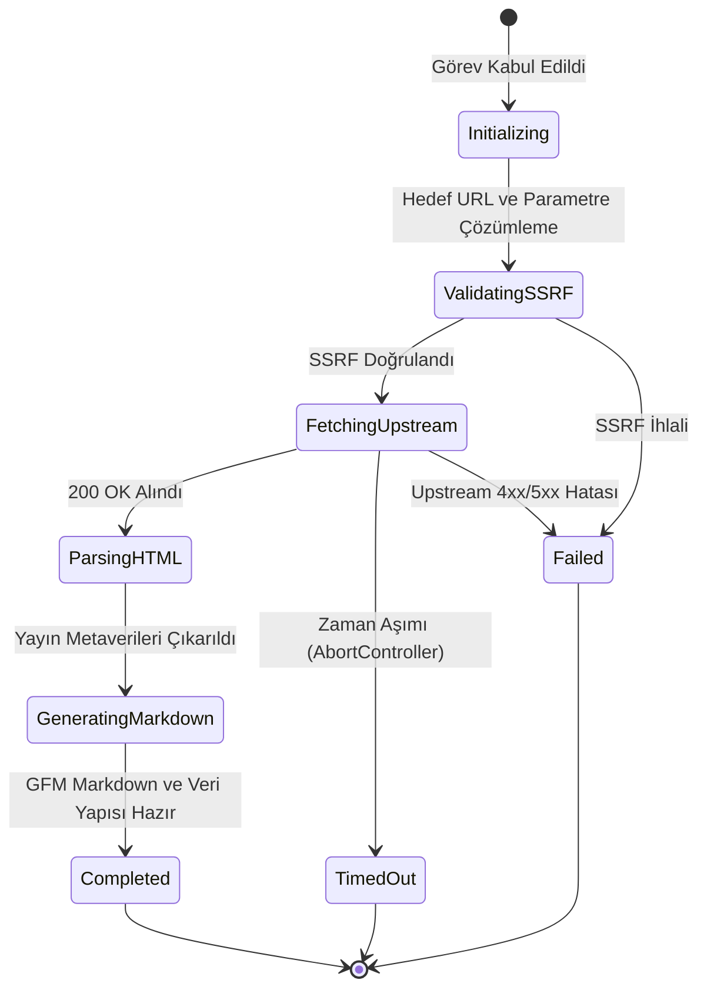

# philpapers — Teknik Wiki ve Çalışma Şartnamesi

## 1. Metadata ve Sınıflandırma

| Alan | Değer |
|---|---|
| **Aktör Tanımlayıcı (Type)** | `philpapers` |
| **Kategori** | `corpus` |
| **Sürüm** | `1.0.0` |
| **Birincil Sınıf** | `PhilPapersActor` (`src/actors/corpus/philpapers-actor.ts`) |
| **Protokol / Kaynak** | HTTP / HTML Scraping (`philpapers.org`) |
| **Hedef Çıktı Biçimi** | `GFM Markdown` & Publication Records |
| **MCP Aracı** | `query_philpapers` (`src/mcp/protokol-mcp-server.ts`) |
| **Test Dosyası** | `tests/philpapers-actor.test.ts` |

---

## 2. Mekanizma ve Teknik Genel Bakış

`PhilPapersActor`, 2.5 milyondan fazla akademik felsefe makalesini, kitabını, konferans bildirisini ve 5.000'den fazla kategori içeren felsefi taksonomiyi barındıran dünyanın en geniş felsefe araştırma arşivi PhilPapers üzerinden veri toplayan bir korpus aktörüdür.

Desteklenen eylemler:
1. `record`: Belirtilen bir PhilPapers kayıt kimliği (ör. `CHADCO`, `DENCAI`) veya kayıt URL'i (`https://philpapers.org/rec/<id>`) üzerinden yayın başlığı, yazarlar, yayın yılı, dergi/kitap bilgisi, sayfa/cilt, özet (abstract), taksonomi kategorileri, DOI ve açık erişim durumunu çeker; temiz GFM Markdown özeti üretir.
2. `search`: Arama sorgusu (`https://philpapers.org/s/<query>`) üzerinden yayınları arar, eşleşen makale listesini, yazarları, yılları ve özet pasajlarını döndürür.
3. `category`: Kategori taksonomisi (`https://philpapers.org/browse/<category>`) üzerinden kategori başlığı, açıklaması, alt kategoriler ve öne çıkan yayınları ayrıştırır.

---

## 3. Mimari ve Bileşen Sınırları



---

## 4. Sıralı İşlem Akışı (Sequence Diagram)

```mermaid
sequenceDiagram
    autonumber
    participant Client as İstemci (REST / MCP)
    participant Server as REST Sunucu / MCP Sunucu
    participant Actor as PhilPapersActor
    participant Guard as SSRFGuard
    participant Fetcher as safeRedirectFetch
    participant Upstream as philpapers.org

    Client->>Server: POST /api/v1/philpapers (id: "CHADCO")
    Server->>Actor: run(task, context)
    Actor->>Guard: validateUrlWithDns(endpoint)
    Guard-->>Actor: valid: true
    Actor->>Fetcher: safeRedirectFetch(endpoint)
    Fetcher->>Upstream: GET /rec/CHADCO
    Upstream-->>Fetcher: 200 OK (HTML)
    Fetcher-->>Actor: HTML Yanıtı
    Actor->>Actor: Cheerio ayrıştırma (başlık, yazarlar, yıl, dergi, özet, kategoriler, DOI)
    Actor-->>Server: ActorResult (completed, status 200, data)
    Server-->>Client: 200 OK JSON (record, markdown)
```

---

## 5. Durum Geçiş Modeli (State Diagram)



---

## 6. Güvenlik İnvariantları ve Kısıtlar

1. **SSRF Koruması:** `philpapers.org` ve doğrudan sağlanan URL'ler hop-by-hop doğrulanır.
2. **Bibliyografik Bütünlük:** Yazar listeleri ve yayın detayları temiz dizilere ayrıştırılır.
3. **Zaman Aşımı ve Kaynak Kontrolü:** 30.000 ms zaman aşımı ile askıda kalan ağ bağlantıları kesilir.
