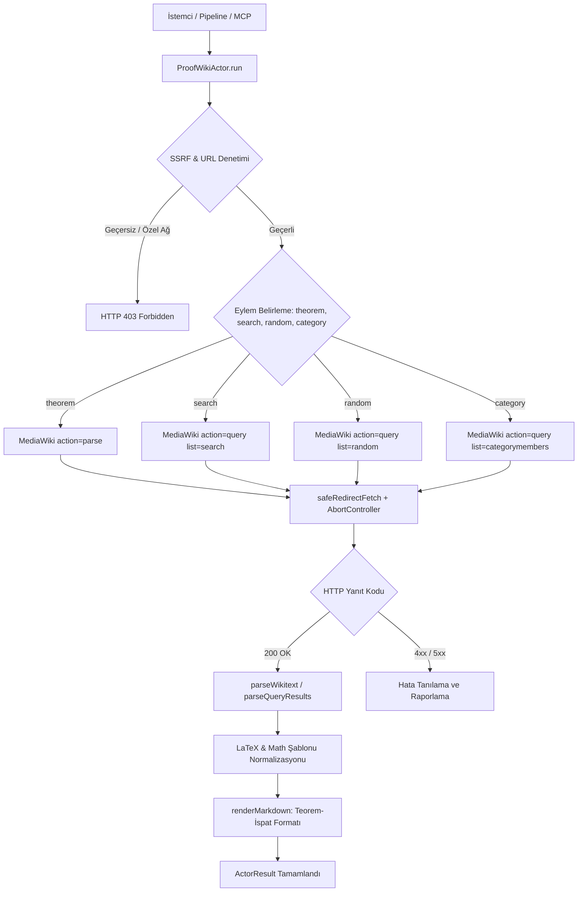
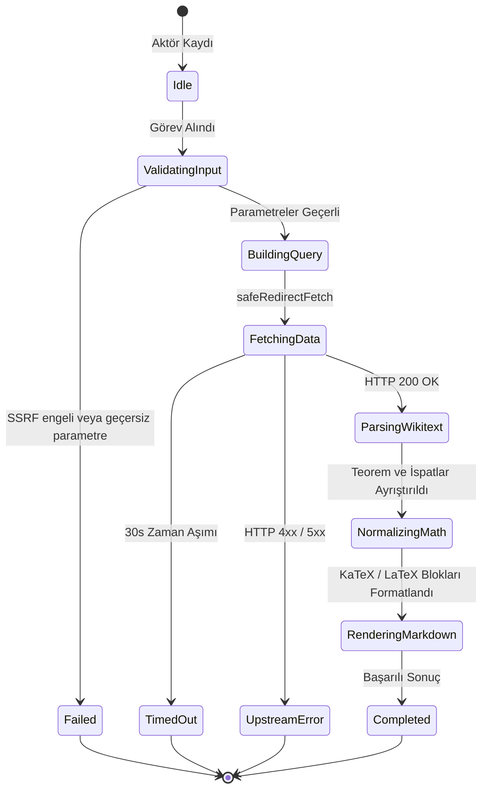

# Formel Matematiksel Teoremler ve İspatlar Çıkarıcı (`proofwiki`)

ProofWiki MediaWiki API (`action=parse`, `action=query`) üzerinden matematiksel teorem ifadeleri, çok adımlı biçimsel ispatlar, tanımlar, kaynaklar ve LaTeX matematik formüllerini yapılandırılmış olarak toplayan korpus aktörü.

---

## 1. Mimari Akış Şeması (Architecture Flowchart)



---

## 2. Sıra Diyagramı (Sequence Diagram)

```mermaid
sequenceDiagram
    autonumber
    participant Caller as Pipeline / MCP Caller
    participant Actor as ProofWikiActor
    participant SSRF as SSRFGuard
    participant Fetcher as SafeRedirectFetcher
    participant API as ProofWiki MediaWiki API

    Caller->>Actor: run(task, context)
    Actor->>SSRF: validateUrlWithDns(targetUrl)
    SSRF-->>Actor: valid
    Actor->>Actor: resolveParameters(options)
    Actor->>Actor: buildApiUrl(action, parameters)
    Actor->>SSRF: validateUrlWithDns(apiUrl)
    SSRF-->>Actor: valid
    Actor->>Fetcher: GET api.php
    Fetcher->>API: HTTP GET (format=json)
    API-->>Fetcher: 200 OK (JSON Payload)
    Fetcher-->>Actor: Response Stream
    Actor->>Actor: parseWikitext & normalizeMath
    Actor->>Actor: renderMarkdown
    Actor-->>Caller: ActorResult<ProofWikiActorResult>
```

---

## 3. Durum Makinesi (State Machine)



---

## 4. Girdi Parametreleri (Input Options)

| Parametre | Tip | Zorunlu | Varsayılan | Açıklama |
|---|---|---|---|---|
| `action` | `string` | Hayır | `"theorem"` | Çıkarma kipi: `"theorem"` (doğrudan başlık), `"search"`, `"random"`, `"category"`. |
| `title` | `string` | Hayır | – | Hedef teorem veya tanım sayfa başlığı (`action="theorem"` durumunda). |
| `query` | `string` | Hayır | – | Arama anahtar sözcüğü (`action="search"` durumunda). |
| `category` | `string` | Hayır | – | MediaWiki kategori adı (`action="category"` durumunda). |
| `limit` | `number` | Hayır | `10` | Çekilecek maksimum kayıt sayısı (1-50). |
| `targetUrl` | `string` | Hayır | `https://proofwiki.org/w/api.php` | Özel ProofWiki MediaWiki API uç noktası. |
| `timeoutMs` | `number` | Hayır | `30000` | İstek zaman aşımı süresi (milisaniye). |

---

## 5. Çıktı Sözleşmesi (Output Contract)

```typescript
export interface ProofWikiItem {
  pageId?: number;
  title: string;
  url: string;
  theorem?: string;
  proofs?: string[];
  definitions?: string[];
  sources?: string[];
  categories?: string[];
  rawWikitext?: string;
}

export interface ProofWikiActorResult {
  action: string;
  totalResults: number;
  items: ProofWikiItem[];
  queryUrl: string;
  markdown?: string;
}
```

---

## 6. Güvenlik ve SSRF İnvariantları

1. **DNS Hop-by-Hop Doğrulama:** `SSRFGuard.validateUrlWithDns` kontrolü ile döngüsel ağlar (`127.0.0.1`), metadata servisleri (`169.254.169.254`) ve RFC 1918 adresleri engellenir.
2. **Kullanıcı Aracısı (User-Agent):** `protokol-7/1.0 (ProofWiki Corpus Harvester)` başlığı ile MediaWiki bot politikalarına uygun istek gönderilir.
3. **Zaman Aşımı Güvenliği:** `AbortController` 30 saniye sonra tetiklenerek açık ağ soketi kalması önlenir.

---

## 7. Wikitext ve Matematik Formülü Normalizasyonu

- **`<math>` Etiketleri:** `<math>...</math>` blokları standart KaTeX satır içi `$ ... $` veya çok satırlı `$$ ... $$` formatına dönüştürülür.
- **`{{begin-eqn}} / {{eqn}} / {{end-eqn}}` Şablonları:** ProofWiki denklem şablonları `\begin{aligned} ... \end{aligned}` LaTeX matematik bloklarına çevrilir.
- **Teorem / İspat Başlıkları:** `== Theorem ==`, `== Proof ==`, `== Proof 1 ==`, `== Proof 2 ==` başlıkları hiyerarşik olarak taranıp bağımsız ispat adımları olarak ayrıştırılır.

---

## 8. REST API Uç Noktası

- **Yol:** `POST /api/v1/proofwiki` (Takma Ad: `POST /proofwiki`)
- **İstek Gövdesi:**
  ```json
  {
    "action": "theorem",
    "title": "Pythagorean Theorem",
    "limit": 10
  }
  ```

---

## 9. MCP Araç Entegrasyonu

- **Araç Adı:** `query_proofwiki`
- **Kullanım:** Claude Code veya Gemini Agent üzerinden doğrudan çağrılabilir:
  ```json
  {
    "name": "query_proofwiki",
    "arguments": {
      "action": "theorem",
      "title": "Pythagorean Theorem"
    }
  }
  ```

---

## 10. Kendi Kendini İyileştirme ve Hata Matrisi (Self-Healing Matrix)

| Hata Kodu / Durum | Olası Kök Neden | İyileştirme / Çözüm Yolu |
|---|---|---|
| `400 MISSING_PARAM` | `action="theorem"` için `title`, `search` için `query` belirtilmemiş | Zorunlu arama veya sayfa başlığı parametresini sağla. |
| `404 NOT_FOUND` | Belirtilen teorem başlığı ProofWiki üzerinde bulunamadı | Başlık yazımını doğrula veya `action="search"` kullanarak arama yap. |
| `429 RATE_LIMIT` | MediaWiki API istek hız sınırı aşıldı | İstek aralığını artır veya toplu çekim gecikmesi ekle. |
| `500 UPSTREAM_ERROR` | ProofWiki sunucu hatası | Yeniden deneme mekanizmasını tetikle. |

---

## 11. Performans ve Bellek Profili

- **Sıfır DOM Parser Bağımlılığı:** Wikitext doğrudan regex ve durum odaklı metin tarayıcı ile işlenir, DOM overhead'i oluşmaz.
- **Bellek Tüketimi:** Ortalama teorem ve çoklu ispat yükü ~100-300 KB olup tepe bellek kullanımı < 10 MB düzeyindedir.
