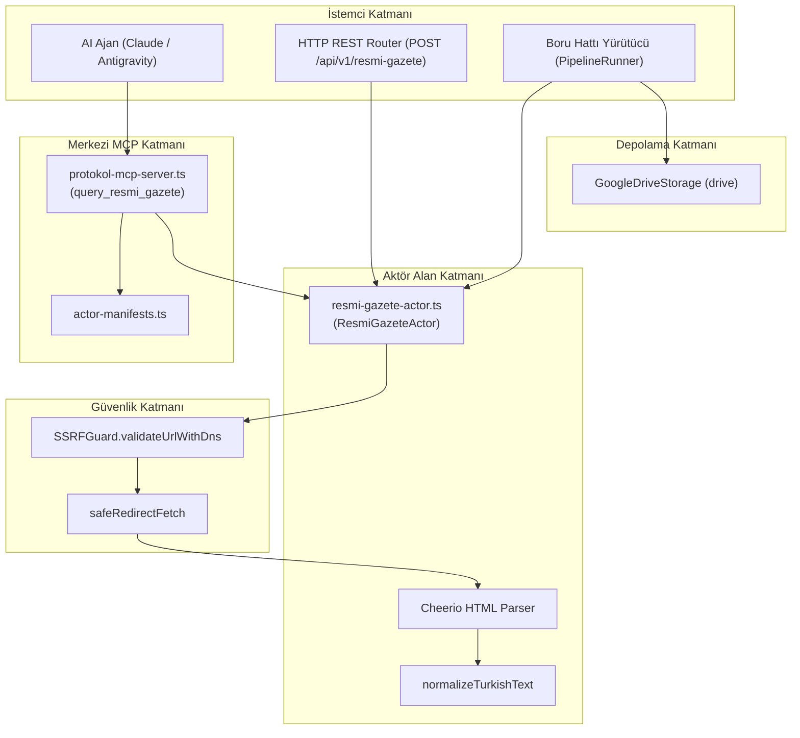
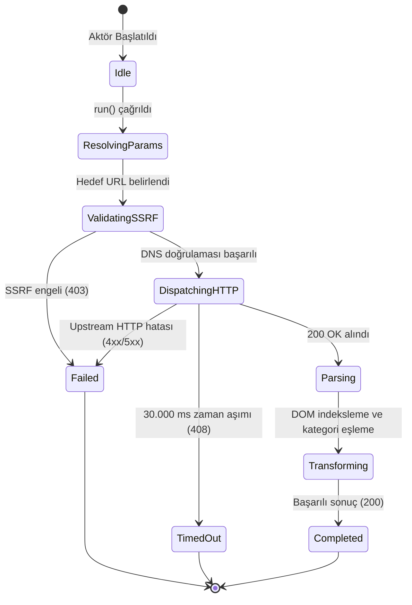

# ResmiGazete Actor — Teknik Wiki ve Çalışma Şartnamesi

## 1. Metadata ve Sınıflandırma

| Alan | Değer |
|---|---|
| **Aktör Tanımlayıcı (Type)** | `resmi-gazete` |
| **Kategori** | `corpus` (`src/actors/corpus/resmi-gazete-actor.ts`) |
| **Sürüm** | `1.0.0` |
| **Birincil Sınıf** | `ResmiGazeteActor` |
| **MCP Aracı** | `query_resmi_gazete` (`src/mcp/protokol-mcp-server.ts`) |
| **REST Endpoint** | `POST /api/v1/resmi-gazete` |
| **Test Dosyası** | `tests/resmi-gazete-actor.test.ts` |

---

## 2. Mekanizma ve Teknik Genel Bakış

T.C. Resmî Gazete resmi portalından (`resmigazete.gov.tr`) günlük bülten, kanun, cumhurbaşkanlığı kararnamesi, yönetmelik, tebliğ, kurul kararı ve yargı ilanlarının yapılandırılmış olarak çıkarılmasını sağlar.

* **Tarih Çözümleme:** `date` parametresi (`YYYY-MM-DD` veya `YYYYMMDD`) verildiğinde arşiv URL'si (`/eskiler/YYYY/MM/YYYYMMDD.htm`) otomatik inşa edilir.
* **HTML Ayrıştırma:** Cheerio ile bülten başlığı (Sayı No, Tarih, Mükerrer durumu), bölümler (Yürütme ve İdare, Yargı, İlanlar) ve mevzuat bağlantıları çıkarılır.
* **Türkçe Normalizasyonu:** Diakritik ve Türkçe harf duyarlılığı (`normalizeTurkishText`) sayesinde ASCII aramalar (`yonetmelik`, `teblig`) ile Türkçe başlıklar birebir eşleştirilir.
* **Markdown Distilasyonu:** LLM eğitimi ve RAG bağlamı için hiyerarşik GFM Markdown özet tablosu üretilir.

---

## 3. Mimari ve Bileşen Sınırları (Mermaid Flowchart)



---

## 4. İstek Yaşam Döngüsü ve Sıra Şeması (Mermaid Sequence Diagram)

```mermaid
sequenceDiagram
    autonumber
    participant Client as Çağırıcı
    participant Actor as ResmiGazeteActor
    participant SSRF as SSRFGuard
    participant Net as safeRedirectFetch
    participant Parser as Cheerio & Normalizer

    Client->>Actor: run(task, context)
    Actor->>Actor: buildEndpointUrl(date, targetUrl)
    Actor->>SSRF: validateUrlWithDns(endpoint)
    alt SSRF Engeli
        SSRF-->>Actor: { valid: false }
        Actor-->>Client: 403 Forbidden
    else Güvenli Hedef
        SSRF-->>Actor: { valid: true }
        Actor->>Net: safeRedirectFetch(signal)
        Net-->>Actor: HTML Yanıtı
        Actor->>Parser: parseResmiGazeteHtml(html)
        Parser-->>Actor: ResmiGazeteActorResult (Kayıtlar, Metadata, Markdown)
        Actor-->>Client: 200 OK
    end
```

---

## 5. Durum Makinesi (Mermaid State Diagram)



---

## 6. Girdi ve Çıktı Sözleşmesi

### Girdi Parametreleri (`ResmiGazeteActorTaskOptions`)
```typescript
{
  date?: string;          // YYYY-MM-DD veya YYYYMMDD
  issueNumber?: number;   // Sayı no (örn: 32490)
  category?: "all" | "kanun" | "cumhurbaskanligi" | "yonetmelik" | "teblig" | "kurul-karari" | "ilanlar";
  query?: string;         // Başlık ve içerikte anahtar kelime filtresi
  format?: "markdown" | "json";
  limit?: number;         // Azami kayıt adedi (varsayılan: 50)
  targetUrl?: string;     // Doğrudan hedef adres
  timeoutMs?: number;     // Zaman aşımı (varsayılan: 30.000 ms)
}
```

### Çıktı Modeli (`ResmiGazeteActorResult`)
```typescript
{
  date: string;           // YYYY-MM-DD
  issueNumber?: number;   // Resmî Gazete sayısı
  isRepeated?: boolean;   // Mükerrer bülten kontrolü
  totalItems: number;     // Çıkarılan mevzuat sayısı
  items: Array<{
    id: string;
    title: string;
    category: string;
    actNumber?: string;   // Kanun No veya Karar Sayısı
    url: string;
    pdfUrl?: string;
    content?: string;
    metadata?: Record<string, unknown>;
  }>;
  queryUrl: string;
  markdown?: string;      // Hiyerarşik GFM Markdown metni
}
```

---

## 7. Güvenlik İnvariantları

1. **SSRF Koruması:** `SSRFGuard.validateUrlWithDns` ile hem `targetUrl` hem de dinamik üretilen uç noktalar denetlenir.
2. **Zaman Aşımı:** Varsayılan 30.000 ms zaman aşımı `AbortController` ile kesin olarak işletilir.
3. **Bellek Güvenliği:** Gövde metinleri ve liste elemanları bellek taşmasına karşı filtrelenir.
