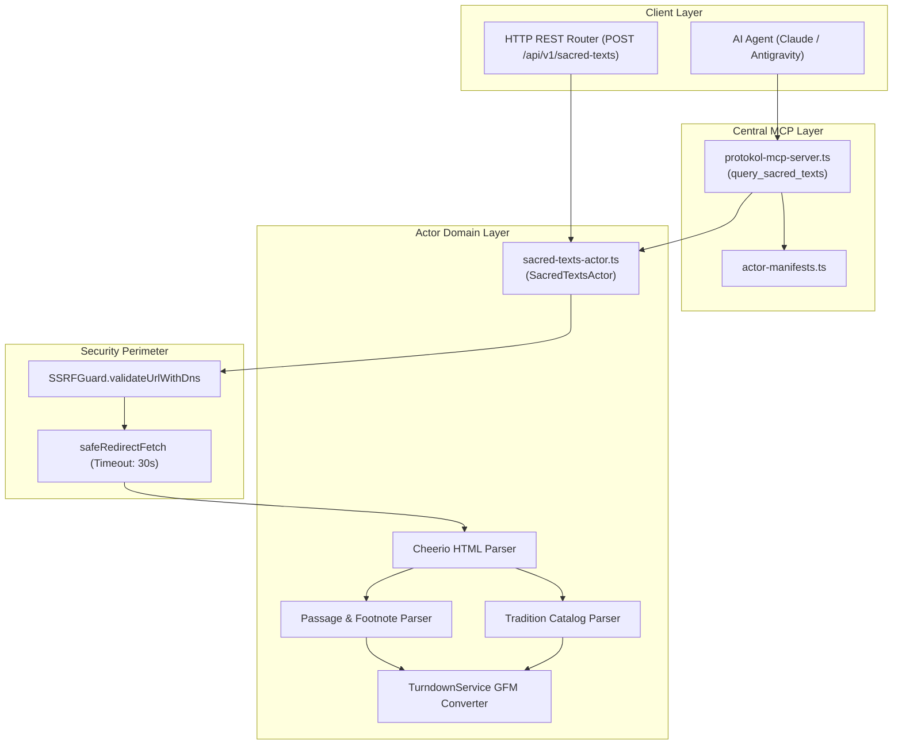

# Internet Sacred Text Archive Actor — Technical Wiki and Specification

## 1. Metadata and Classification

| Field | Value |
|---|---|
| **Actor Type** | `sacred-texts` |
| **Category** | `corpus` (`src/actors/corpus/sacred-texts-actor.ts`) |
| **Version** | `1.0.0` |
| **Primary Class** | `SacredTextsActor` |
| **MCP Tool** | `query_sacred_texts` (`src/actors/actor-manifests.ts`) |
| **REST Endpoint** | `POST /api/v1/sacred-texts`, `POST /sacred-texts` |
| **Test Suite** | `tests/sacred-texts-actor.test.ts` |
| **Example Config**| `examples/actors/sacred-texts.json` |

---

## 2. Mechanism and Technical Overview

`SacredTextsActor` extracts full-text sacred books, comparative mythology, religious treatises, folklore, and alchemy literature from the Internet Sacred Text Archive (`www.sacred-texts.com`). ISTA comprises over 1,700 complete books covering world traditions.

The actor supports three primary operational modes:
1. `text`: Retrieves an individual chapter, hymn, or section. Extracts title, author, translator, tradition, clean Turndown-converted Markdown text, and parsed footnotes.
2. `catalog`: Parses index pages for specific traditions (`hin`, `isl`, `chr`, `jud`, `bud`, `tao`, `cla`, `egy`, `ane`, `neu`, `celt`, `alc`) to produce structured lists of books, authors, translators, and years.
3. `search`: Traverses archive search results across topics and traditions.

---

## 3. Architecture and Component Boundaries



---

## 4. Actions and Input Parameters

| Parameter | Type | Required? | Description |
|---|---|---|---|
| `action` | `string` | No | `text`, `catalog`, or `search` (default: `text`). |
| `tradition` | `string` | No | Archive tradition code (e.g. `hin`, `isl`, `chr`, `jud`, `bud`, `tao`, `cla`, `egy`, `ane`, `neu`, `celt`, `alc`). |
| `path` | `string` | No | Archive book or chapter path (e.g. `/hin/sbe01/sbe01003.htm`). |
| `query` | `string` | No | Keywords or topic query. |
| `limit` | `number` | No | Maximum books to return in catalog mode (default: 30). |
| `targetUrl` | `string` | No | Direct sacred-texts.com URL. |

---

## 5. Output Schema and Data Structure

```typescript
export interface SacredTextsActorResult {
  action: SacredTextsAction;
  queryUrl: string;
  totalResults: number;
  passage?: SacredTextsPassage;
  books?: SacredTextsBookItem[];
  markdown?: string;
}
```
