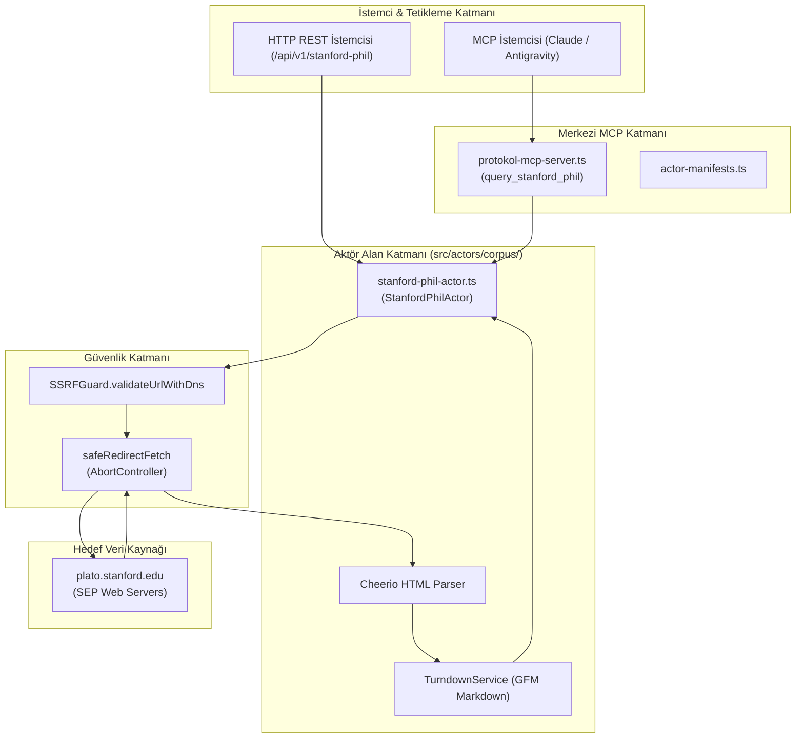
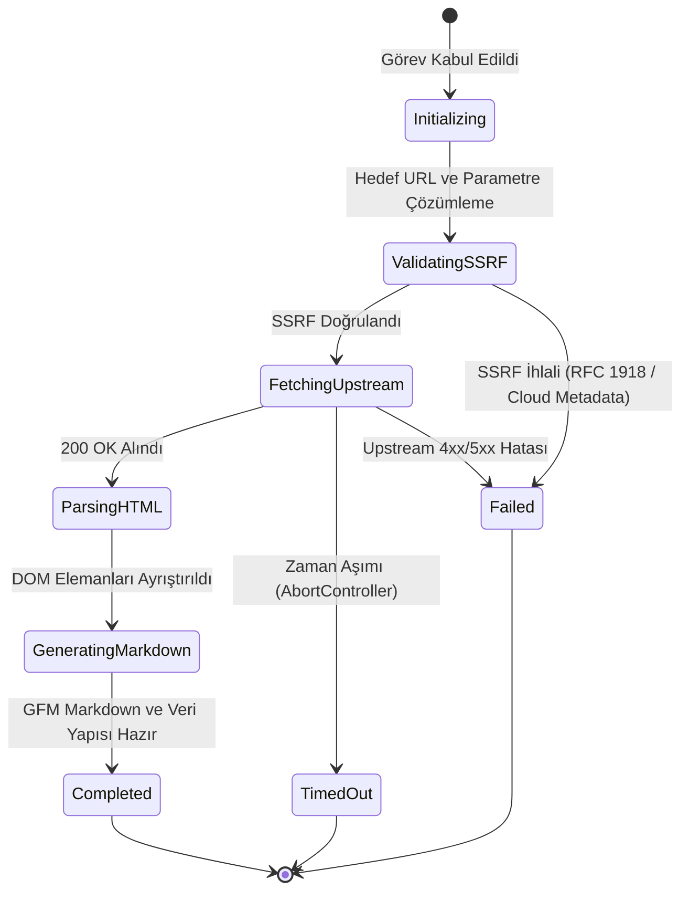

# stanford-phil — Teknik Wiki ve Çalışma Şartnamesi

## 1. Metadata ve Sınıflandırma

| Alan | Değer |
|---|---|
| **Aktör Tanımlayıcı (Type)** | `stanford-phil` |
| **Kategori** | `corpus` |
| **Sürüm** | `1.0.0` |
| **Birincil Sınıf** | `StanfordPhilActor` (`src/actors/corpus/stanford-phil-actor.ts`) |
| **Protokol / Kaynak** | HTTP / HTML Scraping (`plato.stanford.edu`) |
| **Hedef Çıktı Biçimi** | `GFM Markdown` & Structured Treatises |
| **MCP Aracı** | `query_stanford_phil` (`src/mcp/protokol-mcp-server.ts`) |
| **Test Dosyası** | `tests/stanford-phil-actor.test.ts` |

---

## 2. Mekanizma ve Teknik Genel Bakış

`StanfordPhilActor`, Stanford Üniversitesi bünyesinde hakemli olarak yayımlanan dünyanın en saygın felsefe ve mantık ansiklopedisi olan Stanford Encyclopedia of Philosophy (SEP) üzerindeki felsefi makaleleri, kavramsal argüman dizilimlerini, dipnot ve kaynakçaları (bibliyografyaları), felsefi ontolojileri ve dizinleri otonom olarak toplayan bir korpus aktörüdür.

Aktör üç çalışma modunu destekler:
1. `entry`: Belirtilen bir slug veya URL üzerinden ilgili felsefi makaleyi (`https://plato.stanford.edu/entries/<slug>/`) çeker; başlık, yazar(lar), ilk yayım ve revizyon tarihleri, giriş/önsöz (preamble), ana hatlar (outline/TOC), hiyerarşik alt bölümler, bibliyografya ve ilişkili maddeleri ayrıştırarak temiz GFM Markdown olarak sunar.
2. `search`: Arama motoru uç noktası (`https://plato.stanford.edu/search/searcher.py?query=<query>`) üzerinden terim araması gerçekleştirir ve eşleşen makale başlıklarını, bağlantılarını ve alıntı özetlerini listeler.
3. `contents`: Alfabetik genel dizin (`https://plato.stanford.edu/contents.html`) üzerinden maddeleri listeler.

Tüm dış HTTP istekleri hop-by-hop DNS çözümlemesi ve IP denetimi (`SSRFGuard.validateUrlWithDns`) ile güvenceye alınır; yönlendirmeler `safeRedirectFetch` ile yürütülür.

---

## 3. Mimari ve Bileşen Sınırları



---

## 4. Sıralı İşlem Akışı (Sequence Diagram)

```mermaid
sequenceDiagram
    autonumber
    participant Client as İstemci (REST / MCP)
    participant Server as REST Sunucu / MCP Sunucu
    participant Actor as StanfordPhilActor
    participant Guard as SSRFGuard
    participant Fetcher as safeRedirectFetch
    participant Upstream as plato.stanford.edu

    Client->>Server: POST /api/v1/stanford-phil (slug: "goedel-incompleteness")
    Server->>Actor: run(task, context)
    Actor->>Guard: validateUrlWithDns(endpoint)
    Guard-->>Actor: valid: true
    Actor->>Fetcher: safeRedirectFetch(endpoint)
    Fetcher->>Upstream: GET /entries/goedel-incompleteness/
    Upstream-->>Fetcher: 200 OK (HTML)
    Fetcher-->>Actor: HTML Yanıtı
    Actor->>Actor: Cheerio ayrıştırma (başlık, yazarlar, TOC, bölümler, bib)
    Actor->>Actor: TurndownService GFM Markdown üretimi
    Actor-->>Server: ActorResult (completed, status 200, data)
    Server-->>Client: 200 OK JSON (entry, markdown)
```

---

## 5. Durum Geçiş Modeli (State Diagram)



---

## 6. Güvenlik İnvariantları ve Kısıtlar

1. **SSRF Koruması:** `plato.stanford.edu` veya doğrudan sağlanan `targetUrl` uç noktaları önce DNS seviyesinde doğrulanır. Bulut metadata adresleri (169.254.169.254), döngüsel adresler (127.0.0.1) ve yerel ağlar engellenir.
2. **Zaman Aşımı ve Kaynak Kontrolü:** Varsayılan 30.000 ms zaman aşımı `AbortController` ile yönetilir.
3. **Bellek Güvenliği:** Yalnızca ilgili içerik seçicileri (`#auhead`, `#toc`, `#main-text`, `#bib`) işlenir, gereksiz stil ve script etiketleri DOM'dan temizlenir.
