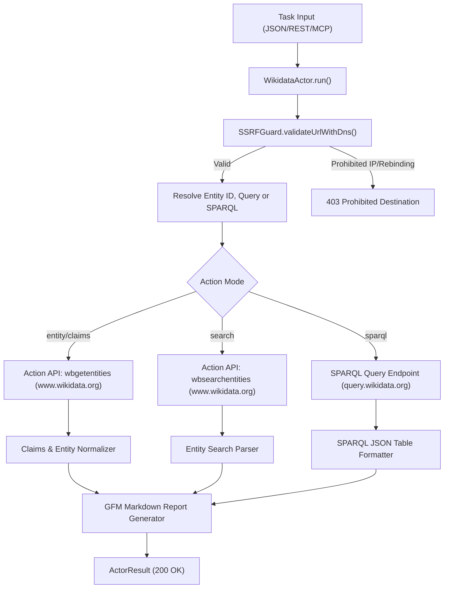
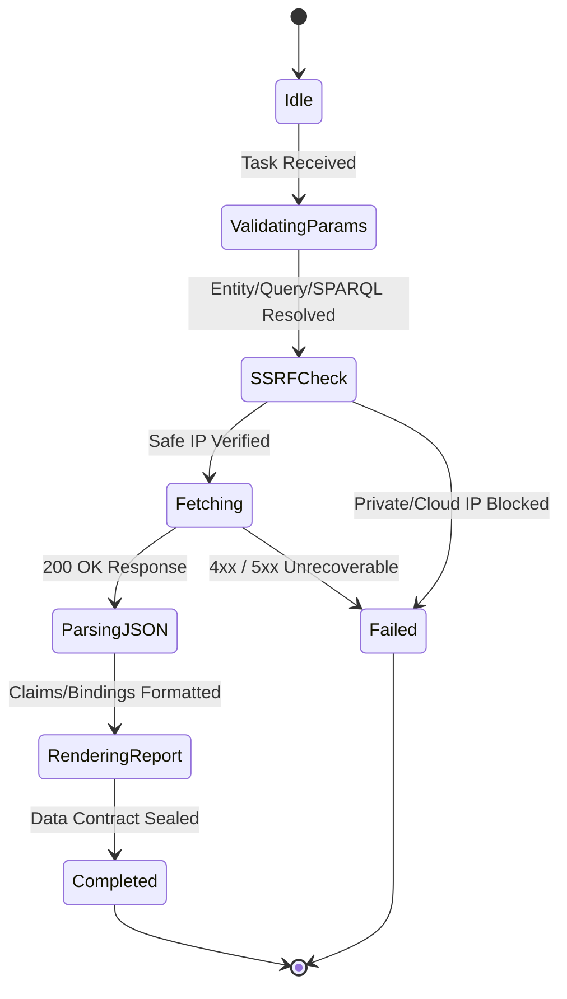

# Wikidata Structured Knowledge Graph Harvester — Technical Specification

## 1. Architectural Overview

The `WikidataActor` extracts structured knowledge graph entities, Q-IDs, P-IDs, statements, claims, and semantic triples from official Wikimedia Wikidata APIs (`wbgetentities`, `wbsearchentities`, and `query.wikidata.org` SPARQL endpoint).



---

## 2. Sequence Diagram

```mermaid
sequenceDiagram
    autonumber
    participant Client as REST API / MCP Client
    participant Actor as WikidataActor
    participant Guard as SSRFGuard
    participant Wiki as Wikidata API / SPARQL Endpoint

    Client->>Actor: execute(task)
    Actor->>Actor: resolveParameters(targetUrl, options)
    Actor->>Actor: buildApiUrl(action, entityId, query, sparql)
    Actor->>Guard: validateUrlWithDns(resolvedQueryUrl)
    Guard-->>Actor: valid: true
    Actor->>Wiki: GET /w/api.php?action=wbgetentities&ids={id}
    Wiki-->>Actor: 200 OK (Entities JSON)
    Actor->>Actor: parseEntityClaims(rawJson)
    Actor->>Actor: renderMarkdownReport(items)
    Actor-->>Client: 200 OK (WikidataActorResult)
```

---

## 3. State Machine



---

## 4. Input & Output Contract

### 4.1 Input Specification
```typescript
export interface WikidataActorTaskOptions {
  action?: "entity" | "search" | "sparql" | "claims"; // Default: entity
  entityId?: string;        // Entity or property identifier (e.g. 'Q42', 'P31')
  entityIds?: string[];     // Multiple entity IDs
  query?: string;           // Search expression for wbsearchentities
  sparql?: string;          // SPARQL query string
  propertyId?: string;      // Filter claims to specific property (e.g. 'P31')
  lang?: string;            // Language code for labels (default: 'en')
  limit?: number;           // Results limit (default: 10)
  timeoutMs?: number;       // Request timeout in milliseconds (default: 30000)
}
```

### 4.2 Output Specification
```typescript
export interface WikidataActorResult {
  action: "entity" | "search" | "sparql" | "claims";
  queryUrl: string;
  items?: WikidataEntityItem[];
  sparqlResults?: {
    head: { vars: string[] };
    results: { bindings: WikidataSparqlBinding[] };
  };
  markdown?: string;
}
```

---

## 5. Security & Invariants

1. **SSRF Guard Protection:** DNS resolution checking through `SSRFGuard.validateUrlWithDns` prior to network dispatch.
2. **Deterministic Timeouts:** Maximum 30,000 ms timeout per upstream call with `AbortController`.
3. **Structured Entity Representation:** Normalizes complex Wikibase datavalues and snaks into strongly-typed property-value claim records.
