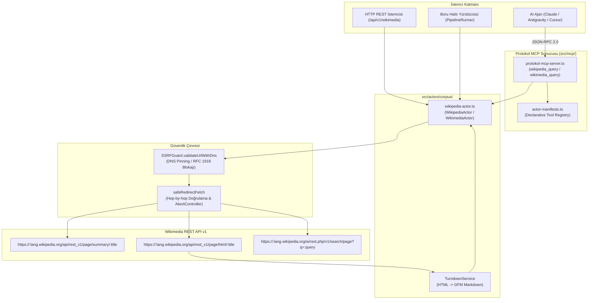
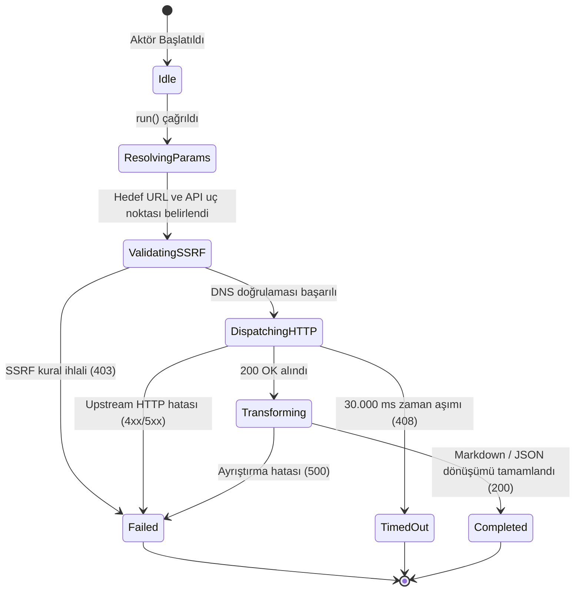

# Wikipedia / Wikimedia Actor — Teknik Wiki ve Çalışma Şartnamesi

## 1. Metadata ve Sınıflandırma

| Alan | Değer |
|---|---|
| **Aktör Tanımlayıcı (Type)** | `wikipedia` (Eşad: `wikimedia`) |
| **Kategori** | `corpus` (`src/actors/corpus/wikipedia-actor.ts`) |
| **Sürüm** | `1.0.0` |
| **Birincil Sınıf** | `WikipediaActor` (Geriye Dönük Eşad: `WikimediaActor`) |
| **Protokol / Kaynak** | `Wikimedia REST API v1` (Resmi Wikimedia Vakfı Uç Noktaları) |
| **Hedef Çıktı Biçimi** | `GFM Markdown` \| `JSON Structured Summary` |
| **MCP Aracı** | `wikipedia_query` / `wikimedia_query` (`src/mcp/protokol-mcp-server.ts`) |
| **Test Dosyası** | `tests/wikimedia-actor.test.ts` / `tests/wikipedia-actor.test.ts` |

---

## 2. Mekanizma ve Teknik Genel Bakış

`WikipediaActor`, Wikimedia Vakfı'nın resmi REST API v1 altyapısı üzerinden tüm dil sürümlerindeki (en, tr, de, fr vb.) Wikipedia içeriklerini deterministik ve yapılandırılmış olarak çeken LLM ön eğitim ve olgusal bilgi çıkarım aktörüdür.

Aktör 3 temel işlem modunu destekler:
1. **Summary Modu (`action: "summary"`):** Sayfanın kanonik özetini, açıklamasını, masaüstü URL'ini, koordinatlarını (varsa) ve küçük resim (thumbnail) bağlantısını ayrıştırır.
2. **Article Modu (`action: "article"`):** Parsoid HTML motoru tarafından üretilen tam sayfa HTML içeriğini çeker. `TurndownService` kullanarak ATX başlık stilleri, tel örgülü kod blokları (`fenced code blocks`) ve temizlenmiş referanslarla saf GitHub Flavored Markdown (GFM) metnine dönüştürür. Betik (`script`), stil (`style`) ve no-script etiketleri soket düzeyinde soyulur.
3. **Search Modu (`action: "search"`):** Belirtilen anahtar kelime sorgusu için Wikipedia arama dizinini sorgular. Arama sonucu parçacıklarındaki (snippets) HTML vurgulama etiketlerini (`<span>`, `<b>`) temizleyerek yapılandırılmış sayfa adayları listesi döndürür.

---

## 3. Mimari ve Bileşen Sınırları (Mermaid Flowchart)



---

## 4. İstek Yaşam Döngüsü ve Sıra Şeması (Mermaid Sequence Diagram)

```mermaid
sequenceDiagram
    autonumber
    participant Caller as Çağırıcı (MCP / REST / Test)
    participant Actor as WikipediaActor
    participant SSRF as SSRFGuard (DNS Pinning)
    participant Net as safeRedirectFetch
    participant Upstream as Wikimedia REST API v1

    Caller->>Actor: run(task, context)
    Actor->>Actor: resolveParameters(targetUrl, options)
    Actor->>SSRF: validateUrlWithDns(resolvedApiUrl)
    alt SSRF Engeli (Özel IP / 169.254.169.254)
        SSRF-->>Actor: { valid: false, reason }
        Actor-->>Caller: ActorResult (status: "failed", statusCode: 403)
    else Güvenli IP Doğrulandı
        SSRF-->>Actor: { valid: true }
        Actor->>Net: safeRedirectFetch(resolvedApiUrl, timeout: 30s)
        Net->>Upstream: GET /api/rest_v1/...
        Upstream-->>Net: HTTP Yanıtı (200 OK / JSON / HTML)
        Net-->>Actor: Response Stream
        alt action == "article"
            Actor->>Actor: TurndownService.turndown(html) -> GFM Markdown
        else action == "search"
            Actor->>Actor: stripHtmlTags(excerpt)
        else action == "summary"
            Actor->>Actor: Normalize summary fields
        end
        Actor-->>Caller: ActorResult (status: "completed", statusCode: 200, executionDurationMs)
    end
```

---

## 5. Durum Makinesi (Mermaid State Diagram)



---

## 6. Güvenlik İnvariantları ve Çalışma Kuralları

1. **SSRF Koruması (Mandatory Invariant):**
   * İstek atılacak URL doğrudan dışarıdan sağlansa da, içsel olarak oluşturulsa da her iki aşamada `SSRFGuard.validateUrlWithDns` fonksiyonundan geçirilir.
   * `allowLocalNetwork` parametresi sadece `NODE_ENV === "test"` durumunda aktiftir; üretim ortamında yerel döngü (loopback) veya intranet adreslerine erişim engellenir.
2. **Hop-by-Hop Yönlendirme Denetimi:**
   * Doğrudan yerel `fetch()` kullanılmaz; `safeRedirectFetch` ile yönlendirmeler tek tek izlenip her adımda DNS IP kontrolü yapılır.
3. **Zaman Aşımı ve Kaynak Tahsisi:**
   * `DEFAULT_TIMEOUT_MS = 30_000` (30 saniye) kuralı geçerlidir.
   * Süre dolduğunda `AbortController` soketi derhal sonlandırarak bellek sızıntısını önler.
4. **Kullanıcı Aracısı (User-Agent):**
   * Tüm upstream çağrılarında `"User-Agent": "protokol-7/1.0 (+https://github.com/protokol-7; wikipedia-actor)"` başlığı kullanılır.

---

## 7. Tip Sözleşmesi ve Girdi/Çıktı Şemaları

### Girdi Seçenekleri (`WikipediaActorTaskOptions`)

```typescript
export interface WikipediaActorTaskOptions {
  lang?: string;                          // Dil kodu (örn: "en", "tr", "de"). Varsayılan: "en"
  title?: string;                         // Wikipedia madde başlığı (örn: "Alan Turing")
  action?: "summary" | "article" | "search"; // Eylem türü. Varsayılan: "summary"
  query?: string;                         // Arama sorgusu (action="search" ise)
  limit?: number;                         // Arama sonuç sınırı. Varsayılan: 10
  timeoutMs?: number;                     // Zaman aşımı süresi (ms). Varsayılan: 30000
}
```

### Çıktı Modeli (`WikipediaActorResult`)

```typescript
export interface WikipediaActorResult {
  lang: string;
  action: "summary" | "article" | "search";
  items: WikipediaArticleItem[];
  queryUrl: string;
}

export interface WikipediaArticleItem {
  title: string;
  extract?: string;
  description?: string;
  url: string;
  markdown?: string;
  lang: string;
  thumbnailUrl?: string;
  coordinates?: { lat: number; lon: number };
  timestamp?: string;
}
```

---

## 8. Aktör MCP Entegrasyonu

Aktörün MCP erişimi merkezi `src/mcp/protokol-mcp-server.ts` üzerinden ve `src/actors/actor-manifests.ts` bildirimsel şemasıyla yönetilir:

* **Araç Adı:** `wikipedia_query` (ve geriye dönük uyumlu `wikimedia_query`)
* **Sunucu Kaynağı:** `src/mcp/protokol-mcp-server.ts`
* **İşleyici:** `WikipediaActor` / `WikimediaActor`
* **Yetki:** Yapay zeka ajanlarının Wikipedia üzerinde özet çıkarma, tam makale markdown'ı okuma ve konu araması yapmasını sağlar.

---

## 9. Hata Kodları ve İyileştirme Matrisi (Self-Healing)

| HTTP / Durum Kodu | Açıklama | Kök Neden | Kendi Kendine İyileştirme Yolu |
|---|---|---|---|
| `400 Bad Request` | Geçersiz parametre | Başlık ve arama sorgusu sağlanmadı | `title` veya `query` parametresi gir |
| `403 Forbidden` | SSRF ihlali | Hedef IP yasaklı özel blokta veya bulut metadata adresinde | Hedef adresi doğrula; testte `NODE_ENV=test` sağla |
| `404 Not Found` | Sayfa bulunamadı | İlgili dil sürümünde madde mevcut değil | Başlığı doğrula veya `action="search"` ile ara |
| `408 Request Timeout` | Zaman aşımı | Wikimedia API 30 saniye içinde yanıt vermedi | `timeoutMs` değerini artır veya isteği tekrarla |
| `500 Internal Error` | Ayrıştırma hatası | Beklenmeyen API yanıtı veya bozuk HTML | Upstream durumunu kontrol et |

---

## 10. Kullanım Örnekleri

### 10.1 cURL ile HTTP REST Çağrısı
```bash
# Alan Turing maddesinin Türkçe özetini çek
curl -X POST http://127.0.0.1:4000/api/v1/wikimedia \
  -H "Content-Type: application/json" \
  -d '{"title": "Alan Turing", "lang": "tr", "action": "summary"}'
```

### 10.2 MCP JSON-RPC 2.0 Çağrısı
```json
{
  "jsonrpc": "2.0",
  "id": "wiki-req-1",
  "method": "tools/call",
  "params": {
    "name": "wikipedia_query",
    "arguments": {
      "title": "Quantum computing",
      "lang": "en",
      "action": "article"
    }
  }
}
```

### 10.3 Programatik TypeScript Kullanımı
```typescript
import { WikipediaActor } from "./wikipedia-actor";

const actor = new WikipediaActor();
const result = await actor.run({
  taskId: "wiki-task-1",
  actorType: "wikipedia",
  options: {
    wikipediaOptions: {
      title: "Nikola Tesla",
      lang: "en",
      action: "summary",
    },
  },
}, { startTime: Date.now() });

console.log(result.data?.items[0].extract);
```

---

## 11. Test Süiti ve Doğrulama

Test süiti `tests/wikimedia-actor.test.ts` ve `tests/wikipedia-actor.test.ts` dosyaları aşağıdaki tüm senaryoları kapsar:
1. `Alan Turing` maddesi için sayfa özeti çekme ve JSON alanlarını doğrulama.
2. Parsoid HTML içeriğinin ATX Markdown'a dönüştürülmesi ve `<script>` etiketlerinin soyulduğunun teyidi.
3. Arama sonuçlarının listelenmesi ve arama parçacıklarındaki HTML etiketlerinin temizlenmesi.
4. `169.254.169.254` adresine yapılan SSRF girişimlerinin 403 ile engellenmesi.
5. Merkezi MCP sunucusu üzerinden `wikipedia_query` aracının çağrılması.
