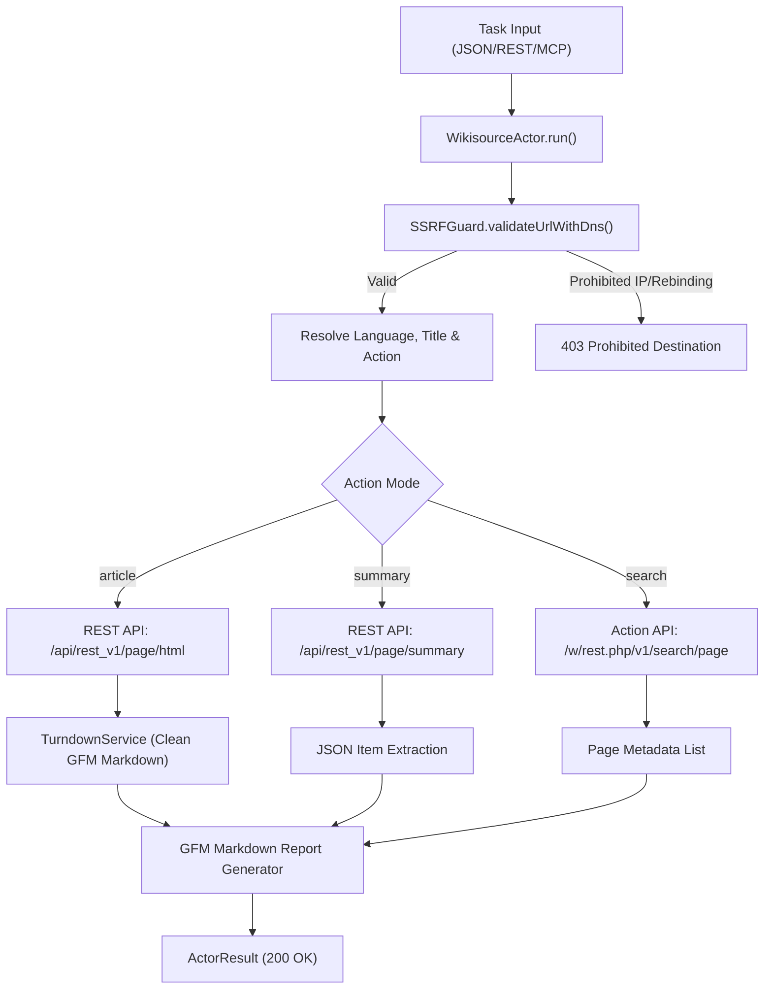
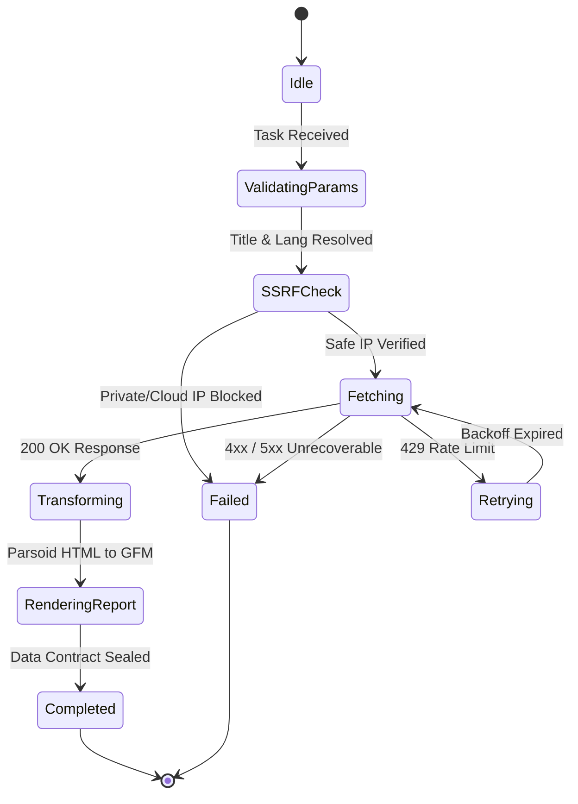

# Wikisource Historical & Literary Texts Harvester — Technical Specification

## 1. Architectural Overview

The `WikisourceActor` harvests primary historical documents, philosophical essays, speeches, and literary classics across all 85+ Wikimedia Wikisource language editions (including ancient and classical languages such as Latin, Sanskrit, Old English, and multilingual sourceswiki) via official Wikimedia REST and Action APIs.



---

## 2. Sequence Diagram

```mermaid
sequenceDiagram
    autonumber
    participant Client as REST API / MCP Client
    participant Actor as WikisourceActor
    participant Guard as SSRFGuard
    participant Wiki as Wikimedia Wikisource API
    participant TD as TurndownService

    Client->>Actor: execute(task)
    Actor->>Actor: resolveParameters(targetUrl, options)
    Actor->>Actor: buildApiUrl(lang, action, title)
    Actor->>Guard: validateUrlWithDns(resolvedQueryUrl)
    Guard-->>Actor: valid: true
    Actor->>Wiki: GET /api/rest_v1/page/html/{title}
    Wiki-->>Actor: 200 OK (Parsoid HTML)
    Actor->>TD: turndown(cleanHtml)
    TD-->>Actor: GFM Markdown Text
    Actor->>Actor: renderMarkdownReport(items)
    Actor-->>Client: 200 OK (WikisourceActorResult)
```

---

## 3. State Machine



---

## 4. Input & Output Contract

### 4.1 Input Specification
```typescript
export interface WikisourceActorTaskOptions {
  lang?: string;            // Language code: 'la', 'tr', 'en', 'sa', 'ang', 'mul' (default: 'en')
  title?: string;           // Canonical work/chapter title (e.g. 'De bello Gallico', 'Nutuk')
  titles?: string[];        // Batch of titles
  action?: "summary" | "article" | "search"; // Default: 'summary'
  query?: string;           // Search expression
  limit?: number;           // Max results (default: 10)
  timeoutMs?: number;       // Execution timeout in ms (default: 30000)
  fetchFullArticles?: boolean; // Fetch full article markdown for search hits
}
```

### 4.2 Output Specification
```typescript
export interface WikisourceActorResult {
  lang: string;
  action: "summary" | "article" | "search";
  items: WikisourceArticleItem[];
  queryUrl: string;
  markdown?: string;
}

export interface WikisourceArticleItem {
  title: string;
  url: string;
  extract?: string;
  description?: string;
  fullMarkdown?: string;
  rawHtml?: string;
  thumbnailUrl?: string;
  timestamp?: string;
  lang: string;
}
```

---

## 5. Security & Isolation Invariants

1. **SSRF Guard:** Every destination URL is resolved through `SSRFGuard.validateUrlWithDns` ensuring private IP ranges (`10.0.0.0/8`, `172.16.0.0/12`, `192.168.0.0/16`, `127.0.0.0/8`) and cloud metadata endpoints (`169.254.169.254`) are blocked prior to HTTP dispatch.
2. **Turndown Sanitization:** Strips edit sections (`.mw-editsection`), print markers (`.noprint`), scan metadata (`.prp-page-qualityheader`), and script/style tags while preserving poem/verse linebreaks (`.poem`).
3. **Multilingual Routing:** Automatically routes `mul` and `sources` language codes to `wikisource.org` (multilingual repository) while routing standard language codes to `<lang>.wikisource.org`.
