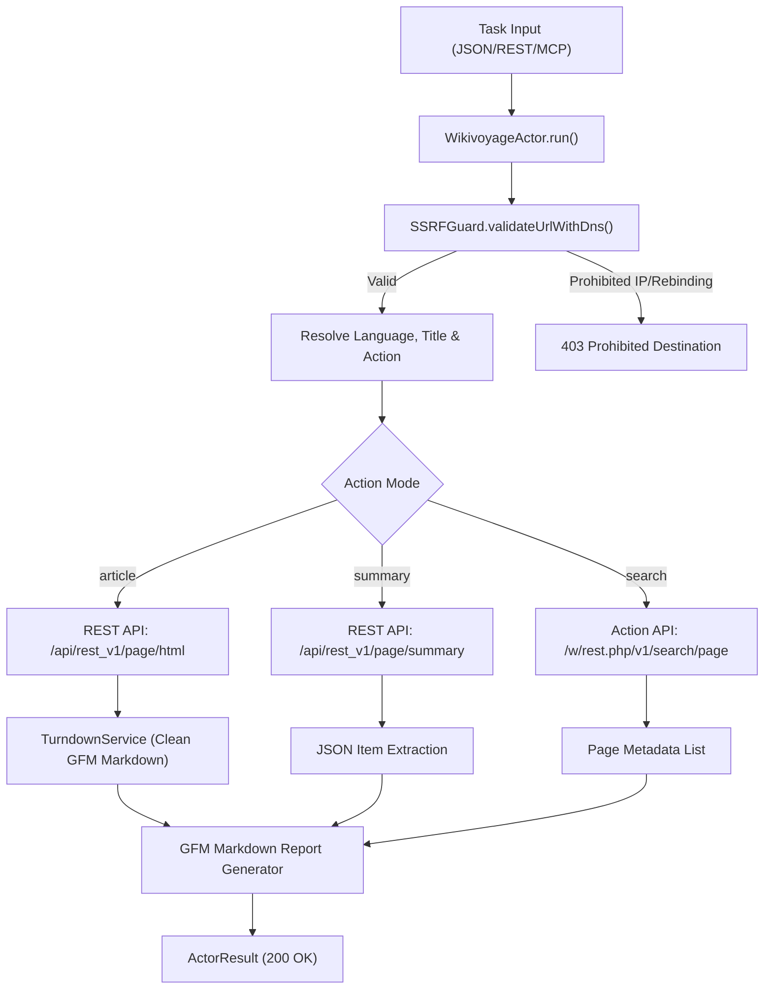
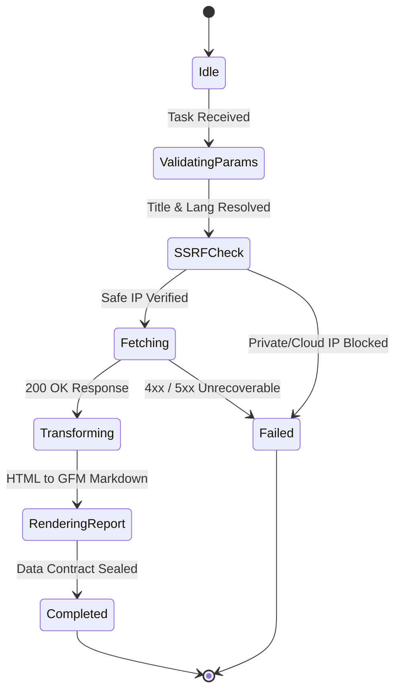

# Wikivoyage Travel & Geographic Harvester — Technical Specification

## 1. Architectural Overview

The `WikivoyageActor` extracts comprehensive geographic guides, city profiles, itineraries, and cultural landmarks across 30+ Wikimedia Wikivoyage language editions via official Wikimedia REST and Action APIs.



---

## 2. Sequence Diagram

```mermaid
sequenceDiagram
    autonumber
    participant Client as REST API / MCP Client
    participant Actor as WikivoyageActor
    participant Guard as SSRFGuard
    participant Wiki as Wikimedia Wikivoyage API
    participant TD as TurndownService

    Client->>Actor: execute(task)
    Actor->>Actor: resolveParameters(targetUrl, options)
    Actor->>Actor: buildApiUrl(lang, action, title)
    Actor->>Guard: validateUrlWithDns(resolvedQueryUrl)
    Guard-->>Actor: valid: true
    Actor->>Wiki: GET /api/rest_v1/page/html/{title}
    Wiki-->>Actor: 200 OK (Parsoid HTML)
    Actor->>TD: turndown(cleanHtml)
    TD-->>Actor: GFM Markdown Text
    Actor->>Actor: renderMarkdownReport(items)
    Actor-->>Client: 200 OK (WikivoyageActorResult)
```

---

## 3. State Machine



---

## 4. Input & Output Contract

### 4.1 Input Specification
```typescript
export interface WikivoyageActorTaskOptions {
  lang?: string;            // Language code: 'en', 'tr', 'de', 'fr', 'es', etc. (default: 'en')
  title?: string;           // Destination or guide title (e.g. 'Istanbul', 'Tokyo')
  titles?: string[];        // Multiple titles for batch destination extraction
  action?: "summary" | "article" | "search"; // Default: summary
  query?: string;           // Search expression
  limit?: number;           // Results limit (default: 10)
  timeoutMs?: number;       // Request timeout in milliseconds (default: 30000)
  fetchFullArticles?: boolean; // When true, fetches full markdown for search hits
}
```

### 4.2 Output Specification
```typescript
export interface WikivoyageActorResult {
  lang: string;
  action: "summary" | "article" | "search";
  items: WikivoyageArticleItem[];
  queryUrl: string;
  markdown?: string;
}
```

---

## 5. Security & Invariants

1. **SSRF Guard Protection:** DNS resolution checking through `SSRFGuard.validateUrlWithDns` prior to network dispatch.
2. **Deterministic Timeouts:** Maximum 30,000 ms timeout per upstream call with `AbortController`.
3. **Turndown Noise Sanitization:** Strips `.mw-editsection`, `.noprint`, `.navbox`, `.banner-box`, and formats `.vcard`/`.listing` elements.
