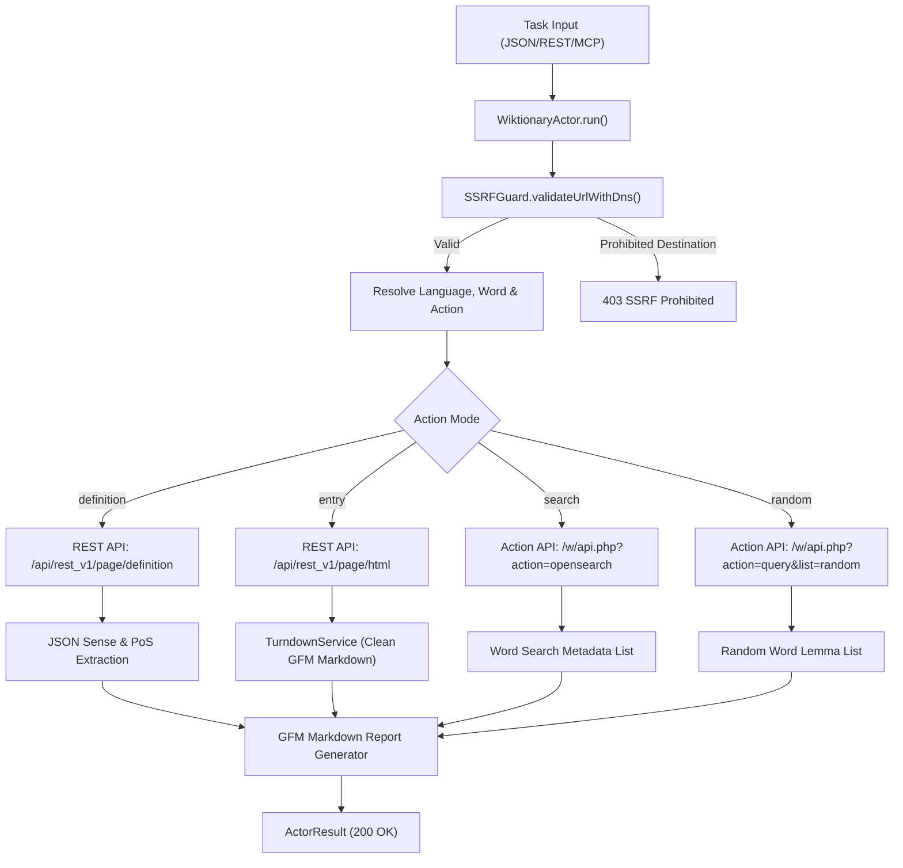
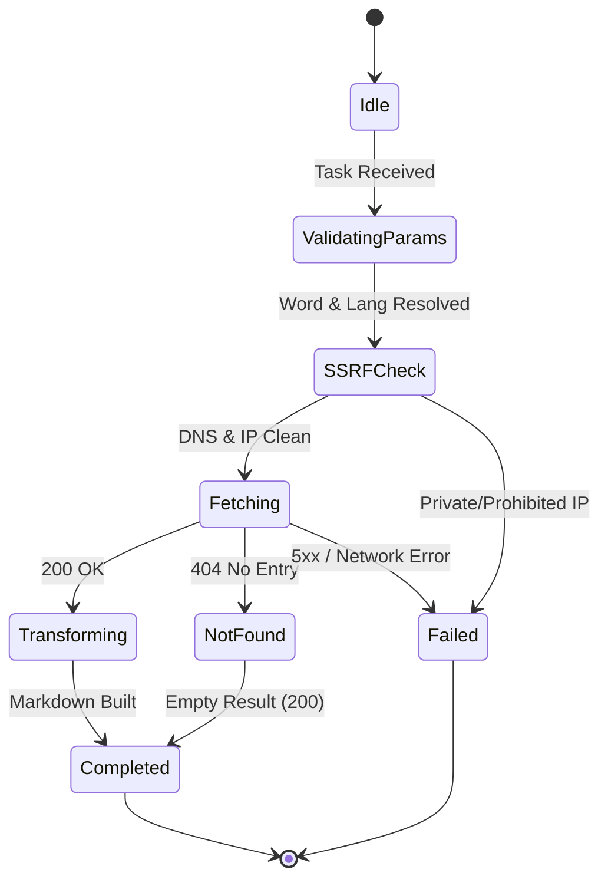

# Wiktionary Multi-Language Lexical & Etymological Extractor — Technical Specification

## 1. Architectural Overview

The `WiktionaryActor` extracts dictionary definitions, parts of speech, etymologies, phonetic pronunciations, and cross-lingual translations across all 198+ Wikimedia Wiktionary language editions via official Wikimedia REST and Action APIs.



---

## 2. Sequence Diagram

```mermaid
sequenceDiagram
    autonumber
    participant Client as REST API / MCP Client
    participant Actor as WiktionaryActor
    participant Guard as SSRFGuard
    participant Wiki as Wikimedia Wiktionary API
    participant TD as TurndownService

    Client->>Actor: execute(task)
    Actor->>Actor: resolveParameters(targetUrl, options)
    Actor->>Actor: buildApiUrl(lang, action, word)
    Actor->>Guard: validateUrlWithDns(resolvedQueryUrl)
    Guard-->>Actor: valid: true
    Actor->>Wiki: GET /api/rest_v1/page/definition/{word}
    Wiki-->>Actor: 200 OK (JSON Definition Matrix)
    Actor->>TD: cleanDefinitionHtml(def.definition)
    TD-->>Actor: Clean Markdown Definition
    Actor->>Actor: renderMarkdownReport(items)
    Actor-->>Client: 200 OK (WiktionaryActorResult)
```

---

## 3. State Machine



---

## 4. Input & Output Contracts

### Input Schema (`POST /api/v1/wiktionary`)
```json
{
  "word": "algorithm",
  "lang": "en",
  "action": "definition",
  "extractMarkdown": true,
  "options": {
    "timeoutMs": 15000,
    "limit": 10
  }
}
```

### Output Schema (`WiktionaryActorResult`)
```json
{
  "lang": "en",
  "action": "definition",
  "items": [
    {
      "word": "algorithm",
      "url": "https://en.wiktionary.org/wiki/algorithm",
      "lang": "en",
      "partsOfSpeech": [
        {
          "partOfSpeech": "Noun",
          "language": "English",
          "definitions": [
            {
              "definition": "A collection of ordered steps that solve a mathematical problem."
            }
          ]
        }
      ],
      "fullMarkdown": "# Wiktionary: algorithm (en)\n\n## English — Noun\n\n1. A collection of ordered steps that solve a mathematical problem."
    }
  ],
  "queryUrl": "https://en.wiktionary.org/api/rest_v1/page/definition/algorithm",
  "markdown": "# Wiktionary: algorithm (en)\n\n## English — Noun\n\n1. A collection of ordered steps that solve a mathematical problem."
}
```
