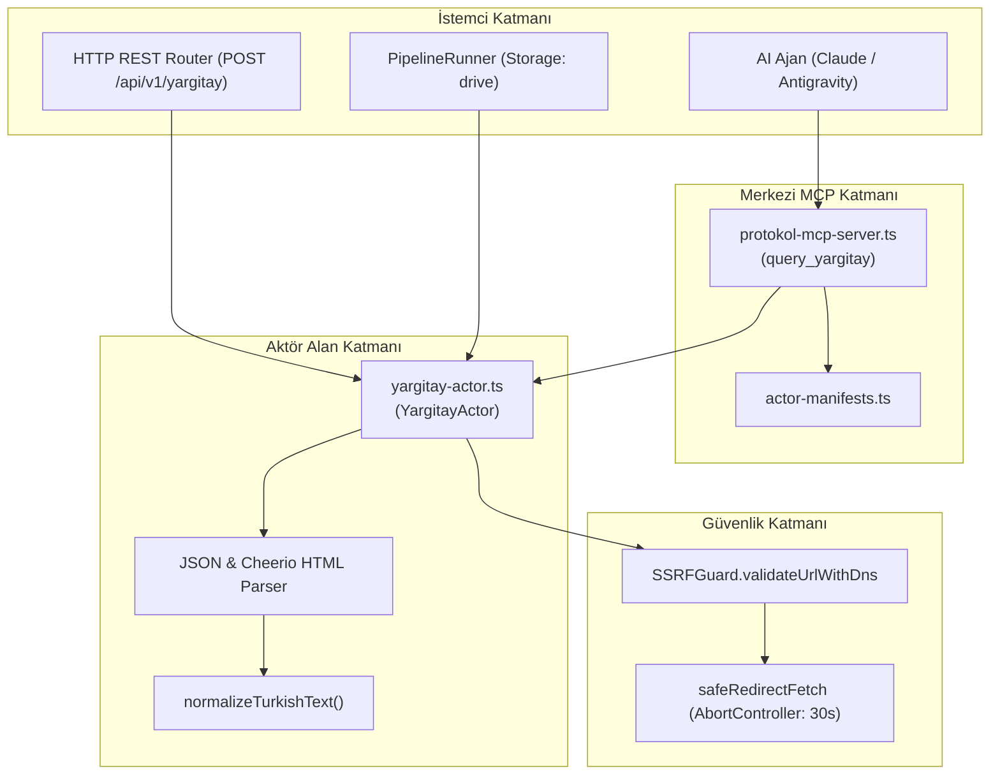
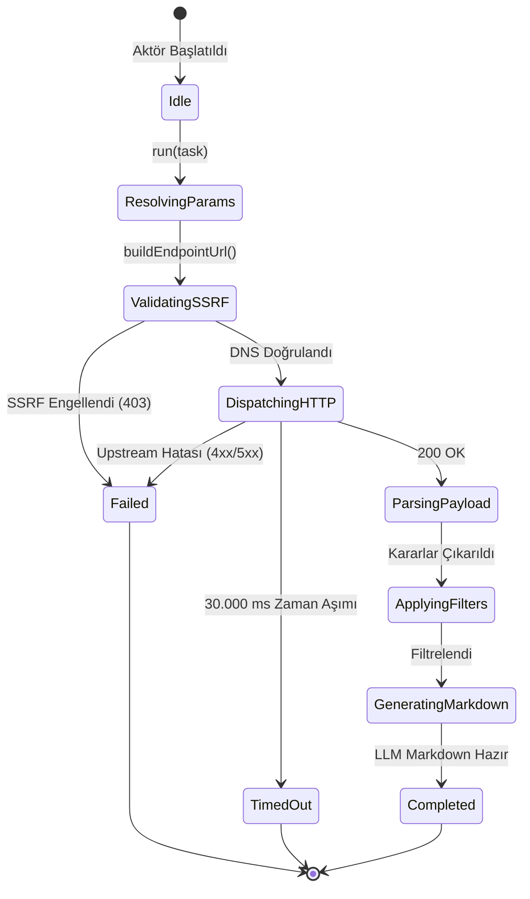

# Yargıtay & Danıştay Actor — Teknik Wiki ve Çalışma Şartnamesi

## 1. Metadata ve Sınıflandırma

| Alan | Değer |
|---|---|
| **Aktör Tanımlayıcı (Type)** | `yargitay` |
| **Kategori** | `corpus` (`src/actors/corpus/yargitay-actor.ts`) |
| **Sürüm** | `1.0.0` |
| **Birincil Sınıf** | `YargitayActor` |
| **MCP Aracı** | `query_yargitay` (`src/mcp/protokol-mcp-server.ts`) |
| **REST Uç Noktası** | `POST /api/v1/yargitay`, `POST /yargitay` |
| **Test Dosyası** | `tests/yargitay-actor.test.ts` |
| **Örnek Pipeline** | `examples/pipelines/yerel-hukuk-yargitay.yaml` (Google Drive) |

---

## 2. Mekanizma ve Teknik Genel Bakış

`YargitayActor`, T.C. Yargıtay ve Danıştay emsal karar arama sistemlerinden hukuk ve ceza daireleri kararlarını, genel kurul içtihatlarını, gerekçeli metinleri ve dava künyelerini (Esas No, Karar No, Karar Tarihi, Daire) yapılandırılmış veri ve LLM eğitimine hazır GFM Markdown formatında çıkaran aktördür.

Hem resmi JSON arama API yanıtlarını hem de HTML arama sonuç tablolarını ve detay sayfalarını ayrıştırabilir. `normalizeTurkishText` algoritması ile Türkçe büyük/küçük harf (`İ`/`I`/`ı`/`i`) ve yumuşatıcı diyakritik işaret farklarını ortadan kaldırarak deterministik arama ve filtreleme sağlar.

---

## 3. Mimari ve Bileşen Sınırları (Mermaid Flowchart)



---

## 4. İstek Yaşam Döngüsü ve Sıra Şeması (Mermaid Sequence Diagram)

```mermaid
sequenceDiagram
    autonumber
    participant Caller as Çağırıcı (REST / MCP / Pipeline)
    participant Actor as YargitayActor
    participant SSRF as SSRFGuard
    participant Net as safeRedirectFetch
    participant Store as GoogleDriveStorage

    Caller->>Actor: run(task, context)
    Actor->>Actor: buildEndpointUrl(targetUrl, options)
    Actor->>SSRF: validateUrlWithDns(endpoint, { allowLocalNetwork })
    alt SSRF Engeli
        SSRF-->>Actor: { valid: false, reason }
        Actor-->>Caller: 403 Forbidden
    else Güvenli Hedef
        SSRF-->>Actor: { valid: true }
        Actor->>Net: safeRedirectFetch(endpoint, signal, timeoutMs: 30s)
        alt Upstream Hatası (4xx/5xx)
            Net-->>Actor: HTTP Error
            Actor-->>Caller: Failed Status (statusCode)
        else Başarılı Yanıt (200 OK)
            Net-->>Actor: Raw Data (JSON or HTML)
            Actor->>Actor: parseResponse() -> Decisions
            Actor->>Actor: applyFilters(chamber, query, legalArea)
            Actor->>Actor: renderMarkdownSummary()
            alt Pipeline Drive Aktif
                Actor->>Store: uploadBuffer(driveFolderId, decisions.jsonl)
            end
            Actor-->>Caller: 200 OK (YargitayActorResult)
        end
    end
```

---

## 5. Durum Makinesi (Mermaid State Diagram)



---

## 6. Güvenlik İnvariantları

1. **SSRF Koruması:** `SSRFGuard.validateUrlWithDns` hem başlangıç URL'i hem de türetilen hedef arama uç noktası için zorunludur.
2. **Zaman Aşımı ve Kaynak Tahsisi:** Varsayılan 30.000 ms `AbortController` işletilir. Bellek sızıntılarını önlemek için akış anında kapatılır.
3. **Kullanıcı Aracısı:** `Mozilla/5.0 (compatible; Protokol7Scraper/1.0; +https://protokol-7.local)` standart başlığı ile iletilir.
4. **Türkçe Karakter Normalizasyonu:** Diacritics stripping ve Unicode normalization ile regex enjeksiyonları veya sessiz filtre kaçakları engellenir.
