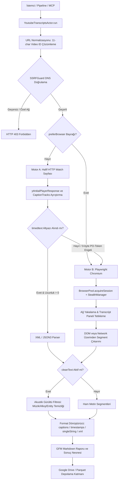
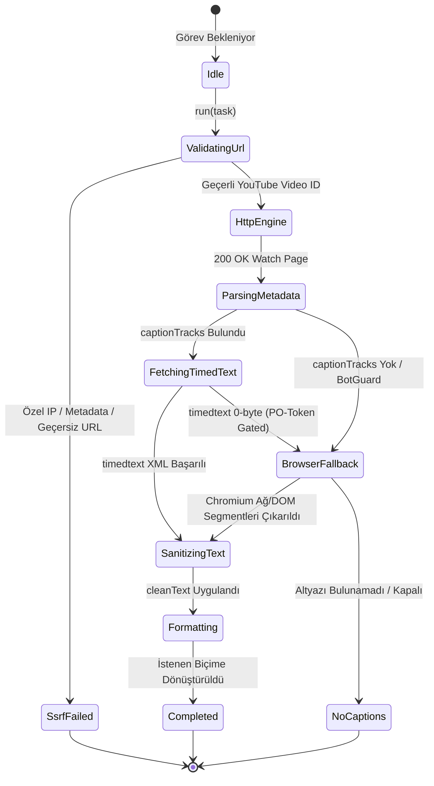

# YouTube Altyazı ve Transkript Çıkarıcı (`youtube-transcripts`)

YouTube video ve Shorts içeriklerinden altyazı (transcript/caption), zaman damgalı segmentler ve video üstverilerini (başlık, kanal, yayın tarihi, izlenme, etiketler vb.) yapılandırılmış olarak toplayan, LLM eğitimine uygun akustik gürültü temizleme filtrelerine ve çift motorlu (HTTP + Playwright) PO-token kalkanına sahip korpus aktörü.

---

## 1. Mimari Akış Şeması (Architecture Flowchart)



---

## 2. Sıra Diyagramı (Sequence Diagram)

```mermaid
sequenceDiagram
    autonumber
    participant Caller as Pipeline / MCP Caller
    participant Actor as YoutubeTranscriptsActor
    participant SSRF as SSRFGuard
    participant Fetcher as SafeRedirectFetcher
    participant Pool as BrowserPool
    participant YT as YouTube CDN / TimedText

    Caller->>Actor: run(task, context)
    Actor->>Actor: extractVideoId(rawUrl)
    Actor->>SSRF: validateUrlWithDns(watchUrl)
    SSRF-->>Actor: valid
    Actor->>Fetcher: GET https://www.youtube.com/watch?v={id}
    Fetcher->>YT: HTTP GET
    YT-->>Fetcher: 200 OK (HTML + ytInitialPlayerResponse)
    Fetcher-->>Actor: HTML Text
    Actor->>Actor: extractPlayerResponse & captionTracks
    alt captionTracks mevcut ve doğrudan timedtext başarılı
        Actor->>Fetcher: GET timedtext baseUrl
        Fetcher->>YT: HTTP GET
        YT-->>Fetcher: 200 OK (TimedText XML)
        Fetcher-->>Actor: XML Body
        Actor->>Actor: parseTimedTextXml(xml)
    else PO-Token / BotGuard boş gövde (0-byte) yanıtı
        Actor->>Pool: acquireSession(options)
        Pool-->>Actor: session (Chromium + Stealth)
        Actor->>Pool: page.goto(watchUrl)
        Actor->>Pool: Intercept / Trigger transcript panel
        Pool-->>Actor: Extracted Segments
        Actor->>Pool: session.release()
    end
    opt cleanText = true (Varsayılan)
        Actor->>Actor: cleanSegmentText (Acoustic labels & HTML entities)
    end
    Actor->>Actor: formatOutput(outputFormat)
    Actor->>Actor: renderMarkdownSummary(records)
    Actor-->>Caller: ActorResult (records, markdown, duration)
```

---

## 3. Durum Diyagramı (State Machine)



---

## 4. Teknik Sözleşmeler ve Güvenlik İnvariantları

1. **SSRF Savunması:** İstek atılmadan önce `SSRFGuard.validateUrlWithDns` yürütülür; döngüsel (loopback), RFC 1918 ve bulut metadata (169.254.169.254) adresleri engellenir.
2. **Çift Motorlu Hibrit Dayanıklılık:**
   - **Hafif HTTP Motoru:** `safeRedirectFetch` ile minimum kaynak tüketimiyle meta verileri ve doğrudan altyazıları çeker.
   - **Playwright Chromium Fallback:** YouTube'un 2025/2026 PO-token (Proof of Origin) bot koruma bariyerini `StealthManager` ile aşarak oturum seviyesinde segmentleri yakalar.
3. **Akustik ve Altyazı Gürültü Filtresi (`cleanText`):**
   - `[Music]`, `[Müzik]`, `[Applause]`, `[Alkış]`, `[Laughter]`, `[Gülüşmeler]`, `(music)`, `♪`, `♫` gibi konuşma dışı efektler temizlenir.
   - HTML entity kodlamaları (`&amp;` -> `&`, `&#39;` -> `'`) düzeltilir.
   - Satır başındaki `>>` ve `SPEAKER 1:` tarzı yönlendiriciler elenir.
   - Unicode NFKC ve boşluk normalizasyonu uygulanır.
4. **Çıktı Formatları:**
   - `captions`: Salt metin satırları (`string[]`).
   - `textWithTimestamps`: Kesit bazlı `{ start, end, text }` nesneleri.
   - `singleStringText`: LLM ön eğitimi ve RAG indeksleme için birleştirilmiş akıcı paragraf.
   - `xmlWithoutTimestamps`: Zaman özniteliksiz XML.
   - `xmlWithTimestamps`: Ham YouTube timedtext XML metni.
5. **Google Drive ve Parquet Boru Hattı:**
   - Bir kanalın tüm videoları Zstandard (`zstd`) sıkıştırmalı tek bir `.parquet` dosyasına paketlenir.
   - `GoogleDriveStorage` üzerinden Google Drive klasörüne yüklenir ve `manifest.json` ile SHA-256 bütünlüğü mühürlenir.
