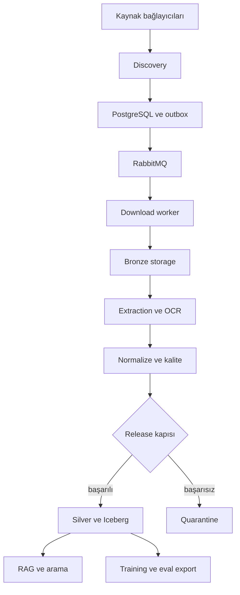

# 01 — Mimari ve kapsam
## Hedef ve gerçek ölçek
500 TB bir lake kapasitesi hedefidir; bugün ölçülmüş veri hacmi değildir. PDF, ham yanıt ve metinler control DB'ye konmaz. DB kimlik, state, lineage, manifest ve object reference tutar. Çok sayıda stateless worker; az sayıda iyi yönetilen stateful servis kullanılır. İlk sürümde global distributed SQL zorunlu değildir.

| Düzlem | Sistem | Sorumluluk |
|---|---|---|
| Control | PostgreSQL | kaynak, cursor, job, lease, outbox, artifact, release |
| Event | RabbitMQ | küçük job bildirimi, delivery ve DLQ |
| Data | StorageRegistry | ham dosya ve türev object'ler |
| Lakehouse | Parquet; sonraki kapıda Iceberg + REST catalog | analitik tablo ve snapshot |
| Query | DuckDB local; ileride Trino | kontrol/analitik sorguları |
| Serving | API/MCP; isteğe bağlı search/vector | yetkili erişim |

## Akış

Her geçiş bir sonraki job + outbox event oluşturur; storage tek başına job scheduling yapmaz. Diyagram mantıksal veri akışını gösterir, fiziksel notification tüm aşamalarda outbox/queue üzerinden gider.

## Uygulama sınırları
Node: HTTP/OpenAPI, MCP, kaynak actor'ları ve browser pool. Python: ingestion, download, extraction, OCR, normalization, lake writer ve AI dataset işlemleri. Ortak JSON Schema; TS/Python model üretimi CI'da doğrulanır. Ortak DB migration tek sahibi tarafından yönetilir. Servisler repository yöntemleri üzerinden yazabilir; her iş akışı için tek transaction sahibi tanımlanır.

Actor sözleşmesi: capabilities, source descriptor, discover(cursor, budget), normalize(record), checkpoint proposal. Actor checkpoint'i doğrudan ileri almaz; controller ham artifact ve kayıt transaction'ı tamamlandıktan sonra alır. download/extract sorumluluğu worker'dadır. API/bulk önceliği source'e göre seçilir; ardından OAI-PMH/feed/HTTP/browser. Mevcut actor sayısı ve stealth özellikleri README beyanıdır, bu teslimde doğrulanmış değildir.

## Katmanlar
Bronze immutable ham response/PDF/HTML; Silver normalize edilmiş document/page/table; Gold amaç bazlı sürümlü RAG/training/eval çıktısı. Quarantine ayrı namespace ve erişim rolü. Catalog object listesiyle değil DB manifest ve Iceberg metadata ile keşfedilir. Raw artifact lisansı metadata lisansından ayrı tutulur.

## Kimlik
source + external_id upstream kayıt kimliğidir. Aynı içeriği işaret eden kayıtlar korunur. SHA-256 binary content identity sağlar, bibliyografik document identity yerine geçmez. Bir document birden fazla asset/version'a bağlanabilir. Object SHA-256 indirme sonrası hesaplanır; daha önce bilinmeyen aynı PDF'nin network üzerinden tekrar indirilmesini tek başına önleyemez. Ön URL/ETag lookup optimizasyon, hash doğrulaması kesin content dedup sağlar.

## Hedef dizin
apps/api, apps/mcp, pipelines/sources, workers/{download,extract,ocr,normalize,publish}, packages/{contracts,storage,ledger}, lakehouse/{catalog,maintenance}, infra, tests, docs. Büyük toplu taşıma yapmayın; mevcut src ve pipelines üzerinde sınırları önce interface ile oluşturun.

## ADR özeti
A01 relational ledger; A02 DB truth + queue notification; A03 at-least-once ve idempotent sonuç; A04 seçimli storage; A05 raw yeniden işleme; A06 AI release kapısı; A07 local geliştirme/tek host, R2 paylaşımlı üretim adayı; A08 Iceberg ancak ham akış stabil olduğunda. Her ADR'nin değişim koşulu backlog ve evidence belgesinde.
