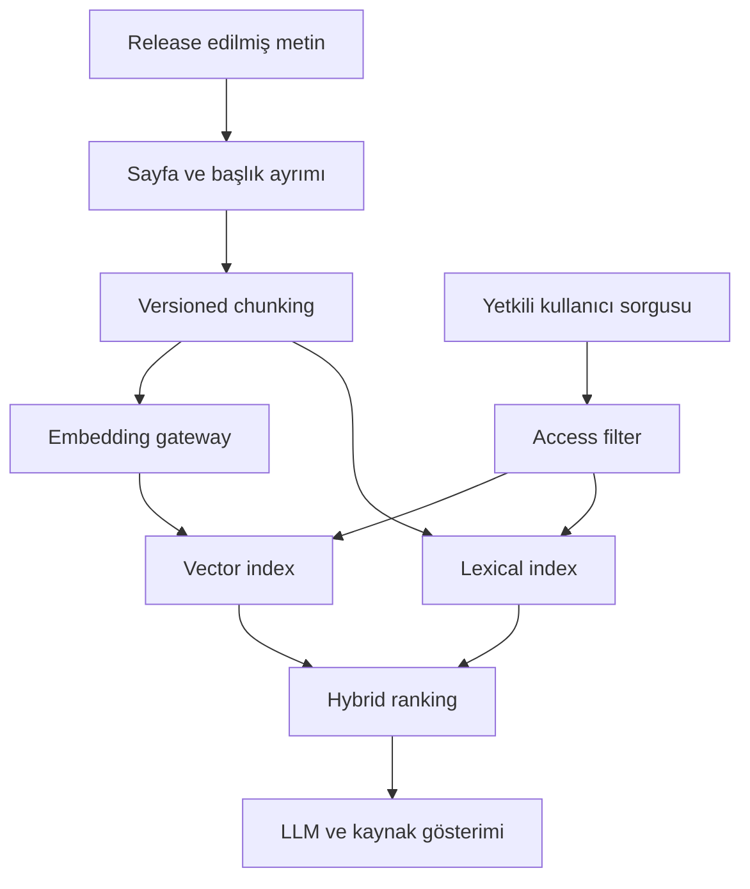

# 04 — AI/LLM veri ve beceri seti
## AI amaçları ayrı ürünlerdir
| Amaç | Veri çıktısı | Release koşulu |
|---|---|---|
| RAG/search | chunk + page/section citation + access label | retrieval hakkı, tazelik, silme propagasyonu |
| Pretraining | metin/document manifest | training hakkı, exact/near dedup, contamination kontrolü |
| SFT | messages JSONL + source derivation | QA rubric, synthetic marker, train/eval ayrımı |
| DPO | prompt, chosen, rejected, label provenance | gerçek tercih protocolü veya açık synthetic işareti |
| Eval | frozen holdout + scorer | overlap audit, version/hash, uzman örnek doğrulama |
| Multimodal | image/page/audio alignment | media rights ve timestamp/bbox |

İlk ürün RAG olabilir; pretraining/SFT/DPO zorunlu aynı anda kurulmaz. Sıradan Q&A preference label değildir. LLM üretimi insan etiketi gibi sunulmaz. Ham PDF'ler LLM'e varsayılan olarak gönderilmez.

## RAG akışı

chunk_id deterministic(document version, page/section, offsets, chunk policy). Token sınırı tokenizer/model sürümüne bağlıdır; örnek 512 token hedef ve 64 overlap sadece pilot başlangıcıdır. Tablo/başlık ilişkisi korunur. Türkçe Unicode ve karakter offsetleri byte offsetlerinden ayrı tutulur. Embedding provenance model name+revision+dimension+distance+normalization içerir; model değişikliği yeni index sürümüdür. Access filter retrieval öncesi ve sonuç üzerinde uygulanır. Search/vector truth değil yeniden oluşturulabilir türevdir.

## LLM Gateway
generate/embed/rerank yetenekleri ayrı. Config local inference veya yetkili harici provider seçer. Adapter canonical request/response, model revision, usage, latency, cost, retry ve structured output validation sağlar. Secret ref config dışındaki secret store'a gider. Input context'e dokümandan gelen talimatlar güvenilmeyen içerik olarak aktarılır; source metni agent yetkisini yükseltemez. RAG yanıtı citation doğruluğu ve answerability kontrolünden geçer. Kaynakta cevap yoksa abstention kabul edilir. Tenant cost cap, per-request token cap ve concurrency limit uygulanır; prompt tam metni telemetry'de varsayılan loglanmaz.

## Kalite ve veri yönetişimi
Her artifact: source/run, acquired_at, content hash, parser/code/schema version, language confidence, OCR quality, rights_by_purpose, PII policy, lineage parent refs. Haklar unknown/pending ise training release yok. RAG ve training için ayrı hak değerlendirmesi. Exact dedup hash; near dedup MinHash/benzeri ölçülmüş eşik; bilimsel sürümler ve alıntılar otomatik aşırı silinmez. Eval bölme document family/source/time düzeyinde, split öncesi near duplicate kümelenerek yapılır. Aynı makalenin farklı aynaları farklı split'e gitmez. Benchmark örtüşmesi lexical ve gerektiğinde semantic audit ile raporlanır.

PII detector → redaction/review → versioned output; tek regex yeterli kabul edilmez. Dataset withdrawal → impacted lineage → index/chunk/export tombstone → yeni release. Model ağırlığından seçici unutma basit object silme ile garantilenmez; impacted model kayıt altına alınır.

## AI agent beceri kataloğu (bu pakette TASARIM)
| Beceri | Girdi → çıktı | İzin ve kabul |
|---|---|---|
| source-onboarding | resmi docs → descriptor/adapter/fixture | bounded pilot, rights unknown açık |
| storage-adapter | provider docs → adapter/contract evidence | scoped bucket, credential log yok |
| ledger-migration | schema → migration/backfill report | test DB, rollback + parity |
| worker-implementation | operation contract → worker/kill tests | epoch fence ve retry testi |
| extraction-quality | sample PDF → QA report | source/page lineage, OCR confidence |
| llm-dataset-release | candidate → versioned manifest | rights, PII, dedup, holdout gate |
| rag-evaluation | holdout → retrieval/citation metrics | frozen set, model/tokenizer version |
| production-readiness | staging evidence → go/no-go | restore/HA/capacity/security kanıtı |
| incident-triage | redacted metrics → diagnosis/runbook | varsayılan read-only |

Bunlar kurulmuş Codex becerileri olduğu iddiası değildir; repository .agents/skills altında uygulanacak spesifikasyonlardır. Mevcut data-ingestion-protocol ve AGENTS.md repo alındığında önce okunmalı; bu paket onları geçersiz kılmaz. Agent yeni source için descriptor→fixture→bounded pilot→quality→registry adımlarını tamamlar. Her beceri output schema, tool allowlist, budget, timeout, evidence ve acceptance tanımlar. Skill metni runtime RBAC'ın yerine geçmez.

## MCP tool yüzeyi
read: sources.list, jobs.get, datasets.describe, artifacts.lineage, metrics.summary.
operate: ingestion.plan, ingestion.start (bounded), jobs.retry (bounded), pipelines.pause, datasets.validate.
admin: migration, retention deletion, bulk retry, role change; ayrı rol/audit/policy.
LLM plan üretir; orchestrator parametre şeması, source scope, budget ve permission kontrolüyle çalıştırır. request_id/idempotency_key ve actor_id audit'e yazılır. Otomatik 5M job retry veya sınırsız crawl yok. HTTP ve MCP aynı authorization service'i kullanır.

## Ölçümler ve kabul
RAG: Recall@k, citation page correctness, unsupported claim rate, abstention, latency, cost. SFT: rubric pass, source linkage, synthetic proportion. OCR: örnek doğrulanmış CER/WER veya domain alternatifleri. Token sayısı gerçek tokenizer ile ölçülür; kelime sayısından uydurulmaz. Threshold'lar pilot holdout üzerinde ekipçe onaylanır; bu teslim model başarısı iddia etmez.
