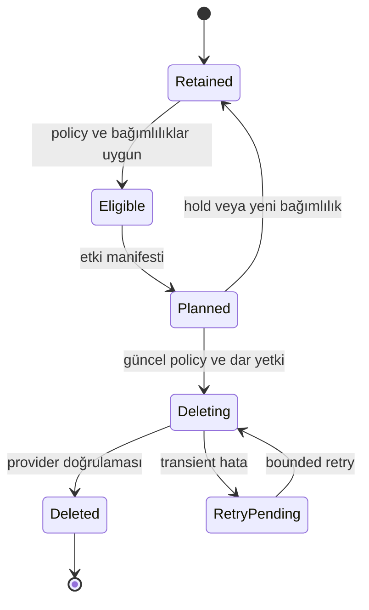

# 09 — Ham veri saklama ve silme
## Karar
Ham veri işlenince otomatik olarak hemen silinmez. Source/dataset/purpose için seçilmiş retention policy belirler. V2 default keep; delete_after_release ve ttl opt-in'dir. Bu paket silme tasarımıdır; mevcut dosya veya upstream veri silinmedi.

| Mod | Davranış | Kullanım |
|---|---|---|
| keep | süresiz değil, belirlenen review date'e kadar tut | replay/audit için başlangıç |
| ttl | acquisition_at + TTL sonrası eligibility | yeniden edinilebilir büyük raw |
| delete_after_release | doğrulanmış release + grace sonrası | bilinçli raw maliyet azaltımı |
| archive_then_delete | doğrulanmış archive replica sonra hot copy sil | maliyet/erişim dengesi |

unknown/pending policy silme yapamaz. Geçerli hak/retention yükümlülüğü seçilen modun üst sınırını etkiler; çatışma review'e gider. legal_hold/dispute/incident_hold silmeyi bloklar. Acil privacy/rights talebi ordinary retention'dan ayrı withdrawal workflow'u başlatır; operasyon ekibi conflict ve backup kapsamını değerlendirir.

## Delete eligibility gate
- Download tam, binary integrity ve expected size kontrolleri geçti.
- Extraction/OCR/normalize ve gereken downstream release başarılı; pending/retry/running reprocess yok.
- Metin, gerekli page/table metadata, parser/version, lineage ve hash/size manifest'i durable konumda.
- İlgili türevlerin backup/restore veya regeneration stratejisi doğrulandı.
- Policy revision, purpose, grace deadline ve hold kontrolü güncel.
- Aynı content object'e bağlı TÜM document/source/version retention istekleri kontrol edildi; herhangi biri raw gerektiriyorsa physical shared object silinmez.
- Raw kaybının citation/page image/re-OCR/reprocessing etkisi plan'da gösterildi.

SHA-256 ve extraction output raw dosyanın geri oluşturulmasını sağlamaz. Upstream tekrar indirilebilir varsayımı garanti değildir; URL ve erişim zaman içinde değişebilir. Raw silinirse yeni parser ile yeniden işleme ve bazı multimodal çıktılar kaybedilir. keep önerisi bu tradeoff nedeniyle başlangıç tercihidir.

## Silme state machine

DB deletion plan object_ref/version/hash, policy revision, impacted refs, cutoff, reason, actor, dry_run, expires_at içerir. Execute transaction'ında dependency generation fence ve object deletion lease alınır; yeni raw consumer bu lease altında object'e bağlanamaz. Ağ silmesi DB transaction dışında yapılır. Finalize sonuç ve tombstone audit kaydeder. Worker çöküp silme başarılı fakat DB finalize olmadıysa head/version check reconciliation tamamlar. 404 ancak doğru object identity/version doğrulandığında idempotent sonuç sayılır. Başka version'ın bulunması original hedef silme başarısını gizlemez.

Object versioning varsa current delete marker eski version'ları kalıcı silmez. Provider-specific purge inventory gerekir. Shared replica, cache, backup, Drive trash ve index/export farklı lifecycle'dır; physical purge tamamlanmadan 'tamamen silindi' denmez. Backup retention sonunda purge süresi raporlanır. Upstream kaynak dosya silinmez; yalnızca Protokol-7'nin sahip olduğu raw replica hedeflenir. Drive input silme izinleri verilmez.

## Kaynak geri alınması
withdraw release → serving engelle → türev lineage etkisi → chunk/vector/search/export invalidation → raw/türev deletion plan. Dağıtılmış üçüncü taraf export geri çağırma garantisi yok; alıcıya notification ayrı yetkilendirilmiş entegrasyon ister. Eğitilmiş modelden seçici unutma object delete ile garanti edilmez.

## Kabul testleri
Shared hash iki source, biri keep: silinmez. Running extract: silinmez. Yeni reprocess planıyla race: fence engeller. Upload/delete credential separation: download worker delete reddi. Grace geçmeden execute reddi. Hold plan sonrası eklendi: execute reddi. Provider timeout: audit retry, success iddiası yok. Versioned object: marker+versions ayrımı. Delete sonrası yeniden delivery: idempotent reconcile. Restore edilen DB tombstone'ları geri getirip object'i mevcut göstermemeli.
