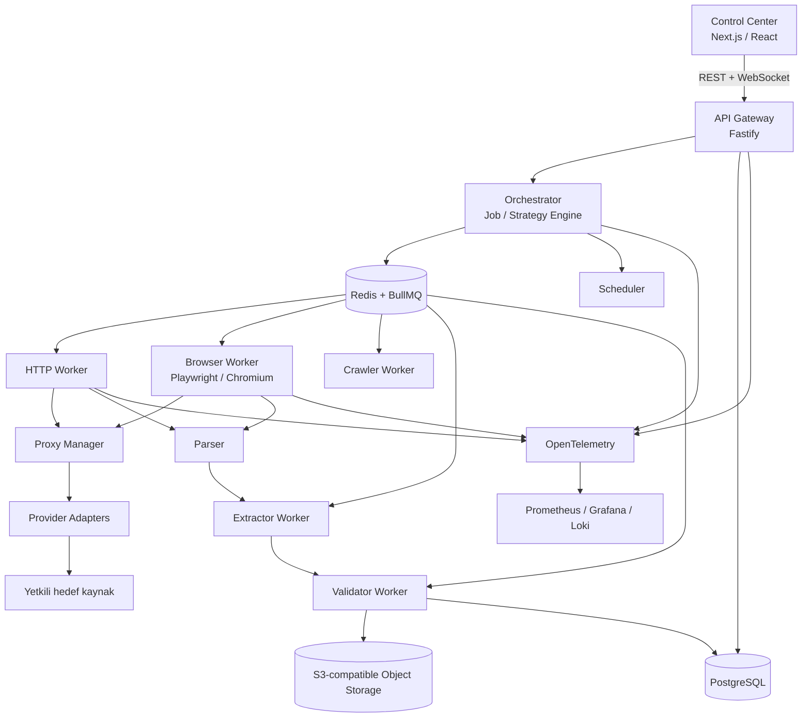
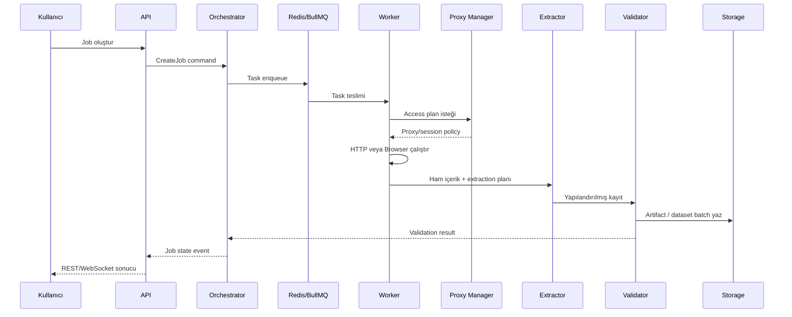

# 01 — Mimari ve Bileşen Tasarımı

**Sürüm:** 0.1.0  
**Durum:** Tasarım  
**Kapsam:** Platform sınırları, servisler, veri akışları ve teknik kararlar

## 1. Mimari hedef

Platformun amacı, hedef web kaynağına erişim yöntemini, çalışma ortamını, çıkarım stratejisini ve doğrulama adımlarını tek bir iş akışı içinde yönetmektir. Kullanıcı arayüzü, API veya zamanlayıcı üzerinden oluşturulan her iş; orkestrasyon katmanı tarafından görevlere ayrılır, uygun worker'a yönlendirilir ve sonucu doğrulanmış bir dataset sürümüne dönüştürülür.

Temel mimari kural **HTTP-first, browser-when-needed** yaklaşımıdır. Statik veya doğrudan HTTP ile alınabilen sayfalarda browser başlatılmaz. JavaScript, oturum, etkileşim veya ağ seviyesinde tarayıcı davranışı gerçekten gerekli olduğunda Browser Worker devreye girer. Bu yaklaşım, gereksiz kaynak tüketimini ve operasyonel karmaşıklığı azaltır.

## 2. Mantıksal mimari



Şema, mantıksal bağımlılıkları gösterir. Fiziksel dağıtımda API, orkestrator, scheduler ve worker süreçleri ayrı deployment olarak çalıştırılabilir; MVP'de aynı monorepo içinde ayrı process olarak işletilmeleri yeterlidir.

## 3. Bileşenler ve sorumluluklar

| Bileşen | Sorumluluk | Kalıcı durum | Dış bağımlılık |
|---|---|---|---|
| Control Center | Proje, hedef, schema, job, dataset ve operasyon ekranlarını sunar | Tarayıcı tarafında geçici UI durumu | API, WebSocket |
| API Gateway | Kimlik doğrulama, yetkilendirme, doğrulama, kaynak yönetimi ve sorgulama | PostgreSQL üzerinden | Redis, object storage |
| Orchestrator | Job'ı görevlere ayırır, strategy kararını uygular, durum geçişlerini yönetir | Job, task, attempt ve olay kayıtları | Redis, PostgreSQL |
| Scheduler | Zamanlanmış işlerin tetiklenmesi ve çakışma kontrolü | Schedule ve execution kayıtları | Redis, PostgreSQL |
| HTTP Worker | HTTP isteği, response alma, temel parse ve erişim ölçümleri | Attempt özeti ve artifact referansı | Proxy Manager |
| Browser Worker | Playwright/Chromium ile sayfa açma, action, session ve artifact üretimi | Browser attempt ve artifact referansı | Proxy Manager |
| Crawler Worker | URL keşfi, canonicalization, deduplication ve kuyruk önceliği | URL frontier, crawl state | Redis, PostgreSQL |
| Extractor Worker | CSS/XPath, JSONPath ve kontrollü AI extraction | Extraction result ve quality girdileri | LLM provider, object storage |
| Validator Worker | Schema, tip, zorunlu alan ve kalite kontrolleri | Validation result, quality score | PostgreSQL |
| Proxy Manager | Provider seçimi, kota, health, session ve erişim politikası | Proxy usage ve health snapshot | Proxy provider'ları |
| Storage | Ham içerik, ekran görüntüsü, PDF, export ve büyük artifact'leri saklar | Object storage | S3 uyumlu servis |
| Observability | Trace, metrik ve yapılandırılmış log toplar | Metrik/log backend'i | OpenTelemetry, Prometheus, Grafana, Loki |

Her servis kendi sorumluluğu dışındaki iş kuralını sahiplenmemelidir. Örneğin worker, job'ın tamamlanıp tamamlanmadığına karar vermez; yalnızca kendisine verilen task'ı çalıştırır ve sonucu orkestrator sözleşmesine uygun biçimde yayınlar.

## 4. Veri akışı

Birincil veri akışı aşağıdaki sırayı izler:

1. Kullanıcı Project, Target ve Schema tanımlar.
2. API, isteği tenant ve yetki bağlamı ile doğrular.
3. Orchestrator bir Job ve en az bir Task oluşturur.
4. Strategy Engine, HTTP veya Browser çalışma modunu ve extraction planını seçer.
5. Task, BullMQ kuyruğuna idempotency anahtarıyla yazılır.
6. Worker görevi alır, policy kontrolü yapar, gerekirse Proxy Manager'dan bir erişim planı ister.
7. Response, DOM veya API payload'ı parse edilerek Extractor'a aktarılır.
8. Extractor yapılandırılmış sonucu üretir; Validator schema uygunluğunu ve kalite puanını hesaplar.
9. Geçerli kayıtlar Dataset sürümüne eklenir; ham artifact'ler object storage'a yazılır.
10. Orchestrator Job durumunu günceller ve dashboard, webhook veya API sorgusu için olay yayınlar.



## 5. Servis iletişimi

Dış istemciler için tek giriş noktası API Gateway'dir. Servis içi komutlar ve iş yükleri Redis/BullMQ üzerinden asenkron yürütülür. Düşük hacimli, anında cevaplanabilen okuma işlemleri REST ile yapılabilir; worker sonucu, durum değişimi ve ilerleme bildirimleri olay tabanlı taşınmalıdır.

| İletişim türü | Kullanım | Sözleşme |
|---|---|---|
| REST/JSON | Kaynak CRUD, job başlatma, sorgulama ve export başlatma | Versiyonlanmış HTTP API |
| BullMQ mesajı | Worker command ve sonuç event'i | Şema kontrollü JSON envelope |
| WebSocket | Dashboard canlı durum ve ilerleme | Olay adı + sürümlü payload |
| Webhook | Job tamamlandı/başarısız oldu bildirimi | İmzalı HTTP POST, retry |
| Object storage | Ham response, PDF, ekran görüntüsü, export | URI + checksum + metadata |

## 6. Monorepo yapısı

```text
scraping-platform/
├── apps/
│   ├── control-center/
│   ├── api/
│   ├── scheduler/
│   └── docs/
├── workers/
│   ├── http/
│   ├── browser/
│   ├── crawler/
│   ├── extractor/
│   └── validator/
├── packages/
│   ├── types/
│   ├── database/
│   ├── queue/
│   ├── proxy/
│   ├── browser/
│   ├── crawler/
│   ├── extractor/
│   ├── ai/
│   ├── observability/
│   └── config/
├── infra/
│   ├── docker/
│   ├── kubernetes/
│   └── terraform/
└── docs/
    ├── architecture/
    ├── api/
    ├── security/
    ├── operations/
    └── adr/
```

## 7. Mimari ilkeler

| İlke | Uygulama sonucu |
|---|---|
| Sorumlulukların ayrılması | API, orkestrasyon, worker ve extraction bağımsız test edilir. |
| Adapter arkasında dış servis | Proxy ve LLM provider değişimi çekirdek iş mantığını etkilemez. |
| Asenkron varsayılan | Uzun süren crawl ve browser işleri HTTP request yaşam süresine bağlanmaz. |
| Ham veriyi koruma | Tekrar extraction veya hata incelemesi için artifact referansı tutulur. |
| Tenant sınırı | Her sorgu ve kuyruk mesajı tenant bağlamını taşır. |
| Gözlemlenebilirlik birinci sınıf | Job → Task → Attempt → Worker → Proxy → Target zinciri trace edilir. |
| Güvenli varsayılanlar | SSRF, credential sızıntısı, sınırsız crawl ve yetkisiz hedefler varsayılan olarak engellenir. |

## 8. MVP ve sonraki faz ayrımı

MVP, tek bölge ve sınırlı provider kapsamı ile çalışan bir platform olmalıdır. HTTP Worker ve Browser Worker aynı job modelini paylaşmalı, ancak çalışma motorları birbirinden bağımsız deploy edilebilmelidir. Yüksek performans gerektiren crawler veya worker bileşenlerinin ileride Go'ya ayrılması, mevcut mesaj ve veri sözleşmeleri korunarak yapılmalıdır.

İleri fazlarda provider sayısının artırılması, gelişmiş AI Strategy Engine, recursive crawler optimizasyonları, multi-region dağıtım ve maliyet bazlı otomatik yönlendirme eklenebilir. Bu özellikler MVP sözleşmelerini geriye dönük bozmayacak şekilde yeni adapter ve strategy sürümleri olarak eklenmelidir.

## References

[1]: ../source/pasted_content.txt "Kullanıcı tarafından sağlanan sistem taslağı"
