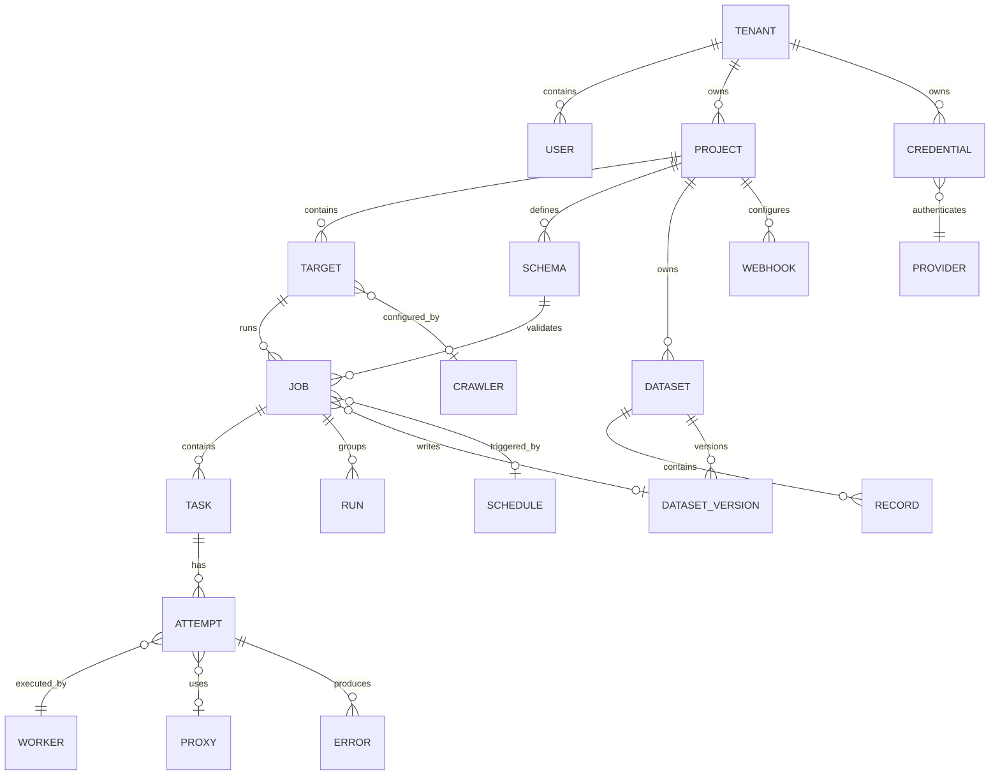

# 02 — Domain Modeli ve Veri Sözlüğü

**Sürüm:** 0.1.0  
**Durum:** Tasarım  
**Kapsam:** Tenant, project, target, job, task, worker, proxy, extraction ve dataset varlıkları

## 1. Modelleme yaklaşımı

Domain modeli, kullanıcı tarafından tanımlanan niyet ile bu niyetin worker'lar tarafından yürütülmesi arasındaki sınırı temsil eder. **Project** kullanıcı organizasyonunun çalışma alanıdır; **Target** erişilecek kaynağı ve policy sınırlarını tanımlar; **Job** belirli bir çalıştırma niyetini; **Task** ise bu çalıştırmanın yürütülebilir en küçük birimini ifade eder.

Her tenant'a ait iş, kaynak ve artifact kaydı tenant kimliğini taşımak zorundadır. Kimlikler dışarıya tahmin edilebilir sıralı değerler olarak açılmamalı; UUID veya eşdeğeri opak kimlikler kullanılmalıdır. Zaman alanları UTC olarak saklanmalı ve API'de ISO 8601 biçiminde sunulmalıdır.

## 2. İlişki diyagramı



## 3. Varlık sözlüğü

| Varlık | Tanım | MVP durumu | Ana sahip servis |
|---|---|---:|---|
| Tenant | İzolasyon, faturalama ve yetki sınırının kökü | Zorunlu | API |
| User | Tenant içindeki kullanıcı kimliği | Zorunlu | API/Auth |
| Project | Aynı hedef, schema ve dataset bağlamındaki çalışma alanı | Zorunlu | API |
| Target | URL, domain policy, erişim ve çalışma tercihleri | Zorunlu | API |
| Crawler | Seed, derinlik, URL ve link keşif ayarları | Sonraki MVP genişlemesi | Crawler |
| Schema | Beklenen alanlar, tipler, zorunluluk ve extraction mapping | Zorunlu | API/Validator |
| Job | Kullanıcının başlattığı veya schedule tarafından tetiklenen çalışma | Zorunlu | Orchestrator |
| Task | Job içindeki tek yürütülebilir iş | Zorunlu | Orchestrator |
| Run | Bir job'ın mantıksal çalıştırma grubu | Zorunlu | Orchestrator |
| Attempt | Bir task için tek yürütme denemesi | Zorunlu | Worker/Orchestrator |
| Worker | HTTP, browser, crawler, extractor veya validator yürütücüsü | Zorunlu | Worker Registry |
| Browser | Browser process/context/session bilgisi | Browser için zorunlu | Browser Worker |
| Proxy | Seçilen erişim endpoint'i ve kullanım metadata'sı | Adapter düzeyinde zorunlu | Proxy Manager |
| Session | Cookie, localStorage ve sticky-session bağlamı | Browser için zorunlu | Browser Worker |
| Extractor | Seçim, parse ve yapılandırılmış veri üretim planı | Zorunlu | Extractor |
| Dataset | Aynı schema ile üretilen kayıt koleksiyonu | Zorunlu | Storage/Validator |
| Dataset Version | Dataset'in değişmez, sorgulanabilir çıktı sürümü | Önerilir | Storage |
| Record | Dataset içindeki tek normalize edilmiş çıktı | Zorunlu | Validator |
| Error | Sınıflandırılmış teknik veya policy hatası | Zorunlu | Orchestrator |
| Webhook | Job olaylarının dış sisteme teslim ayarı | Sonraki MVP genişlemesi | API |
| Schedule | Job üretmek için zaman planı | Sonraki MVP genişlemesi | Scheduler |
| Credential | Provider veya hedef erişimi için şifreli sır referansı | Zorunlu | Secrets adapter |
| Provider | Proxy veya LLM gibi dış servis sağlayıcısı | Zorunlu | Adapter layer |

## 4. Önerilen çekirdek tablolar

Aşağıdaki model fiziksel migration'ın başlangıç sözleşmesidir. İlişkisel veritabanında tablo isimleri çoğul, kolon isimleri `snake_case` kullanılmalıdır.

| Tablo | Zorunlu alanlar | İndeks / kısıt |
|---|---|---|
| `tenants` | `id`, `name`, `status`, `created_at` | `status`; soft delete policy |
| `users` | `id`, `tenant_id`, `email`, `status` | `(tenant_id, email)` unique |
| `projects` | `id`, `tenant_id`, `name`, `status` | `(tenant_id, name)` unique |
| `targets` | `id`, `project_id`, `url`, `host`, `policy_json`, `status` | `(project_id, host)`; URL normalize |
| `schemas` | `id`, `project_id`, `name`, `version`, `definition_json` | `(project_id, name, version)` unique |
| `jobs` | `id`, `tenant_id`, `project_id`, `target_id`, `schema_id`, `status`, `run_id` | `(tenant_id, created_at)`; status |
| `tasks` | `id`, `job_id`, `type`, `status`, `attempt_count`, `payload_json` | `(job_id, status)` |
| `attempts` | `id`, `task_id`, `worker_id`, `status`, `started_at`, `finished_at` | `(task_id, started_at)` |
| `errors` | `id`, `tenant_id`, `job_id`, `task_id`, `code`, `retryable`, `details_json` | `(job_id, code)` |
| `workers` | `id`, `type`, `version`, `status`, `last_heartbeat_at` | `(type, status)` |
| `datasets` | `id`, `tenant_id`, `project_id`, `name`, `schema_id` | `(project_id, name)` unique |
| `dataset_versions` | `id`, `dataset_id`, `job_id`, `version_no`, `quality_score` | `(dataset_id, version_no)` unique |
| `records` | `id`, `dataset_version_id`, `record_key`, `payload_json`, `quality_score` | `(dataset_version_id, record_key)` |
| `artifacts` | `id`, `tenant_id`, `attempt_id`, `kind`, `storage_uri`, `checksum` | `(attempt_id, kind)` |
| `credentials` | `id`, `tenant_id`, `provider_id`, `secret_ref`, `status` | Sır değeri tabloya yazılmaz |
| `providers` | `id`, `type`, `name`, `status`, `config_json` | `(type, name)` unique |
| `usage_events` | `id`, `tenant_id`, `job_id`, `category`, `quantity`, `unit_cost` | `(job_id, category)` |
| `audit_logs` | `id`, `tenant_id`, `actor_id`, `action`, `resource_type`, `resource_id` | `(tenant_id, created_at)` |

## 5. Kimlik ve zaman kuralları

`id` alanları opak UUID biçiminde üretilmelidir. `created_at`, `updated_at`, `started_at` ve `finished_at` alanları timezone bilgisi taşıyan timestamp olarak saklanmalıdır. `updated_at` değişiklik optimizasyonu ve cache invalidation için kullanılabilir; iş durumunun geçmişi yalnızca bu alanla takip edilmemeli, ayrıca event veya audit kaydı tutulmalıdır.

Bir kaydın silinmesi, ilişki ve denetim izi gerektiriyorsa fiziksel silme yerine `deleted_at` veya `status=DELETED` yaklaşımıyla yapılmalıdır. Ham artifact, kişisel veri veya sözleşmesel retention kuralı nedeniyle silinmesi gerektiğinde object storage silme olayı database durumuyla birlikte izlenmelidir.

## 6. Tenant izolasyonu

Her repository sorgusu tenant kapsamı ile başlamalıdır. API katmanı `tenant_id` değerini istemci gövdesinden kabul ederek yetki sınırını aşmamalı; kimlik bağlamından türetmelidir. Worker mesajları tenant kimliğini taşımalı, worker sonucu işlenirken job'ın tenant'ı ile mesajdaki tenant'ın eşleşmesi zorunlu tutulmalıdır.

Object storage anahtarları en az `tenant/{tenant_id}/project/{project_id}/...` hiyerarşisini kullanmalıdır. Export ve artifact URI'ları imzalı, süreli erişim bağlantısı olarak üretilmeli; kalıcı bucket erişimi istemciye verilmemelidir.

## 7. Değişmezlik ve sürümleme

Schema, extraction planı ve dataset version oluşturulduktan sonra geriye dönük değiştirilmemelidir. Bir schema değişikliği yeni `version` üretir; eski job ve kayıtlar eski schema sürümüyle ilişkilendirilmeye devam eder. Böylece aynı URL'nin zaman içindeki sonuçları karşılaştırılabilir ve tekrar üretim mümkün olur.

Dataset version oluşturulurken `source_job_id`, `schema_version`, `created_at`, `record_count`, `valid_record_count`, `quality_score` ve `content_checksum` metadata olarak tutulmalıdır. Aynı job tekrar çalıştırıldığında yeni version mı yoksa mevcut version üzerinde güncelleme mi yapılacağı ürün kuralı olarak açıkça seçilmelidir; varsayılan davranış yeni version üretmektir.

## 8. Örnek JSON kaynakları

### Target

```json
{
  "id": "target_01J...",
  "projectId": "project_01J...",
  "url": "https://example.com/products",
  "allowedHosts": ["example.com"],
  "execution": {
    "preferredMode": "http",
    "allowBrowserFallback": true,
    "timeoutMs": 30000,
    "maxConcurrency": 4
  },
  "policy": {
    "respectRobots": true,
    "maxDepth": 0,
    "rateLimitPerMinute": 60
  }
}
```

### Schema

```json
{
  "name": "product",
  "version": 1,
  "fields": {
    "product_name": { "type": "string", "required": true },
    "brand": { "type": "string", "required": false },
    "price": { "type": "number", "required": true, "minimum": 0 },
    "currency": { "type": "string", "required": true },
    "availability": { "type": "boolean", "required": false },
    "rating": { "type": "number", "required": false, "minimum": 0, "maximum": 5 }
  }
}
```

## References

[1]: ../source/pasted_content.txt "Kullanıcı tarafından sağlanan sistem taslağı"
