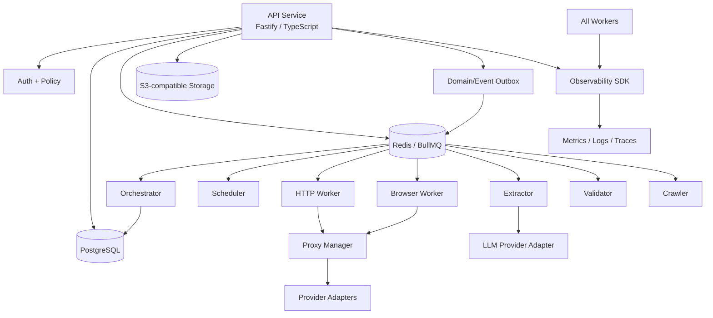
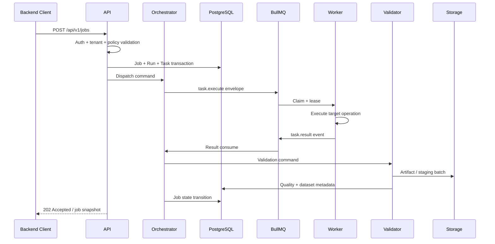

# Backend Phase 0 — M0 Architecture Baseline

**Program:** Scraping Platform  
**Kapsam:** Yalnızca backend  
**Faz:** Phase 0 — Architecture & Specification  
**Milestone:** M0 — Architecture Baseline  
**Sürüm:** 1.0.0  
**Durum:** Onaya sunulacak baseline  
**Yazar:** Manus AI

## 1. Amaç

Bu belge, platformun ilk milestone'ı olan **M0 Architecture Baseline** için backend teknik kararlarını tek bir referans altında toplar. Bu aşamada uygulama kodu yazılmaz; servis sınırları, veri sahipliği, API ve queue sözleşmeleri, lifecycle, güvenlik, tenant izolasyonu, gözlemlenebilirlik, retention, maliyet ve adapter yaklaşımı netleştirilir.

Baseline'ın amacı sonraki Phase 1 — Core Platform geliştirmesinin belirsizliği azaltılmış, ölçülebilir ve onaylanabilir bir sözleşmeyle başlamasını sağlamaktır.

> **Kapsam ilkesi:** Frontend, Control Center ekranları, UX, mobil uygulama ve görsel tasarım bu milestone'ın kapsamı dışındadır. Backend'in UI tarafından tüketilecek sözleşmeleri tanımlanır; UI implementasyonu yapılmaz.

## 2. M0 başarı ölçütü

M0 tamamlanmış sayılırsa aşağıdaki artefact'ler onaylanmış olmalıdır:

| Artefact | Beklenen içerik | Durum |
|---|---|---|
| Backend context/container mimarisi | Servis sınırları, iletişim ve veri akışları | Hazır |
| Domain ve veri sahipliği | Tenant, Project, Target, Job, Task, Attempt, Dataset ve ilişkileri | Hazır |
| REST API contract | Resource, request/response, error, pagination ve idempotency | Hazır |
| Queue contract | Command/event envelope, queue routing, retry ve DLQ | Hazır |
| Lifecycle modeli | Job, Task, Attempt, Worker, Proxy, Extraction ve Dataset durumları | Hazır |
| Security baseline | Auth, RBAC, tenant, secrets, SSRF/egress, isolation ve audit | Hazır |
| Observability baseline | Log, metric, trace, correlation ve alarm gereksinimleri | Hazır |
| Retention/cost baseline | Veri sınıfları, yaşam süreleri ve usage event modeli | Hazır |
| ADR/karar kaydı | Kritik seçimlerin gerekçesi ve trade-off'ları | Hazır |
| Phase 1 handover | Başlangıç task listesi, bağımlılık ve kabul kriterleri | Hazır |

M0 gate'inin kapanması için **Architecture Owner**, **Engineering Manager**, **Product Owner**, **Security Lead** ve **SRE/Platform Lead** tarafından sign-off verilmesi gerekir.

## 3. Backend ürün sınırı

Backend, yetkili hedef kaynaklardan yapılandırılmış ve doğrulanmış veri üretmek üzere aşağıdaki yetenekleri sağlar:

1. Tenant ve proje sınırları içinde Target ve Schema yönetimi.
2. Job oluşturma, kuyruğa alma, worker dispatch, status transition ve sonuç toplama.
3. HTTP-first erişim; policy izin verirse Browser Worker fallback'i.
4. CSS/XPath, JSONPath ve kontrollü AI extraction için ortak yürütme sözleşmesi.
5. Schema validation, quality score ve versioned Dataset üretimi.
6. Proxy provider'ların adapter arkasında yönetilmesi.
7. Job/task/attempt düzeyinde log, metric, trace, error ve cost attribution.
8. REST API, asenkron queue event'leri ve gelecekte webhook/WebSocket tüketimi için backend event stream.

Backend; hedef sistemlerin korumalarını saldırgan biçimde aşan mekanizmaları, yetkisiz credential toplama veya serbest JavaScript çalıştırmayı ürün kabiliyeti olarak sunmaz. Erişim ve fallback kararları target policy, tenant policy, bütçe ve uyum sınırlarıyla çevrilir.

## 4. Önerilen backend bileşenleri



| Bileşen | M0'da kararlaştırılan backend sorumluluğu | Phase 1 teslim durumu |
|---|---|---|
| API Service | Auth, policy, validation, REST resource yönetimi ve command kabulü | Implement edilecek |
| Orchestrator | Job/task/attempt oluşturma, dispatch ve state transition | Implement edilecek |
| Scheduler | Schedule'dan Job üretimi için backend sınırı | İskelet implement edilecek |
| HTTP Worker | HTTP request ve response acquisition | Phase 2'de implement edilecek |
| Browser Worker | Browser task yürütme sözleşmesi | Phase 3'te implement edilecek |
| Extractor | Structured extraction interface | Phase 6'da implement edilecek |
| Validator | Schema ve quality interface | Phase 7'de implement edilecek |
| Crawler | URL frontier ve crawl state interface | Phase 8'de implement edilecek |
| Proxy Manager | Provider selection, lease, health ve usage interface | Phase 4'te implement edilecek |
| Storage Adapter | Artifact ve export object referansı | Phase 1'de temel adapter |
| Observability SDK | Ortak correlation, log, metric, trace helper | Phase 1'de temel; Phase 13'te genişletilecek |

## 5. Teknoloji baseline'ı

| Katman | Baseline kararı | Gerekçe / sınır |
|---|---|---|
| Dil/runtime | TypeScript / Node.js | API, worker ve ortak tiplerde tek dil ile başlama |
| HTTP API | Fastify | API service için düşük ceremony ve plugin sınırı |
| Database | PostgreSQL | İlişkisel domain, transaction ve audit metadata |
| Queue/cache | Redis + BullMQ | Asenkron task dispatch, delay, retry ve DLQ |
| Object storage | S3-compatible | Ham response, browser artifact ve export |
| Browser runtime | Playwright + Chromium | Phase 3 kapsamı; Phase 0 yalnızca interface tanımlar |
| Search | MVP dışında; ihtiyaçta OpenSearch | Önce PostgreSQL sorgu modeliyle başlama |
| Observability | OpenTelemetry + Prometheus/Grafana/Loki | Ortak trace, metric ve structured log standardı |
| Monorepo | apps, workers, packages, infra, docs | Servis ve ortak paketleri ayrıştırmak için |

Teknoloji seçimi, Phase 1'de detaylı dependency version ve deployment manifest'leriyle kesinleştirilecektir. M0, uygulama paketlerinin isim ve sürüm lock dosyasını değil, backend mimari sözleşmesini dondurur.

## 6. Servis sınırları ve veri sahipliği

API Service Project, Target, Schema, Job komutlarının dış sözleşmesini sahiplenir; job'ın yürütülmesini kendisi yapmaz. Orchestrator job/task/attempt state transition ve dispatch kararının sahibidir. Worker'lar yalnızca kendilerine verilen task'ı yürütür ve result event yayınlar. Dataset/record publish kararı Validator + Dataset Service sözleşmesiyle yapılır.

| Veri / karar | Tekil sahip | Diğer bileşenlerin erişimi |
|---|---|---|
| Tenant ve user context | API/Auth | Read-only context |
| Project/Target/Schema | API Service | Orchestrator read; worker snapshot |
| Job/Run/Task/Attempt state | Orchestrator | API read; worker result write via event |
| Queue lease | Queue/Orchestrator | Worker claim/heartbeat |
| HTTP/browser execution result | İlgili Worker | Orchestrator result event |
| Extraction plan/result | Extractor | Validator input |
| Validation/quality | Validator | Dataset publish input, API read |
| Dataset version/record | Dataset/Storage | API read/export |
| Proxy lease/health | Proxy Manager | Worker request, cost/observability read |
| Usage event/cost summary | Cost Service/FinOps | Job, dashboard ve report read |
| Audit event | Audit Service | Yetkili read-only |

## 7. Backend request akışı



API request transactionı ile queue dispatch arasında kayıp oluşmaması için Phase 1'de **transactional outbox veya eşdeğer güvenilir event publish** uygulanmalıdır. Outbox event'i publish edilmeden job `QUEUED` olarak işaretlenmemeli veya reconcile edilebilir şekilde `DISPATCH_PENDING` ara durumu kullanılmalıdır.

## 8. Domain minimumu

M0 için aşağıdaki varlıklar zorunludur: `Tenant`, `User`, `Project`, `Target`, `Schema`, `Job`, `Run`, `Task`, `Attempt`, `Worker`, `Dataset`, `DatasetVersion`, `Record`, `Artifact`, `Error`, `Provider`, `Credential` ve `UsageEvent`. `Crawler`, `Browser`, `Session`, `Webhook` ve `Schedule` sözleşmeleri tanımlanır; implementasyonları ilgili faza bırakılır.

Temel invariant'lar şunlardır:

| Invariant | Kural |
|---|---|
| Tenant ownership | Tenant'a bağlı tüm kaynaklarda tenant scope bulunur |
| Project consistency | Target, Schema, Job ve Dataset ilişkileri aynı tenant/project sınırındadır |
| Job immutability | Job'ın source target, schema ve strategy snapshot'ı sonradan değişmez |
| Attempt history | Retry yeni attempt üretir; eski attempt silinmez |
| Dataset lineage | Her published record source job/attempt/schema version taşıyabilir |
| Status validity | State transition yalnızca tanımlı geçiş tablosuyla yapılır |
| Idempotency | Aynı command/event tekrarlandığında çift kayıt/çift maliyet oluşmaz |
| Secret safety | Credential, cookie ve auth header raw değeri loglanmaz veya API'de dönmez |

## 9. API baseline

M0 API sözleşmesi `/api/v1` ile başlar. Yazma işlemleri kimlik doğrulama, tenant policy ve request schema validation'dan geçer. Uzun süren işlemler `202 Accepted` ile job kimliğini döndürür; sonuç REST ile sorgulanır.

| Uç | Amaç | MVP durumu |
|---|---|---|
| `POST /projects` | Project oluşturma | Phase 1 |
| `POST /projects/{projectId}/targets` | Target oluşturma | Phase 1 |
| `POST /projects/{projectId}/schemas` | Schema oluşturma | Phase 1/7 |
| `POST /jobs` | Job kabulü ve task planı | Phase 1 |
| `GET /jobs/{jobId}` | Job snapshot | Phase 1 |
| `POST /jobs/{jobId}/cancel` | İptal command'ı | Phase 9 |
| `POST /jobs/{jobId}/retry` | Retry command'ı | Phase 9 |
| `GET /jobs/{jobId}/tasks` | Task listesi | Phase 1/9 |
| `GET /dataset-versions/{id}/records` | Record sorgusu | Phase 11 |
| `GET /health/live` | Liveness | Phase 1 |
| `GET /health/ready` | Readiness | Phase 1 |

Ortak error biçimi:

```json
{
  "error": {
    "code": "VALIDATION_ERROR",
    "message": "İstek doğrulanamadı.",
    "requestId": "req_01J...",
    "retryable": false,
    "details": {}
  }
}
```

## 10. Queue baseline

Queue mesajı aşağıdaki envelope'ı kullanır:

```json
{
  "messageId": "msg_01J...",
  "messageType": "task.execute",
  "schemaVersion": 1,
  "tenantId": "tenant_01J...",
  "projectId": "project_01J...",
  "jobId": "job_01J...",
  "taskId": "task_01J...",
  "attemptId": "attempt_01J...",
  "traceId": "trace_01J...",
  "issuedAt": "2026-08-26T10:00:01Z",
  "payload": {}
}
```

Phase 1 queue listesi:

| Queue | Producer | Consumer | Başlangıç amacı |
|---|---|---|---|
| `job.commands` | API / Scheduler | Orchestrator | Job create/cancel/retry |
| `task.execute.http` | Orchestrator | HTTP Worker | HTTP fetch task'ı |
| `task.execute.browser` | Orchestrator | Browser Worker | Browser task'ı |
| `task.execute.extract` | Orchestrator | Extractor | Extraction task'ı |
| `task.execute.validate` | Orchestrator | Validator | Validation task'ı |
| `task.results` | Worker | Orchestrator | Success/failure result event'i |
| `events.domain` | Orchestrator/Services | Consumers | State ve audit event'leri |
| `dead-letter` | Queue | Operator/replay | Retry budget'i tükenen mesajlar |

Queue mesajları versioned, idempotent ve tenant context taşımalıdır. Raw credential veya büyük response body queue payload'ına konulmamalı; artifact URI/checksum kullanılmalıdır.

## 11. Lifecycle baseline

M0'da zorunlu durum geçişleri:

```text
Job: CREATED → QUEUED → RUNNING → EXTRACTING → VALIDATING → COMPLETED
                                  └────────────→ FAILED → RETRYING → RUNNING
                                  └────────────→ CANCEL_REQUESTED → CANCELLED
```

`Task` ve `Attempt` ayrı tutulur. Worker lease/heartbeat kaybında attempt `WORKER_LOST` veya `TIMEOUT` sonucu alır; retry kararı Orchestrator tarafından verilir. Worker, job status'i doğrudan `COMPLETED` yapamaz.

## 12. Security baseline

| Konu | M0 kararı |
|---|---|
| Auth | Kullanıcı oturumu ve programatik API key için provider-agnostic interface |
| Authorization | Role + tenant + resource scope; merkezi policy fonksiyonu |
| Tenant isolation | DB query scope, queue tenant envelope, storage prefix, negative test |
| Secret | Secret reference; raw credential database/log/trace/API response içinde yok |
| SSRF | Private/loopback/metadata IP, unsafe port ve redirect engeli |
| Egress | Target host/port allowlist, DNS/redirect revalidation |
| Worker isolation | Least privilege, resource limit, browser context isolation |
| Audit | Login, credential, policy, job, export, role ve admin eylemleri append-only event |
| Encryption | Transit ve at-rest encryption; key/rotation runbook Phase 15'te sertifikalanır |
| Data minimization | LLM veya log'a gerekli minimum içerik; secret/PII redaction |

M0 güvenlik baseline'ı, Phase 1'de unit/integration negative testleri ve Phase 15'te hardening/pentest ile doğrulanacaktır.

## 13. Observability baseline

Her backend event ve log en az `requestId`, `traceId`, `tenantId`, `jobId`, `taskId`, `attemptId`, `service`, `version` ve `occurredAt` alanlarını uygun olduğunda taşır. Secret, cookie, authorization header, tam URL query veya ham response body telemetry'ye yazılmaz.

İlk ölçüm seti: API latency/error, queue depth/wait, job/task status, worker heartbeat, target status class, attempt duration, extraction quality, artifact write failure, retry count, provider health ve usage event completeness'tir. M0'da her sinyalin adı, sahibi ve cardinality kuralı tanımlanır; Phase 1'de temel emission uygulanır.

## 14. Retention ve cost baseline

| Veri sınıfı | M0 kararı |
|---|---|
| Job/task/attempt metadata | Operasyonel geçmiş; tenant policy ile silinebilir |
| Raw response/artifact | Kısa/orta retention; yeniden extraction gereksinimine bağlı |
| Session/cookie state | İş sonrası silme veya çok kısa retention |
| Dataset published version | Ürün/sözleşme politikasına göre korunur |
| Logs/traces | Maskeli, kısa retention |
| Audit logs | Uzun retention, append-only |

Usage event kategorileri `http_request`, `browser_seconds`, `proxy_request`, `proxy_bandwidth`, `llm_input_tokens`, `llm_output_tokens`, `storage_bytes`, `compute_seconds` ve `retry_attempt` olarak başlatılır. Her event tenant/job/attempt ile ilişkilendirilir; birim fiyat ve para birimi ayrı metadata'dır. Cost summary yeniden hesaplanabilir olmalıdır.

## 15. Adapter baseline

Dış provider'ların çekirdek domain'e sızmasını önlemek için aşağıdaki interface'ler tanımlanır:

```ts
interface ProxyProvider {
  acquire(request: ProxyRequest): Promise<ProxyLease>;
  release(leaseId: string, result: LeaseResult): Promise<void>;
  health(scope?: HealthScope): Promise<ProviderHealth>;
  estimateCost(request: ProxyRequest): Promise<CostEstimate>;
}

interface LLMProvider {
  structuredExtract(request: StructuredExtractRequest): Promise<StructuredExtractResult>;
  estimateCost(request: TokenEstimateRequest): Promise<CostEstimate>;
}
```

M0 kararına göre provider-specific secret, response ve fiyat formatı adapter içinde normalize edilir. Core service yalnızca capability, health, cost ve result sözleşmesini görür.

## 16. Açık kararlar ve varsayılanlar

| Karar | Varsayılan öneri | Karar sahibi | Ne zaman kesinleşmeli |
|---|---|---|---|
| Kimlik sağlayıcı | Provider-agnostic interface; ilk implementasyon seçilecek | EM + SEC | Phase 1 kickoff |
| S3-compatible servis | Staging ve production sağlayıcısı belirlenecek | SRE | Phase 1 storage task |
| Outbox yaklaşımı | PostgreSQL outbox + publisher veya eşdeğeri | BE + SRE | Phase 1 queue task |
| API dokümantasyon formatı | OpenAPI source-of-truth | BE | Phase 1 API task |
| Schema validation kütüphanesi | JSON Schema uyumlu çözüm | DE + BE | Phase 7 başı |
| İlk gerçek provider | Sözleşme ve yetki durumuna göre seçilecek | PO + SRE + COMP | Phase 4 başı |
| Retention default değerleri | Tenant/contract bilgisiyle sayısallaştırılacak | COMP + PO | Phase 15 öncesi |

Bu kararlar M0'ı bloke etmez; ancak ilgili faz başlamadan önce karar kaydına bağlanmalıdır. Açık kararların varsayılanı değiştirilirse ADR güncellenir.

## 17. Phase 1 handover

Phase 1'e başlanırken aşağıdaki sıra izlenmelidir:

1. Monorepo ve CI baseline.
2. Config/secret reference ve ortam ayrımı.
3. PostgreSQL migration ve tenant-scoped core schema.
4. Redis/BullMQ bağlantısı, envelope, queue routing ve DLQ.
5. API health, auth context, error envelope ve temel CRUD.
6. Orchestrator job/task/attempt create ve dispatch.
7. Storage adapter, artifact metadata ve presigned access.
8. Mock worker ile API → queue → result → DB/storage smoke akışı.
9. M0 kararlarının ADR ve task register ile izlenmesi.

## 18. M0 gate checklist

| Kontrol | Kabul kanıtı | Sonuç |
|---|---|---|
| Mimari | Servis ve veri akış diyagramı | Pending sign-off |
| Domain | Entity sözlüğü, invariant ve ownership | Pending sign-off |
| API | Request/response/error/idempotency contract | Pending sign-off |
| Queue | Envelope, routing, retry, DLQ ve versioning | Pending sign-off |
| Lifecycle | State transition ve lease/heartbeat kuralları | Pending sign-off |
| Security | RBAC, tenant, secret, SSRF/egress ve audit baseline | Pending sign-off |
| Operations | Trace/log/metric/cost/retention baseline | Pending sign-off |
| Delivery | Phase 1 task'ları ve bağımlılıkları | Pending sign-off |
| Governance | ADR, açık karar ve accountable onayı | Pending sign-off |

## References

[1]: ../../source/pasted_content.txt "Kullanıcı tarafından sağlanan sistem taslağı"
[2]: ../01-architecture.md "Platform mimarisi ve bileşen tasarımı"
[3]: ../03-api-contract.md "API sözleşmesi"
[4]: ../04-lifecycles.md "Yaşam döngüleri ve durum makineleri"
[5]: ../07-security-rbac.md "Güvenlik, RBAC ve tenant izolasyonu"
[6]: ../08-observability-cost.md "Gözlemlenebilirlik ve maliyet zekâsı"
