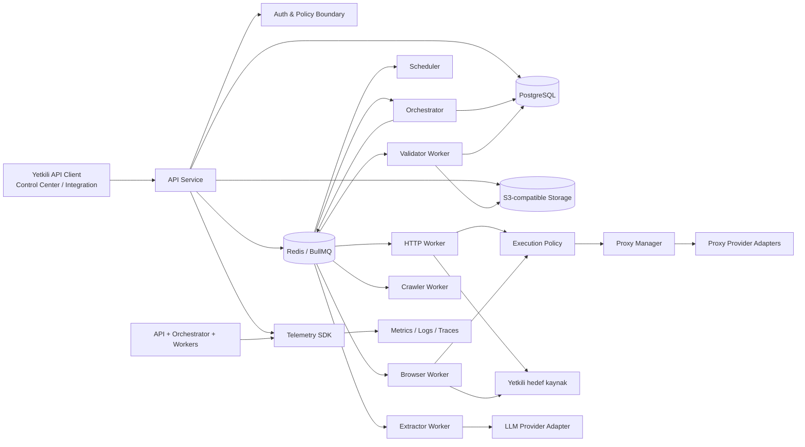

# Backend Phase 0 — P00-B03 Context/Container Architecture

**Program:** Scraping Platform  
**Kapsam:** Yalnızca backend  
**Faz:** Phase 0 — Architecture & Specification  
**Task:** P00-B03 — Backend context/container mimarisini tasarla  
**Sürüm:** 1.0.0  
**Durum:** In Progress  
**Bağımlılık:** P00-B01 ve P00-B02 — Accepted  
**Owner:** Solution Architect

## 1. Tasarım amacı

Bu belge, backend'in çalışma zamanı sınırlarını ve bileşenler arası sorumluluk ayrımını tanımlar. Hedef; API kabul katmanını, iş orkestrasyonunu, queue yürütmesini, worker'ları, kalıcı veri katmanını, object storage'ı, provider adapter'larını ve gözlemlenebilirliği birbirinden ayrıştırarak Phase 1 implementasyonuna doğrudan aktarılabilir bir tasarım üretmektir.

M0 için fiziksel deployment ayrıntıları yalnızca servis sınırını ve iletişim sözleşmesini doğrulayacak seviyededir. Auto-scaling, multi-region ve production kapasite tuning'i sonraki fazlarda kesinleştirilecektir.

## 2. Backend context görünümü



### Context sınırları

| Context | İçerdiği sorumluluk | Dışarıya sunduğu sözleşme |
|---|---|---|
| API Context | Authenticated command, validation, resource query, error envelope | REST/JSON |
| Orchestration Context | Job planlama, task dispatch, lifecycle, retry/cancel decision | Queue command/result/event |
| Execution Context | HTTP/browser/crawler çalışma ortamı | Worker handler + result event |
| Extraction Context | Ham içeriği yapılandırılmış kayda dönüştürme | Extraction command/result |
| Validation/Data Context | Schema, quality, dataset staging/publish | Validation result + dataset API |
| Access Context | Target policy, proxy lease, provider health/cost | Access plan/lease |
| Governance Context | Tenant, RBAC, secret, audit, retention, cost | Policy decision + audit/usage event |
| Telemetry Context | Correlation, structured log, metric, trace | OpenTelemetry/exporter sözleşmesi |

## 3. Container görünümü

### 3.1 API Service

API Service, dış istemcilerin tek backend giriş noktasıdır. Authentication, tenant context, authorization, request schema validation, idempotency kontrolü ve resource query bu katmanda uygulanır. API Service bir hedefe doğrudan scraping isteği göndermez ve browser başlatmaz.

API Service'in command kabulü için database transaction, outbox kaydı ve response snapshot birlikte düşünülmelidir. Job, `QUEUED` olarak görünür hale gelmeden queue publish'in güvenilir biçimde tamamlandığı veya reconcile edilebilir olduğu garanti edilmelidir.

### 3.2 Orchestrator

Orchestrator, Job/Run/Task/Attempt state transition'ın tek sahibidir. API'den veya Scheduler'dan gelen command'ı doğrular, task planı üretir, queue'ya dispatch eder, worker result event'lerini işler ve job'ın terminal sonucunu hesaplar.

Orchestrator; HTTP, Browser, Extractor veya Provider SDK detaylarını bilmez. Bunun yerine `ExecutionPlan`, `AccessPlan`, `ExtractionPlan` ve `ValidationPlan` gibi normalize edilmiş domain nesneleri kullanır.

### 3.3 Scheduler

Scheduler, zamanı gelen Schedule kaydından idempotent bir Job command üretir. Scheduler işin içeriğini yürütmez; overlap guard, due time, misfire davranışı ve schedule execution audit'i üretir. İlk Phase 1 implementasyonunda Scheduler iskeleti küçük tutulabilir; ancak queue ve idempotency sözleşmesini M0'dan devralır.

### 3.4 Worker'lar

Worker'lar queue'dan task claim eder, lease/heartbeat oluşturur, execution context'i uygular ve result event yayınlar. Worker'ın kalıcı job status transition yetkisi yoktur. Worker türleri:

| Worker | Girdi | Çıktı |
|---|---|---|
| HTTP Worker | HTTP execution plan | Response metadata, artifact ref, access result |
| Browser Worker | Browser execution plan | DOM/API/artifact result, access result |
| Crawler Worker | Seed/frontier policy | Discovered URL ve crawl state |
| Extractor Worker | Artifact/content + extraction plan | Candidate records + field diagnostics |
| Validator Worker | Candidate records + schema | Valid/invalid records + quality score |

Worker process'leri stateless olmalıdır. Process-local browser pool veya connection pool kullanılabilir; tenant session state processler arasında ortak kalıcı state olarak paylaşılmamalıdır.

### 3.5 Data stores

| Store | Sistem rolü | Source of truth alanı |
|---|---|---|
| PostgreSQL | İlişkisel metadata, state, ownership, audit ve usage | Tenant, project, target, job, task, attempt, dataset metadata |
| Redis/BullMQ | Queue, lease, delay, retry ve geçici execution koordinasyonu | Queue delivery state; domain state değil |
| S3-compatible storage | Ham response, screenshot, PDF, DOM, export ve büyük artifact | Binary/büyük içerik |
| Telemetry backend | Log, metric ve trace sorgusu | Operasyonel gözlem; domain state değil |

## 4. Servis iletişim matrisi

| Kaynak | Hedef | Model | Sözleşme | Hata davranışı |
|---|---|---|---|---|
| API | PostgreSQL | Senkron transaction | Repository/domain command | Transaction rollback |
| API | Orchestrator | Asenkron command | `job.command` | Outbox retry |
| Orchestrator | Redis/BullMQ | Asenkron dispatch | `task.execute.*` | Retry/DLQ |
| Worker | Orchestrator | Asenkron result | `task.result` | Idempotent result apply |
| Orchestrator | PostgreSQL | Senkron state update | State transition service | Optimistic lock/reconcile |
| Worker | Proxy Manager | Senkron lease | `ProxyProvider` | Provider error/health degrade |
| Worker | Target | Dış senkron çağrı | HTTP/Browser execution policy | Classifier + retry policy |
| Extractor | LLM adapter | Dış senkron çağrı | Structured extract interface | Budgeted retry/fallback |
| Validator | Storage/DB | Batch write | Staging/publish contract | Abort + cleanup |
| All services | Telemetry | Asenkron veya buffered | Common telemetry envelope | Local buffer/drop policy |

## 5. İç modül sınırları

API Service içinde aşağıdaki modüller birbirinden ayrılmalıdır:

```text
api/
├── auth/
├── authorization/
├── projects/
├── targets/
├── schemas/
├── jobs/
├── datasets/
├── health/
├── common/
│   ├── errors/
│   ├── idempotency/
│   ├── pagination/
│   └── request-context/
└── transport/
```

Orchestrator içinde:

```text
orchestrator/
├── commands/
├── planners/
├── lifecycle/
├── dispatch/
├── result-consumer/
├── retry/
├── reconciliation/
└── events/
```

Ortak paketler core iş kuralını kendisine çekmemelidir:

```text
packages/
├── types/          # API, queue ve domain contract types
├── config/         # Validated configuration
├── database/       # Client, migrations, repositories
├── queue/          # Envelope, producer/consumer helper, DLQ
├── policy/         # Target, tenant, egress and budget checks
├── proxy/          # ProxyProvider interfaces and normalized result
├── storage/        # Object storage interface and artifact metadata
└── observability/  # Context propagation, logs, metrics, traces
```

## 6. Veri akışı ve transaction sınırları

### Job create

1. API request context doğrulanır.
2. Project, Target ve Schema aynı tenant/project sınırında yüklenir.
3. Job, Run, ilk Task ve idempotency kaydı transaction içinde oluşturulur.
4. `job.created` veya `job.dispatch_requested` outbox event'i yazılır.
5. Publisher queue'ya command gönderir.
6. Başarılı publish sonrası Job `QUEUED` durumuna geçirilir veya reconcile edilebilir ara durum kullanılır.
7. API `202` ve job snapshot döndürür.

### Worker result

1. Consumer message ID ve attempt idempotency kaydını kontrol eder.
2. Result schema ve tenant/job/task eşleşmesi doğrulanır.
3. Attempt sonucu yazılır; duplicate ise mevcut sonuç döndürülür.
4. Orchestrator state transition ve sonraki task dispatch'ini transaction/outbox ile planlar.
5. Usage event, telemetry ve audit gerekiyorsa aynı korelasyonla üretilir.

## 7. Failure boundary'leri

| Failure boundary | Tespit | Koruma |
|---|---|---|
| API → DB | Connection/transaction error | Retry olmayan write veya kontrollü retry; `503` |
| DB → Outbox | Unpublished event | Outbox publisher + age alarmı |
| Outbox → Queue | Publish error | Backoff, idempotent message ID, DLQ |
| Queue → Worker | Lease/heartbeat kaybı | Visibility timeout, reclaim ve retry |
| Worker → Target | Timeout/status/policy | Deadline, classifier, retry budget |
| Worker → Artifact storage | Write/checksum error | Retry, staging ve publish gate |
| Worker → Orchestrator | Duplicate/out-of-order result | Event idempotency ve sequence check |
| Extractor → LLM | Provider/invalid output | Strict parse, budget, fallback/terminal |
| Orchestrator → DB | Optimistic conflict | Reload, transition re-evaluate, reconcile |

## 8. Ölçeklenebilirlik sınırı

MVP'de API, Orchestrator, Scheduler ve worker'lar ayrı process olarak çalıştırılır. HTTP, Browser, Crawler, Extractor ve Validator worker'ları task type'a göre bağımsız ölçeklenebilir. Browser concurrency CPU/memory ile, HTTP concurrency target/tenant/provider policy ile, LLM çağrıları token/budget policy ile sınırlandırılır.

Multi-region, global routing, mobile/residential proxy network ve yüksek performanslı Go worker ayrıştırması bu baseline'ın parçası değildir. Bu özellikler queue message, domain state ve artifact sözleşmeleri korunarak sonraki ADR'lerle eklenir.

## 9. Kabul kriterleri

P00-B03 `Accepted` sayılması için:

1. Backend context/container diyagramı ve servis sınırları günceldir.
2. Her container'ın sorumluluğu, source of truth'u, giriş/çıkış sözleşmesi ve failure boundary'si tanımlıdır.
3. API, Orchestrator ve Worker arasında senkron/asenkron sınır netleşmiştir.
4. PostgreSQL, Redis/BullMQ, object storage ve telemetry rollerinin çakışmadığı gösterilmiştir.
5. Job create ve worker result transaction akışları açıklanmıştır.
6. Tenant, secret, policy ve telemetry gibi cross-cutting concerns her sınırda görünürdür.
7. Phase 1 deployment ve package yapısına aktarılabilir modül sınırı oluşmuştur.
8. Solution Architect, Backend Lead, Engineering Manager, SRE ve Security review'ü tamamlanmıştır.

## References

[1]: ../../source/pasted_content.txt "Kullanıcı tarafından sağlanan sistem taslağı"
[2]: ../01-architecture.md "Platform mimarisi ve bileşen tasarımı"
[3]: phase-0-m0-backend-baseline.md "Backend M0 baseline"
[4]: phase-0-m0-backend-requirements.md "Backend gereksinim register'ı"
[5]: phase-0-m0-backend-adr.md "Backend M0 ADR kayıtları"
