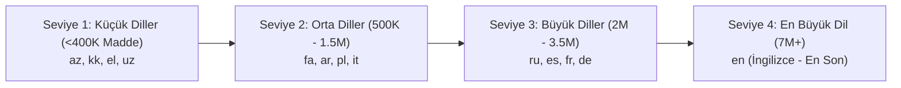

# Çok Dilli Wikipedia LLM Veri Hattı ve Makale Sayısına Göre Sıralı İndirme Planı

## 1. Mimari Tasarım ve Sıralama Stratejisi

Kullanıcı gereksinimi doğrultusunda, Türkçe veri seti sonrası diğer dillerin Wikimedia dökümleri işlenecektir. Sistem kaynaklarını (ağ bant genişliği, yerel disk alanı ve işlemci) verimli kullanmak ve hızlı sonuç almak için **küçük dillerden başlanacak, devasa diller (İngilizce, Almanca vb.) en sona bırakılacaktır**.

### Dinamik Dil Sıralama Matrisi (Küçükten Büyüğe / Ascending Order)



---

## 2. Dil Grupları ve Tahmini Metrikler

| Dil Kodu | Dil Adı | Makale Sayısı (Yaklaşık) | Sıkıştırılmış Dump (BZ2) | Tahmini Parquet (ZSTD-6) | Sıralama Önceliği |
|---|---|---|---|---|---|
| `az` | Azerice | ~218.000 | ~350 MB | ~110 MB | 1 (Öncelikli) |
| `kk` | Kazakça | ~245.000 | ~400 MB | ~130 MB | 2 |
| `el` | Yunanca | ~273.000 | ~750 MB | ~220 MB | 3 |
| `uz` | Özbekçe | ~364.000 | ~450 MB | ~150 MB | 4 |
| `fa` | Farsça | ~1.090.000 | ~2.1 GB | ~650 MB | 5 |
| `ar` | Arapça | ~1.330.000 | ~2.9 GB | ~850 MB | 6 |
| `it` | İtalyanca | ~1.880.000 | ~4.5 GB | ~1.3 GB | 7 |
| `ru` | Rusça | ~2.120.000 | ~6.5 GB | ~1.9 GB | 8 |
| `es` | İspanyolca | ~2.050.000 | ~5.8 GB | ~1.7 GB | 9 |
| `fr` | Fransızca | ~2.700.000 | ~7.8 GB | ~2.3 GB | 10 |
| `de` | Almanca | ~3.150.000 | ~9.2 GB | ~2.8 GB | 11 |
| `en` | İngilizce | ~7.050.000 | ~22.5 GB | ~7.2 GB | 12 (En Son) |

---

## 3. Disk ve Bellek Koruma Stratejisi (Bounded Disk Footprint)

1. **Sıralı İşlem (Sequential Single-Worker):** Diller aynı anda paralel indirilmez; her dil indirme -> temizleme -> parquet paketleme -> ham dump silme döngüsüyle sırayla tamamlanır.
2. **Ham Dump Anında Silme (`--clean-dump`):** Bir dilin Parquet'si üretilip mühürlendiğinde, diskte yer kaplayan ham `.xml.bz2` dökümü derhal silinir. Bu sayede 22 GB'lık İngilizce döküm işlenirken bile diskte önceki dillerin ham dosyaları birikmez.
3. **10 GB Parquet Shard Limit:** Her dilde dosyalar 10 GB tavan limitine göre bölünür. İngilizce (~7.2 GB Parquet) dahil çoğu dil tek bir shard içinde toplanır; 10 GB'ı aşan durumlarda otomatik `part00001` açılır.

---

## 4. Google Drive Klasörleme Mimarisi

Her dil için verilen ana klasör (`1s7Xs0U7ql9tEHT1WuQC7AdStWFys6TUL`) altında izole hiyerarşi oluşturulur:

```text
[Drive Hedef Klasörü: 1s7Xs0U7ql9tEHT1WuQC7AdStWFys6TUL]
├── tr/
│   ├── data/ (trwiki_20260925_part00000_zstd.parquet)
│   └── metadata/ (trwiki_20260925_manifest.json)
├── az/
│   ├── data/ (azwiki_20260925_part00000_zstd.parquet)
│   └── metadata/ (azwiki_20260925_manifest.json)
├── kk/
│   ├── data/
│   └── metadata/
├── ...
└── en/
    ├── data/
    └── metadata/
```

---

## 5. Doğrulama ve Yürütme Adımları
1. Çok dilli orkestratör modülü (`scripts/wikipedia_pipeline/multi_lang_orchestrator.py`) oluşturulması.
2. Wikimedia API üzerinden dillerin makale sayısının dinamik çekilmesi ve küçükten büyüğe sıralanması.
3. Kuru çalışma (dry-run) simülasyonu ile sıralama doğrulaması.
