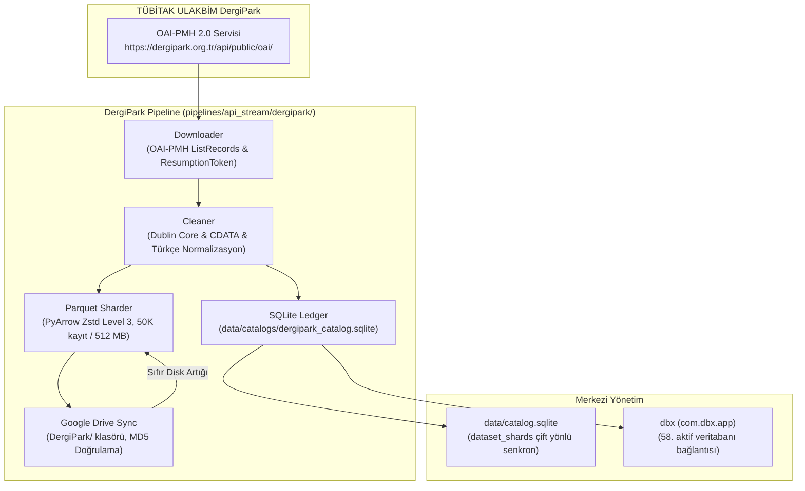

# Plan: DergiPark (TÜBİTAK ULAKBİM) Akış Boru Hattı ve Depolama Mimarisi

Bu doküman, TÜBİTAK ULAKBİM DergiPark ulusal akademik dergi ağının (~2.200 dergi, ~600.000+ açık erişim Türkçe ve İngilizce makale) kurumsal standartlarda hasat edilmesi, temizlenmesi, SQLite ilişkisel kataloğuna işlenmesi, Zstandard Parquet parçalarına bölünmesi ve Google Drive'a sıfır disk artığıyla aktarılması için teknik planı tanımlar.

---

## 1. Mimari Bileşenler

---

## 2. Teknik Dosya Haritası

1. `pipelines/api_stream/dergipark/downloader.py`:
   - DergiPark OAI-PMH uç noktası (`https://dergipark.org.tr/api/public/oai/`).
   - `ListRecords` & `ListSets` akışı.
   - `resumptionToken` ile 24 saatlik güvenli devamlılık.
   - Üstel geri çekilme (exponential backoff) ve SSL sertifika doğrulaması.

2. `pipelines/api_stream/dergipark/cleaner.py`:
   - XML Dublin Core (`oai_dc`) ve CDATA alan ayrıştırma.
   - 16 alanlı standart şema (`id`, `doi`, `title`, `abstract`, `journal`, `publisher`, `issn`, `language`, `year`, `authors`, `affiliations`, `keywords`, `subjects`, `fulltext_url`, `char_count`, `word_count`).
   - Türkçe karakter ve boşluk temizleme, gürültü eleme.

3. `pipelines/api_stream/dergipark/packer.py`:
   - `BaseParquetSharder` tabanlı Zstandard sıkıştırmalı Parquet yazıcı.
   - 50.000 kayıt veya 512 MB boyut sınırında otomatik shard rotasyonu.

4. `pipelines/api_stream/dergipark/ledger.py`:
   - `BaseLedger` tabanlı ACID SQLite işlem defteri (`data/catalogs/dergipark_catalog.sqlite`).
   - Tablolar: `dergipark_articles`, `dergipark_journals`, `dergipark_subjects`, `shards`, `work_items`.
   - Merkezi katalog (`data/catalog.sqlite`) çift yönlü senkronizasyonu.

5. `pipelines/api_stream/dergipark/drive_sync.py`:
   - `BaseDriveSync` tabanlı resumable Google Drive yükleyicisi.
   - Hedef klasör: `DergiPark` (Protokol-7 kök klasörü altında).
   - Uzaktan MD5 hash doğrulaması ve yerel dosyanın anında silinmesi.

6. `pipelines/api_stream/dergipark/orchestrator.py`:
   - Komut satırı yönetim aracı (`--all`, `--set`, `--max-records`, `--batch-size`, `--max-shard-records`, `--shard-size-mb`, `--dry-run`, `--no-drive`, `--sync-shards`).
   - `PYTHONUNBUFFERED=1` ve satır tamponlamalı gerçek zamanlı telemetri.

7. `pipelines/api_stream/dergipark/test_dergipark_pipeline.py`:
   - 8+ pytest birim ve entegrasyon testi.

8. `scripts/run_dergipark.sh`:
   - Arka planda güvenli ve müstakil çalıştırma betiği.

---

## 3. Güven Kademesi ve Doğrulama
- **Tier:** 1 (İzole yeni boru hattı bileşeni).
- **Geri Alma (Rollback):** `pipelines/api_stream/dergipark/` dizini silinerek sistem orijinal haline getirilebilir.
- **Doğrulama Ölçütleri:**
  - 8/8 Python birim testi geçmeli.
  - Test shard'ı yerel ve dry-run olarak üretilmeli.
  - `data/catalogs/dergipark_catalog.sqlite` oluşturulup `dbx` bağlantı listesine işlenmeli.
