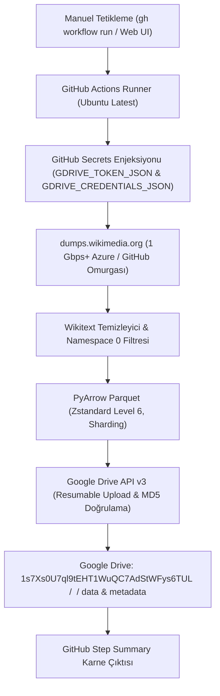

# GitHub Actions Uzak Wikipedia LLM Parquet Veri Hattı Planı

Bu plan, resmi Wikimedia XML dökümlerinin yerel bilgisayar yerine tamamen **GitHub Actions (Ubuntu Linux Bulut Sanal Sunucusu)** üzerinde indirilmesi, Wikitext sözdiziminden arındırılarak temizlenmesi, Apache Parquet (Zstandard) formatına dönüştürülmesi ve doğrudan Google Drive'a mühürlenmesi mimarisini tanımlar.

---

## 1. Mimari Tasarım ve Bulut Veri Akışı



---

## 2. Temel Avantajlar

1. **Sıfır Yerel Donanım ve Disk Tüketimi:**
   Kullanıcının yerel bilgisayarı CPU, RAM veya disk açısından hiçbir yük altına girmez. İşlem tamamen arka planda GitHub'ın Microsoft Azure veri merkezlerindeki sanal sunucularında yürütülür.
2. **Yüksek Bant Genişliği:**
   Wikimedia döküm sunucuları ile GitHub bulut omurgası arasındaki yüksek hızlı bağlantı (1 Gbps+), indirme ve Drive'a yükleme sürelerini önemli ölçüde kısaltır.
3. **Güvenlik ve İzolasyon:**
   Google Drive kimlik bilgileri `gh secret` üzerinden şifreli aktarılır; iş bittiğinde geçici token dosyaları runner yok edildiğinde tamamen silinir.
4. **Esnek Tetikleme:**
   Tek bir komut veya GitHub web arayüzü ile istenen dil (`de`, `en`, `uz`, vb.) seçilerek bağımsız olarak çalıştırılabilir.

---

## 3. Yapılandırma ve Çalıştırma

### 3.1. Tanımlanan Gizli Anahtarlar (GitHub Secrets)
- `GDRIVE_TOKEN_JSON`: Google Drive OAuth2 yenileme ve erişim belirteci.
- `GDRIVE_CREDENTIALS_JSON`: Google Cloud istemci kimlikleri.

### 3.2. Çalıştırma Komutu
```bash
gh workflow run wikipedia-etl.yml -f lang=de -f mode=single -f folder_id=1s7Xs0U7ql9tEHT1WuQC7AdStWFys6TUL
```
