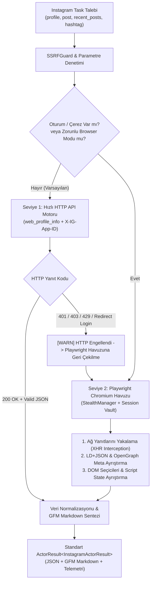

# Mimari Plan: Instagram Veri Çıkarma Aktörü (`instagram`)

Bu doküman, `protokol-7` projesine 70. aktör olarak eklenecek olan **Instagram Veri Çıkarma Aktörü** (`instagram` / `InstagramActor`) için teknik şartnameyi, veri modellerini, ikili motor (dual-engine) mimarisini, güvenlik sınırlarını ve uygulama adımlarını tanımlar.

---

## 1. Görev Özeti ve Hedefler

- **Aktör Tipi (ActorType):** `instagram`
- **Sınıf Adı:** `InstagramActor` (`src/actors/corpus/instagram-actor.ts`)
- **Kategori:** `corpus` (Sosyal Medya, Multimodal Veri ve LLM Korpus Çıkarımı)
- **REST Endpoint:** `POST /api/v1/instagram` ve `POST /instagram`
- **MCP Tool Adı:** `query_instagram`
- **Güven Seviyesi (Trust-Tier):** `Tier 2` (Var olan dosyalarda tip, kayıt, router ve manifest entegrasyonu; kapsamlı test takımı)

---

## 2. Çıkarma Yetenekleri ve Eylemler (Supported Actions)

Aktör 4 temel operasyonel eylemi destekleyecektir:

1. **`profile` (Profil Çıkarımı):**
   - Kullanıcı adı (`username`) veya profil URL'si (`https://www.instagram.com/username/`) üzerinden kamuya açık profil meta verilerini toplar.
   - Çıkarılan alanlar: Kullanıcı adı, tam ad, biyografi, harici bağlantılar, takipçi sayısı, takip edilen sayısı, toplam gönderi sayısı, doğrulanmış hesap rozeti (`is_verified`), profil görseli URL'si, son gönderi önizlemeleri.
2. **`post` / `reel` (Tekil Gönderi / Reel Çıkarımı):**
   - Kısa kod (`shortcode`) veya gönderi/Reel URL'si (`https://www.instagram.com/p/{shortcode}/`, `https://www.instagram.com/reel/{shortcode}/`) üzerinden tekil medya kaydı çıkarır.
   - Çıkarılan alanlar: Gönderi ID, kısa kod, medya türü (`image`, `video`, `carousel`), yüksek çözünürlüklü görsel URL'leri, video URL'si, video izlenme sayısı, beğeni sayısı, yorum sayısı, başlık metni (caption), etiketler (hashtags), bahsedilen kullanıcılar (mentions), konum bilgisi, paylaşım zaman damgası, karusel alt bileşenleri (`children`).
3. **`recent_posts` (Profil Son Gönderileri Çıkarımı):**
   - Hedef profilden sayfalanmış (cursor tabanlı) biçimde son N adet gönderiyi ve detaylı meta verilerini toplu olarak çeker.
4. **`hashtag` (Etiket Akışı Çıkarımı):**
   - Belirtilen etiket (`tag`) altındaki en popüler ve en son gönderileri, toplam gönderi adedini toplar.

---

## 3. İkili Motor Mimarisi (Dual-Engine Ingestion Architecture)

Instagram'ın agresif bot koruma katmanları (login wall, IP rate limit, TLS fingerprinting, checkpoint challenge) göz önünde bulundurularak, sistem YouTube Transcripts aktöründeki gibi **ikili motor (dual-engine)** prensibiyle inşa edilecektir:



### 3.1. Seviye 1: Hızlı HTTP API Motoru (Low-Latency HTTP Engine)
- **Mekanizma:** `safeRedirectFetch` kullanarak doğrudan Instagram Web API uç noktalarına sorgu gönderir.
- **Uç Noktalar:**
  - Profil: `https://www.instagram.com/api/v1/users/web_profile_info/?username=${username}`
  - Gönderi: `https://www.instagram.com/p/${shortcode}/?__a=1&__d=dis`
- **Zorunlu Başlıklar:**
  - `User-Agent`: Modern tarayıcı kimliği
  - `X-IG-App-ID`: `936619743392459` (Instagram Web İstemci Uygulama Kimliği)
  - `Accept`: `*/*`
  - `X-Requested-With`: `XMLHttpRequest`
  - `Sec-Fetch-Site`: `same-origin`
- **Kazanım:** Tarayıcı başlatma yükü olmadan ~200-500 ms içinde doğrudan ham JSON cevabı alınır.

### 3.2. Seviye 2: Dinamik Tarayıcı Havuzu ve Oturum Desteği (Playwright Chromium Stealth)
- **Tetiklenme Koşulları:**
  - HTTP isteklerinin 401 (Login Wall), 403 (Erişim Engeli) veya 429 (Hız Sınırı) dönmesi,
  - Görev opsiyonlarında `renderJavaScript: true` veya `useBrowser: true` belirtilmesi,
  - Görev opsiyonlarında oturum çerezlerinin (`sessionCookies` / `sessionid`) iletilmesi.
- **Mekanizma:**
  - `BrowserPool.acquireContext` ile sıcak Chromium bağlamı alınır.
  - `StealthManager` ile bot imzaları (webdriver, canvas, permissions) maskelenir.
  - İsteğe bağlı `sessionCookies` veya ortam değişkenindeki `INSTAGRAM_SESSION_ID` çerezi enjekte edilir.
  - Mobil veya masaüstü kullanıcı simülasyonu yapılır.
  - Sayfa yanıt dinleyicisi (`page.on('response', ...)`) kurularak arka planda dönen `web_profile_info` veya GraphQL JSON yükleri DOM çizilmeden yakalanır.
  - Sayfa yüklenemese veya login-wall modalı çıksa dahi `<head>` içindeki `<meta property="og:...">` ve `<script type="application/ld+json">` etiketleri ayıklanır.

---

## 4. Veri Sözleşmeleri ve Tipleri (`src/api/types.ts`)

```typescript
export type InstagramAction = "profile" | "post" | "recent_posts" | "hashtag";
export type InstagramMediaType = "image" | "video" | "carousel";

export interface InstagramActorTaskOptions {
  action?: InstagramAction;
  username?: string;
  shortcode?: string;
  hashtag?: string;
  limit?: number;
  useBrowser?: boolean;
  sessionCookies?: Array<{ name: string; value: string; domain?: string; path?: string }>;
  timeoutMs?: number;
  extractMarkdown?: boolean;
}

export interface InstagramProfileRecord {
  id: string;
  username: string;
  fullName: string;
  biography: string;
  externalUrl?: string;
  profilePicUrl?: string;
  isVerified: boolean;
  isPrivate: boolean;
  followerCount: number;
  followingCount: number;
  mediaCount: number;
  recentPostsPreview?: InstagramMediaRecord[];
}

export interface InstagramMediaRecord {
  id: string;
  shortcode: string;
  url: string;
  mediaType: InstagramMediaType;
  caption: string;
  likeCount: number;
  commentCount: number;
  takenAtTimestamp: number;
  displayUrl: string;
  videoUrl?: string;
  videoViewCount?: number;
  hashtags: string[];
  mentions: string[];
  dimensions?: { width: number; height: number };
  children?: Array<{
    id: string;
    mediaType: "image" | "video";
    displayUrl: string;
    videoUrl?: string;
  }>;
  location?: {
    id: string;
    name: string;
    slug?: string;
  };
  owner?: {
    id: string;
    username: string;
    fullName?: string;
    isVerified?: boolean;
    profilePicUrl?: string;
  };
}

export interface InstagramHashtagRecord {
  name: string;
  mediaCount: number;
  topPosts: InstagramMediaRecord[];
  recentPosts: InstagramMediaRecord[];
}

export interface InstagramActorResult {
  action: InstagramAction;
  query: string;
  profile?: InstagramProfileRecord;
  posts?: InstagramMediaRecord[];
  hashtag?: InstagramHashtagRecord;
  markdown: string;
  engineUsed: "http" | "browser";
}
```

---

## 5. Değişiklik Yapılacak Dosyalar ve Etki Alanı

| Dosya Yolu | Sorumluluk / Değişiklik |
|---|---|
| `src/api/types.ts` | `ActorType` union'ına `"instagram"` eklenmesi; girdi ve çıktı arayüzlerinin tanımlanması. |
| `src/actors/corpus/instagram-actor.ts` | `InstagramActor` sınıfının (dual-engine, URL ayrıştırıcı, JSON normalizer, Markdown synthesizer, SSRF guard) yazılması. |
| `src/actors/corpus/index.ts` | `InstagramActor`'ın dışa aktarılması. |
| `src/actors/actor-registry.ts` | Aktörün varsayılan kayıt defterine (`createDefaultActorRegistry`) kaydedilmesi. |
| `src/actors/actor-manifests.ts` | Aktör manifestosu, girdi şeması, örnek girdi ve `query_instagram` MCP araç tanımının eklenmesi. |
| `src/index.ts` | Ana paket dışa aktarımlarına eklenmesi. |
| `src/api/server.ts` | `POST /api/v1/instagram` ve `POST /instagram` HTTP REST rotalarının tanımlanması. |
| `src/api/openapi-spec.ts` | OpenAPI 3.1.0 spesifikasyonuna endpoint dokümantasyonunun eklenmesi. |
| `src/mcp/protokol-mcp-server.ts` | `query_instagram` MCP araç eşleşmesinin eklenmesi. |
| `examples/actors/instagram.json` | Örnek REST girdi yükü dosyası. |
| `docs/actors/instagram.md` | Ayrıntılı teknik aktör kullanım kılavuzu. |
| `src/actors/README.md` | Aktörler kataloğuna 70. aktör olarak eklenmesi. |
| `context/architecture-schema.md` | Mimari şemadaki aktör sayısının (69 -> 70), dosya listesinin ve test yollarının senkronize edilmesi. |
| `tests/instagram-actor.test.ts` | %100 kapsayıcı, bağımsız Node.js birim ve entegrasyon test takımı. |

---

## 6. Doğrulama ve Kabul Kriterleri (Verification Gates)

1. **Birim Testleri (`tests/instagram-actor.test.ts`):**
   - URL ve kısa kod ayıklama (Instagram profil linki, Reel linki, Post linki).
   - Mock HTTP API yanıtları üzerinden profil, gönderi, karusel ve etiket normalizasyonu.
   - HTTP engeli (401/403/429) durumunda tarayıcı yedekleme akışının tetiklenmesi.
   - Özel IP ve SSRF saldırı vektörlerinin engellenmesi.
   - LLM dostu GFM Markdown sentezinin doğrulanması.
   - `POST /api/v1/instagram` HTTP router doğrulaması.
2. **Mimari Bütünlük:**
   - Sıfır emoji kuralı (`rules/logging-discipline.md`).
   - Sıfır pazarlama dili (`rules/naming-discipline.md`).
   - `npm run verify` (6/6 aşama: tip kontrolü, prettier, 884+ test, şema senkronizasyonu).
