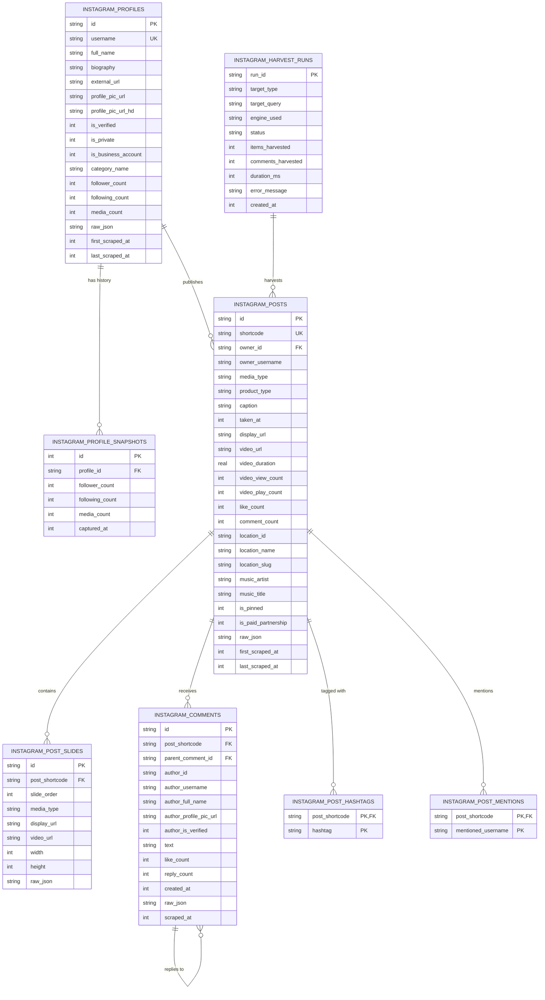

# Instagram Kapsamlı Veritabanı (SQLite) Mimari Planı

Bu doküman, **protokol-7** projesinde Instagram aktörü tarafından toplanan tüm profil, gönderi, karusel medya, kullanıcı yorumları, etiket, bahsetme ve zaman serisi büyüme verilerinin sıfır veri kaybı ile ilişkisel olarak saklanması için tasarlanan SQLite veritabanı mimarisini tanımlar.

---

## 1. Mimari Hedefler ve Temel İlkeler

1. **Tam Normalizasyon ve İlişkisel Bütünlük:**
   - 1-N hiyerarşi (`Profil` -> `Gönderi` -> `Karusel Slaytı` / `Yorum` / `Etiket`) yabancı anahtarlar (`FOREIGN KEY`) ve kademeli silme (`ON DELETE CASCADE`) ile korunur.
2. **"Önceden Neden Eklemedik" Garantisi (Geleceğe Hazırlık):**
   - Her ana tabloda (`instagram_profiles`, `instagram_posts`, `instagram_comments`) bir `raw_json TEXT` kolonu bulunur. Instagram yarın yeni bir alan eklese bile ham yanıt daima saklanır, şema kırılmaz.
3. **Zaman Serisi Büyüme Takibi (`instagram_profile_snapshots`):**
   - Takipçi, takip edilen ve gönderi sayılarının zamana bağlı değişimini analiz edebilmek için her taramada anlık metrik görüntüsü kaydedilir.
4. **Hiyerarşik Yorum Zinciri (`parent_comment_id`):**
   - Yorumlara gelen yanıtlar (sub-comments / threads) `parent_comment_id` ile modellenir.
5. **Mükerrer Kayıt Engelleme ve İdempotency (Upsert):**
   - Tekrarlanan taramalarda `INSERT OR REPLACE` / `UPSERT` mekanizmasıyla var olan kayıtların etkileşim metrikleri (beğeni, yorum sayısı) güncellenir, mükerrer kopyalar oluşmaz.
6. **Sıfır Dış Bağımlılık (Node.js Native):**
   - Node.js yerel `node:sqlite` (`DatabaseSync`) motoru kullanılır. Derleme gerektirmez, ACID uyumludur ve ultra hızlıdır.

---

## 2. İlişkisel Veritabanı Şeması (ERD)

---

## 3. Modül ve Dosya Hiyerarşisi

| Dosya | Görev |
|---|---|
| `src/storage/instagram-database.ts` | `node:sqlite` tabanlı saklama sınıfı (`InstagramDatabase`), tablo başlatma, indexler, upsert metodları, toplu işlem (transaction) ve sorgu fonksiyonları. |
| `src/actors/corpus/instagram-actor.ts` | DB otomatik kayıt (`persistToDatabase: true`, `dbPath: 'data/instagram.sqlite'`) entegrasyonu. |
| `src/api/types.ts` | DB konfigürasyon seçeneklerinin ve istatistik tiplerinin eklenmesi. |
| `tests/instagram-database.test.ts` | Bellek içi (`:memory:`) SQLite birim ve entegrasyon test paketi. |
| `docs/actors/instagram.md` | Teknik dokümantasyon ve SQL şema rehberi. |
| `context/architecture-schema.md` | Mimari katalog senkronizasyonu. |
