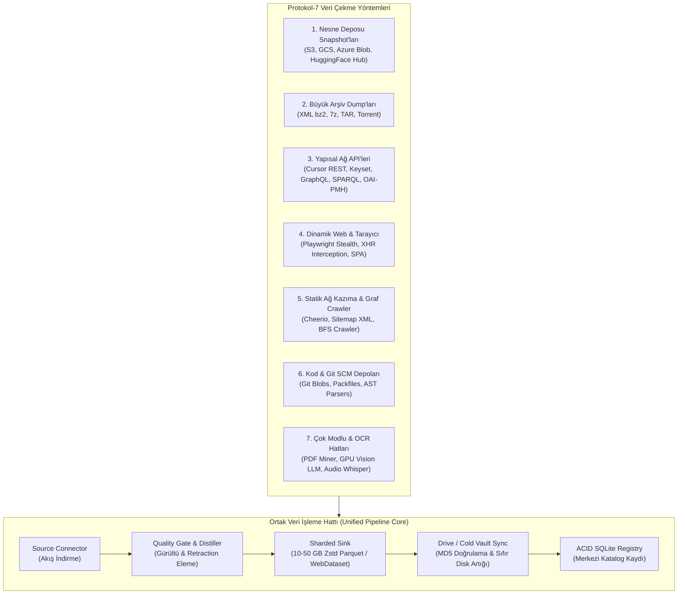

# Plan: Kapsamlı Veri Çekme Yöntemleri ve Kurumsal Modüler Mimari Planı

Bu doküman, `protokol-7` projesinin mevcut ve gelecekteki **tüm veri çekme yöntemlerini** (S3/GCS snapshot, büyük arşiv dump'ları, REST/GraphQL API'ler, dinamik tarayıcı otomasyonu, Git depoları, çok modlu OCR/görsel ve ses/video transkriptleri) tek bir çatı altında toplayan, bakımı kolay, kurumsal sınıf modüler mimari planını tanımlar.

> [!IMPORTANT]
> **Canlı Süreç Güvenlik Prensibi:**
> Sistemde şu anda **PID 958059** olarak `OpenAlex S3 Snapshot Pipeline` arka planda aktif çalışmaktadır.
> Bu plan **tasarım ve mimari hazırlık** aşamasıdır; canlı süreç tamamlanana veya güvenli bir duraklatma (checkpoint) noktasına gelene kadar çalışan dosyalara **kesinlikle fiziksel müdahale yapılmayacaktır**.

---

## 1. Veri Çekme (Ingestion) Yöntemleri Taksonomisi

Protokol-7'nin desteklediği ve ileride eklenecek tüm veri çekme paradigmaları 7 ana yönteme ayrılmıştır:



### 1.1. Yöntem 1: Bulut Nesne Deposu Snapshot'ları (Cloud Object Store Snapshots)
- **Kapsam:** AWS S3, Google Cloud Storage, Azure Blob, Hugging Face Datasets Hub.
- **Kullanım Alanı:** OpenAlex S3 Parquet snapshot'ı (707 GB), Common Crawl WET/WARC S3 havuzu, ArXiv GCS külliyatı.
- **Mekanizma:** `--no-sign-request` veya HMAC kimlik bilgileriyle multipart streaming; tek bir partisyonu indirip yerel diskte geçici işleyip anında imha eden **sıfır disk artığı (zero-disk residue)** motoru.

### 1.2. Yöntem 2: Büyük Arşiv Dump'ları (Bulk Archive Dumps)
- **Kapsam:** Wikimedia XML bz2 dump'ları, Archive.org 7z dump'ları, Gutenberg ISO/ZIP arşivleri, Academic Torrents.
- **Mekanizma:** Arşivi tamamen diske açmadan akış halinde (`bz2.BZ2Decompressor`, `py7zr` stream) satır satır ayrıştırma; hafıza dostu blok okuma.

### 1.3. Yöntem 3: Yapısal Ağ API'leri (Structured Web APIs)
- **Kapsam:** 
  - Cursor/Keyset sayfalamalı REST API'leri (Semantic Scholar, GitHub REST, Crossref, OpenReview).
  - GraphQL API'leri (LessWrong, GitHub GraphQL).
  - Semantik Web SPARQL uç noktaları (Wikidata Query Service, EUR-Lex CELLAR).
  - OAI-PMH 2.0 akademik meta-veri protokolleri (DergiPark, arXiv).
- **Mekanizma:** Otomatik rate-limit geri çekilmesi (exponential backoff), token/anahtar rotasyonu, HTTP/2 multiplexing.

### 1.4. Yöntem 4: Dinamik Tarayıcı & Ağ Ajanları (Browser Automation & Stealth)
- **Kapsam:** JavaScript ile yüklenen tek sayfalı uygulamalar (SPA), Cloudflare korumalı kaynaklar, sonsuz kaydırma (infinite scroll).
- **Mekanizma:** Playwright Chromium havuzu, CDP network interception (XHR/Fetch JSON yakalama), DOM snapshot çıkarma, fingerprint gizleme.

### 1.5. Yöntem 5: Yüksek Hızlı Statik Kazıma & Web Graf Crawler
- **Kapsam:** Düz HTML siteleri, resmi gazeteler, kurum portalları.
- **Mekanizma:** Cheerio / htmlparser2 ile ultra düşük CPU/RAM tüketimli DOM ayrıştırma; sitemap.xml recursive açılımı; robots.txt uyumlu BFS graf örümceği.

### 1.6. Yöntem 6: Kod ve Git SCM Depoları (Source Code Ingestion)
- **Kapsam:** Açık kaynak kod depoları, Python/Rust/Go kütüphaneleri, formel kanıt kodları (Lean 4, Metamath).
- **Mekanizma:** `--depth 1 --filter=blob:none` ile sığ klonlama; Tree/Blob ayrıştırma; lisans bloğu temizleme ve AST sözdizim denetimi.

### 1.7. Yöntem 7: Çok Modlu (Multimodal) & OCR Boru Hatları
- **Kapsam:** Taranmış PDF kitaplar, tıbbi raporlar, formüller, YouTube transkriptleri.
- **Mekanizma:** 
  - Seviye 1: Dijital PDF metin çıkarımı (`unpdf`, `pdfminer`).
  - Seviye 2: Taranmış belgeler için yerel hafif OCR (Tesseract).
  - Seviye 3: Karmaşık iki sütunlu ve formüllü belgeler için uzak GPU Vision LLM (Baidu Unlimited-OCR, Qwen2.5-VL-7B).
  - Seviye 4: YouTube & Ses transkriptleri (Whisper ASR, YouTube Subtitles API).

---

## 2. Hedef Kurumsal Modüler Mimari Şeması

Tüm yöntemleri ve dosya türlerini karmaşadan uzaklaştıran **hedef dizin yapısı**:

```text
protokol-7/
├── config/                                 # Merkezi Proje Konfigürasyonları
│   ├── auth/                               # OAuth token'ları ve API anahtarları (.gitignored)
│   │   ├── gdrive-token.json
│   │   └── credentials.json
│   └── dbs/                                # Wikimedia dil referans listeleri (*_dbs.json)
│
├── data/                                   # Veri Depolama (Net Alt Sınıflandırma)
│   ├── catalogs/                           # ACID SQLite işlem defterleri
│   │   ├── catalog.sqlite                  # Merkezi Protokol-7 sicil defteri
│   │   ├── openalex_snapshot_catalog.sqlite
│   │   ├── gutenberg_catalog.sqlite
│   │   └── wikimedia_*.sqlite
│   ├── parquets/                           # Yerel Parquet veri depoları
│   │   ├── wikimedia/                      # Çok dilli Wikipedia/Wikimedia parçaları
│   │   └── corpus/                         # Yerel saklanan diğer korpus parçaları
│   └── scratch/                            # Geçici işlem ve indirme tamponları (Sıfır disk artığı)
│       ├── openalex_snapshot/
│       ├── gutenberg/
│       └── wikimedia/
│
├── logs/                                   # Çalışma zamanı logları
│   └── openalex_snapshot.log
│
├── pipelines/                              # BÜTÜNLEŞİK HASAT VE ETL BORU HATLARI (Python)
│   │
│   ├── snapshot/                           # Yöntem 1: Bulut Nesne Deposu Snapshot'ları
│   │   ├── openalex/                       # AWS S3 Parquet Snapshot İndirici & Paketleyici
│   │   ├── common_crawl/                   # WET/WARC web kazıma akış hattı (gelecek)
│   │   └── huggingface/                    # HuggingFace Datasets Server akış hattı (gelecek)
│   │
│   ├── dump/                               # Yöntem 2: Büyük Arşiv Dump'ları
│   │   ├── wikimedia/                      # 300+ Dilde Wikimedia XML Dump Hatları
│   │   │   ├── extractors/                 # wikibooks, wikinews, wikiquote, wikisource vb.
│   │   │   └── runners/                    # run_all_wikimedia.py vb.
│   │   ├── stackexchange/                  # Archive.org 7z Soru-Cevap Hattı
│   │   └── gutenberg/                      # Gutenberg Kitap & Görsel WebDataset Hattı
│   │
│   ├── api_stream/                         # Yöntem 3: Yapısal API Sayfalama Hatları
│   │   ├── semantic_scholar/               # S2 Bulk Graph API + PDF Fetcher
│   │   └── openalex_api/                   # OpenAlex REST Cursor Hasatçısı
│   │
│   ├── multimodal/                         # Yöntem 7: OCR & Çok Modlu Hatlar
│   │   ├── pdf_ocr/                        # Local & Colab GPU Vision OCR hattı
│   │   └── youtube_audio/                  # YouTube ses ve transkript çıkarıcı
│   │
│   └── shared/                             # Ortak Boru Hattı Çekirdeği (Shared Framework)
│       ├── cleaner_base.py                 # Ortak kalite kapısı ve metin filtreleme sınıfı
│       ├── sharder_base.py                 # Ortak 10-50 GB Zstd Parquet ve TAR paketleyici
│       ├── drive_sync_base.py              # Resumable Drive v3 istemcisi ve MD5 doğrulayıcı
│       └── ledger_base.py                  # Ortak SQLite WAL defter sınıfı
│
├── scripts/                                # GELİŞTİRME VE SİSTEM ARAÇLARI
│   ├── ops/                                # Node.js CLI Araçları
│   │   ├── verify-pipeline.mjs             # Deterministik doğrulama hattı
│   │   ├── doctor.mjs, pulse.mjs           # Sağlık ve teşhis araçları
│   │   ├── checkpoint.mjs, logs.mjs        # Sürüm ve telemetri araçları
│   │   └── sca-check.mjs                   # Güvenlik ve bağımlılık tarayıcısı
│   └── scaffold/                           # Kod Üretim Şablonları
│       ├── scaffold-actor.mjs              # Yeni aktör iskeleleme aracı
│       └── scaffold-pipeline.py            # Yeni pipeline iskeleleme aracı
│
├── src/                                    # ÇEKİRDEK MİKROSERVİS (TypeScript)
│   ├── actors/                             # Alan Aktörleri (Kategorize)
│   │   ├── web/                            # Web, tarayıcı, sitemap, serp (8 aktör)
│   │   ├── documents/                      # PDF, EPUB, Arşiv, OCR (4 aktör)
│   │   └── corpus/                         # 59 Korpus Aktörü (5 alt domain)
│   │       ├── academic/                   # arxiv, openalex, s2, europe-pmc (11 aktör)
│   │       ├── legal/                      # court-listener, yargitay, danistay (9 aktör)
│   │       ├── reasoning_code/             # github, hacker-news, math-reasoning (12 aktör)
│   │       ├── wikimedia/                  # wikipedia, wikisource, wiktionary (11 aktör)
│   │       └── philosophy_humanities/      # stanford-phil, internet-phil, gutenberg (13 aktör)
│   │
│   ├── api/                                # REST API, Router'lar, RegistryDatabase
│   ├── browser/                            # Playwright havuzu, gizlilik
│   ├── extractors/                         # HTML, PDF, Markdown, Tablo çıkarıcılar
│   ├── pipeline/                           # TypeScript bildirimsel YAML motoru
│   └── mcp/                                # Protokol MCP sunucusu
│
└── tests/                                  # Birim ve Entegrasyon Testleri
```

---

## 3. Ortak Boru Hattı Çekirdeği (Shared Pipeline Framework)

Gelecekte eklenecek onlarca yeni veri kaynağının kod tekrarı yaratmaması ve bakımının zahmetsiz olması için `pipelines/shared/` altında 4 temel soyutlama (base class) tanımlanacaktır:

1. **`BaseCleaner` (`cleaner_base.py`):**
   - Retraction, paratext, lisans kırıntısı filtreleme kuralları.
   - HTML etiket ve entity temizleme fonksiyonları.
   - LLM Markdown sentezleyici.
2. **`BaseSharder` (`sharder_base.py`):**
   - Parametrik boyut tavanı (ör. 10 GB veya 50 GB).
   - Zstandard Parquet ve WebDataset TAR.GZ desteği.
   - Kompakt dosya adlandırma (`oa_w_...`, `wiki_...`).
   - Otomatik SHA-256 ve MD5 sağlama hesaplama.
3. **`BaseDriveSync` (`drive_sync_base.py`):**
   - Kesintisiz (resumable) Drive v3 chunk yükleme.
   - Uzak MD5 doğrulama.
   - **Sıfır yerel disk artığı garantisi** (yükleme onaylanır onaylanmaz yerel dosyayı silme).
4. **`BaseLedger` (`ledger_base.py`):**
   - SQLite WAL modunda parça/partisyon takibi.
   - `data/catalog.sqlite` merkezi sicili ile otomatik dual-sync.

---

## 4. Güvenli Geçiş ve Yol Haritası (Kademeli Plan)

Canlı çalışan sürecin hiçbir şekilde kesintiye uğramaması için geçiş 4 kontrollü faza ayrılmıştır:

```text
[Faz 0: Mevcut Durum - BEKLEME]
   └─ PID 958059 canlı süreci tamamlanana kadar hiçbir dosya silinmez veya taşınmaz.

[Faz 1: Çerçeve Hazırlığı - SIFIR ETKİ]
   ├─ `pipelines/` ve `config/` yeni klasör hiyerarşisi oluşturulur.
   ├─ `pipelines/shared/` çekirdek modülleri (`sharder_base`, `cleaner_base`) yazılır.
   └─ Gelecek pipeline'lar için `scaffold-pipeline.py` aracı hazırlanır.

[Faz 2: Boru Hatlarının Taşınması - SEMBOLİK KÖPRÜ (SYMLINK)]
   ├─ Boru hatları `pipelines/` altındaki ilgili kategorilere (`snapshot/`, `dump/`, `api_stream/`) taşınır.
   ├─ `scripts/` altına eski yolları koruyan symlink'ler konur (geriye dönük uyumluluk).
   ├─ `package.json` script'leri yeni yollarla güncellenir.
   └─ `npm run test:*` testleri doğrulanır.

[Faz 3: Veri Katmanı İzolasyonu]
   ├─ `data/catalogs/`, `data/parquets/`, `data/scratch/` dizinleri devreye alınır.
   └─ Dağınık duran dil parquets ve geçici dizinler alt klasörlere taşınır.

[Faz 4: Aktör Katmanı Alan Sınıflandırması (TypeScript)]
   ├─ `src/actors/corpus/` altındaki 59 aktör 5 alt alana taşınır.
   ├─ `actor-registry.ts` ve `actor-manifests.ts` import yolları güncellenir.
   └─ 884 TypeScript testi ve `npm run verify` doğrulanır.
```

---

## 5. Sağlanan Kazanımlar
- **Sınırsız Ölçeklenebilirlik:** İster Common Crawl'dan 100 TB WARC çekilsin, ister YouTube'dan 10 bin ses dosyası; her yeni yöntem ilgili alt klasörde (`pipelines/snapshot`, `pipelines/multimodal`) aynı standart şablonla çalışacaktır.
- **Bakım Kolaylığı:** Kod tekrarı ortadan kalkacak; tüm pipeline'lar aynı `sharder_base` ve `drive_sync_base` motorunu paylaşacaktır.
- **Sıfır Karışıklık:** `scripts/` dizini sadece geliştirici CLI araçlarına ayrılacak; veri çekme motorları ile operasyonel scriptler birbirine girmeyecektir.
- **Sıfır Kesinti:** Canlı çalışan hiçbir süreç zarar görmeyecektir.
