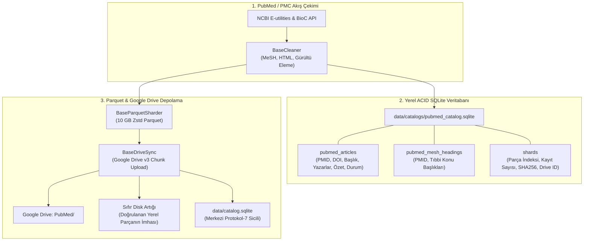

# Plan: PubMed & PubMed Central (PMC) Boru Hattı ve Çekirdek Aktör Mimarisi

Bu doküman, biyomedikal ve tıp bilimleri külliyatı için **PubMed** ve **PubMed Central (PMC)** veri çekme hattının, Google Drive depolama motorunun ve SQLite ACID veritabanı defterinin teknik uygulama planını tanımlar.

---

## 1. Veri Kaynağı ve Protokol Mimarisi

- **Platform:** National Center for Biotechnology Information (NCBI) / National Library of Medicine (NLM).
- **Protokoller:**
  1. **NCBI E-utilities v2.0 (REST/XML):**
     - `esearch.fcgi`: Arama terimleri, MeSH başlıkları, tarih filtreleri ve serbest sorgular üzerinden PMID (PubMed ID) listesi çıkarma.
     - `esummary.fcgi`: Belge metaverisi (başlık, dergi, yayın yılı, DOI, yazarlar).
     - `efetch.fcgi`: Tam PubMed makale XML verisi (yapılandırılmış özet, MeSH terimleri, tam metin bağlantıları).
  2. **NCBI BioC API:**
     - `https://www.ncbi.nlm.nih.gov/research/biorc/rest/`: PMC açık erişimli tam metin makaleleri için yapılandırılmış bölümler (Giriş, Yöntem, Bulgular, Tartışma).

---

## 2. Depolama ve ACID Veritabanı Mimarisi

Kullanıcının talep ettiği **Google Drive depolama** ve **veritabanında saklama** gereksinimleri 3 katmanlı güvenceyle yapılandırılır:

### 2.1. SQLite Veritabanı Şeması (`data/catalogs/pubmed_catalog.sqlite`)
Tüm çekilen veriler diskten bağımsız olarak SQLite veritabanında saklanır:
- `pubmed_articles`: Makale metaverisi, PMID, PMCID, DOI, başlık, dergi, yayın tarihi, özet uzunluğu, tam metin uzunluğu, parça referansı.
- `pubmed_mesh_headings`: Standart tıbbi ontoloji terimleri (MeSH Descriptors & Qualifiers).
- `shards`: Üretilen Parquet parçalarının dosya adı, boyutu, SHA-256/MD5 özetleri, yükleme durumu ve Drive dosya kimliği.
- `central_sync`: `data/catalog.sqlite` üzerindeki `dataset_shards` tablosuyla tam ACID eşitleme.

### 2.2. Google Drive Depolama (`BaseDriveSync`)
- Parquet parçaları (`pm_20261002_p00000_zstd.parquet`) belirlenen boyut tavanına (ör. 10 GB veya test için 10.000 kayıt) ulaştığında kapatılır.
- Google Drive üzerinde `PubMed/` klasörüne kesintisiz (resumable) HTTP chunking ile yüklenir.
- Uzak sunucudaki `md5Checksum` ile yerel MD5 karşılaştırılarak veri bütünlüğü doğrulanır.
- Doğrulama başarıyla tamamlandığı anda yerel Parquet dosyası diskten silinerek **sıfır yerel disk artığı** sağlanır.

---

## 3. Uygulama Adımları

1. **Adım 1: Python Birleşik Boru Hattı (`pipelines/api_stream/pubmed/`)**
   - `cleaner.py`: `BaseCleaner` genişletilerek MeSH terimleri, XML entiteleri ve tıbbi makale metinleri temizlenir.
   - `packer.py`: `BaseParquetSharder` genişletilerek 14 kolonlu Zstandard Parquet şeması oluşturulur.
   - `ledger.py`: `BaseLedger` genişletilerek `pubmed_articles` ve `pubmed_mesh_headings` SQLite tabloları kurulur.
   - `downloader.py`: NCBI E-utilities (esearch, esummary, efetch) ve BioC istemcisi; nazik istek hızlandırma (politeness rate-limiter, 3 req/s) ve exponential backoff.
   - `drive_sync.py`: `BaseDriveSync` genişletilerek Drive v3 `PubMed/` dizinine otomatik yükleme.
   - `orchestrator.py`: CLI komut satırı arayüzü (`--query`, `--max-records`, `--dry-run`, `--drive-upload`).
   - `test_pubmed_pipeline.py`: Birim testleri.

2. **Adım 2: TypeScript Çekirdek Aktör ve REST API**
   - `src/actors/corpus/pubmed-actor.ts`: `PubmedActor` sınıfı (`IActor` sözleşmesi, `search`, `summary`, `fetch`, `bioc` eylemleri).
   - `src/actors/corpus/domains/academic.ts` ve `src/actors/corpus/index.ts`: Dışa aktarımlar.
   - `src/actors/actor-registry.ts` ve `src/actors/actor-manifests.ts`: Aktör kaydı ve JSON şemaları (toplam aktör sayısı: 71).
   - `src/api/server.ts`: `POST /api/v1/pubmed` REST uç noktası.
   - `src/mcp/protokol-mcp-server.ts`: `query_pubmed` MCP aracı.
   - `tests/pubmed-actor.test.ts`: Aktör birim ve entegrasyon testleri.
   - `docs/actors/pubmed.md` ve `examples/actors/pubmed.json`: Dokümantasyon ve örnek girdi.

3. **Adım 3: CLI ve Sistem Entegrasyonu**
   - `package.json`: `npm run pubmed:pipeline` ve `npm run test:pubmed`.
   - `context/architecture-schema.md`: Güncelleme (71 aktör, yeni pipeline).

4. **Adım 4: Doğrulama ve Teslim**
   - `npm run test:pubmed` & `npm run test:corpus-pipelines`
   - `npm test` (tüm TypeScript testleri)
   - `npm run verify` (6/6 deterministik doğrulama hattı)
   - `docs/walkthroughs/pubmed-pipeline-walkthrough.md`
