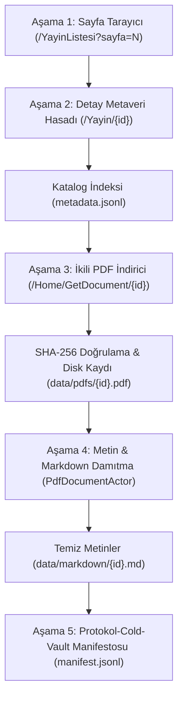

# T.C. Sağlık Bakanlığı E-Kütüphane Kapsamlı Veri Çekme ve Arşivleme Planı

Bu plan, `https://ekutuphane.saglik.gov.tr/` üzerindeki tüm tıp yayınlarının, kılavuzların ve kitapların Protokol-7 mimarisi kullanılarak uçtan uca kazınması, metaveri kataloglaması, ikili PDF indirmesi ve tam metin çıkarımını tanımlar.

---

## 1. Hedef ve Kapsam Analizi

* **Hedef Sistem:** T.C. Sağlık Bakanlığı E-Kütüphane Sistemi (`https://ekutuphane.saglik.gov.tr/`)
* **Sunucu Türü:** Microsoft-IIS/10.0, ASP.NET MVC 5.2 (Sıfır WAF / Sıfır Captcha, açık erişim).
* **Veri Hacmi:**
  * **Katalog Sayfaları:** 67 sayfa (`/YayinListesi?sayfa=1` ... `/YayinListesi?sayfa=67`).
  * **Toplam Yayın Adedi:** Yaklaşık 700–800 resmi tıp yayını, rehber ve kitap.
  * **İkili Dokümanlar:** Boyutları 1 MB ile 80 MB arasında değişen taranmış ve vektörel PDF dosyaları.
  * **Tahmini Toplam Disk İhtiyacı:** ~8 GB – 25 GB arası (PDF'ler + çıkarılan metinler).

---

## 2. Çok Aşamalı Veri Çekme Boru Hattı (Multi-Stage Pipeline)



---

## 3. Aşamaların Detaylı Tasarımı

### Aşama 1: Liste ve Katalog Hasadı (Catalog Crawler)
* **Aktör:** `CheerioScraperActor`
* **Mekanizma:** 
  * `https://ekutuphane.saglik.gov.tr/YayinListesi?sayfa={1..67}` rotaları sırayla gezilir.
  * Her sayfadaki yayın blokları taranır (`/Yayin/{id}` linkleri toplanır).
  * Çıkarılan ID'ler kuyruğa (Queue) eklenir.

### Aşama 2: Yayın Detay Metaverisi Çıkarımı (Metadata Harvester)
* **Aktör:** `CheerioScraperActor`
* **Hedef:** `https://ekutuphane.saglik.gov.tr/Yayin/{id}`
* **Çıkarılacak Yapılandırılmış Alanlar:**
  * `id`: Sayısal yayın kimliği (Örn: `767`)
  * `title`: Yayın adı (Örn: `DSÖ'NÜN OKUL SAĞLIĞI HİZMETLERİNE İLİŞKİN KILAVUZU`)
  * `publisher`: Yayınlayan genel müdürlük/birim (Örn: `Sağlığın Geliştirilmesi Genel Müdürlüğü`)
  * `year`: Basım yılı (Örn: `2026`)
  * `language`: Yayın dili (Örn: `Türkçe`)
  * `page_count`: Sayfa sayısı (Örn: `98`)
  * `size_str`: Belirtilen dosya boyutu (Örn: `4.65 MB`)
  * `summary`: Yayın özeti / açıklaması
  * `cover_image_url`: Kapak görseli tam adresi
  * `download_url`: PDF indirme uç noktası (`/Home/GetDocument/{id}`)
* **Kayıt Yeri:** `output/saglik-ekutuphane/metadata.jsonl`

### Aşama 3: İkili PDF İndirme ve Bütünlük Doğrulama (Binary Downloader)
* **Mekanizma:**
  * Akış tabanlı (Node.js `stream/promises` + `fetch`) indirme yapılır (RAM şişmesi engellenir).
  * İndirme sırasında eşzamanlı olarak **SHA-256** ve **BLAKE3** kriptografik hash özetleri hesaplanır.
  * Boyut kontrolü: Metaverideki yaklaşık boyut ile indirilen gerçek boyut karşılaştırılır.
* **Kayıt Yeri:** `output/saglik-ekutuphane/pdfs/{id}.pdf`

### Aşama 4: PDF Metin Damıtma (Text Extraction & Markdown)
* **Aktör:** `PdfDocumentActor` (`unpdf` motoru)
* **Mekanizma:**
  * İndirilen PDF yerel diskten okunur.
  * Başlıklar, sayfa numaraları, içindekiler ve gövde metinleri ayrıştırılır.
  * LLM/RAG uyumlu YAML frontmatter (başlık, yıl, sayfa sayısı, sha256) eklenerek Markdown olarak mühürlenir.
* **Kayıt Yeri:** `output/saglik-ekutuphane/markdown/{id}.md`

### Aşama 5: Kesintiden Devam Etme (Resumable Checkpoint Engine)
* **Dosya:** `output/saglik-ekutuphane/checkpoint.json`
* **İşlev:** 
  * Her tamamlanan sayfa ve indirilen kitap anında checkpoint dosyasına işlenir.
  * Ağ kopsa, elektrik gitse veya kullanıcı işlemi durdursa, komut tekrar çalıştırıldığında kaldığı yerden (0 veri kaybı ve mükerrer indirme olmadan) devam eder.

---

## 4. Nezaket, Hız ve Güvenlik Disiplini (Politeness Constraints)

Bakanlık sunucusunu (`Microsoft-IIS/10.0`) yormamak ve erişim kısıtına uğramamak için:
* **Eşzamanlılık (Concurrency):** Maksimum **2 worker** (aynı anda en fazla 2 PDF indirilir).
* **İstek Gecikmesi (Jitter Delay):** Liste ve detay sayfaları arasında **800ms - 1500ms** arası rastgele gecikme.
* **Yeniden Deneme (Backoff):** Herhangi bir 500/503 hatasında 5s, 15s, 30s üssel geri çekilme (exponential backoff).
* **SSRF Guard:** Tüm indirme URL'leri `SSRFGuard.validateUrl()` üzerinden geçer.

---

## 5. Çok Katmanlı Havuz Mimarisi ve Çıktı Standartları

Boru hattı tamamlandığında üretilecek standart arşiv havuzu:

```text
output/saglik-ekutuphane/
├── 00_map_index_pool/
│   ├── catalog.jsonl              # 700+ yayının zengin JSON kataloğu (kategori, yıl, yollar, özetler)
│   ├── checkpoint.json            # Kategori bazlı sayfa ve ID durum kaydı (kesintiden devam)
│   ├── checksums.sha256           # Tüm PDF, MD.GZ ve JSON.GZ dosyalarının SHA-256 kriptografik defteri
│   └── manifest.json              # protokol-cold-vault uyumlu üst arşiv manifestosu
├── 01_raw_landing_pool/           # İkili Ham Veri Katmanı
│   ├── kitaplar/
│   │   └── {yil}/{YYYY}{ID4}.pdf
│   ├── dergiler/
│   │   └── {yil}/{YYYY}{ID4}.pdf
│   └── makaleler/
│       └── {yil}/{YYYY}{ID4}.pdf
├── 02_refined_content_pool/       # Damıtılmış Metin ve Yapılandırılmış Veri Katmanı
│   ├── kitaplar/
│   │   └── {yil}/
│   │       ├── {YYYY}{ID4}.md.gz   # LLM/RAG uyumlu sıkıştırılmış Markdown metni
│   │       └── {YYYY}{ID4}.json.gz # Yapılandırılmış zengin metaveri
│   ├── dergiler/
│   │   └── {yil}/
│   │       ├── {YYYY}{ID4}.md.gz
│   │       └── {YYYY}{ID4}.json.gz
│   └── makaleler/
│       └── {yil}/
│           ├── {YYYY}{ID4}.md.gz
│           └── {YYYY}{ID4}.json.gz
└── 03_quarantine_staging/         # Akış sırasında geçici doğrulama tamponu (.tmp)
```

---

## 6. Protokol-Cold-Vault Entegrasyonu

Bu veri çekme görevi tamamlandığında üretilen `output/saglik-ekutuphane/` klasörü:
1. `manifest.json` ve `checksums.sha256` dosyalarını halihazırda içerecektir.
2. Gelecekte geliştirilecek `protokol-cold-vault` projesine doğrudan bir arşiv paketi olarak tanıtılabilir (`vault-cli import --dir output/saglik-ekutuphane`).
3. Doldurulan disk mühürlenip rafa kaldırılmaya hazır formattadır.

---

## 7. Doğrulama ve Kabul Kriteri

1. **Örnekleme Testi (Dry Run / 5 Kitap):**
   * İlk 1 sayfa (10 kitap) taranacak; metaveri, PDF indirme ve metin çıkarma uçtan uca test edilecek.
2. **Bütünlük Denetimi:**
   * `sha256sum -c checksums.sha256` komutu %100 başarıyla geçecek.
3. **Mükerrerlik Kontrolü:**
   * Çekilen `metadata.jsonl` içinde aynı ID'ye sahip iki kayıt olmayacak.
