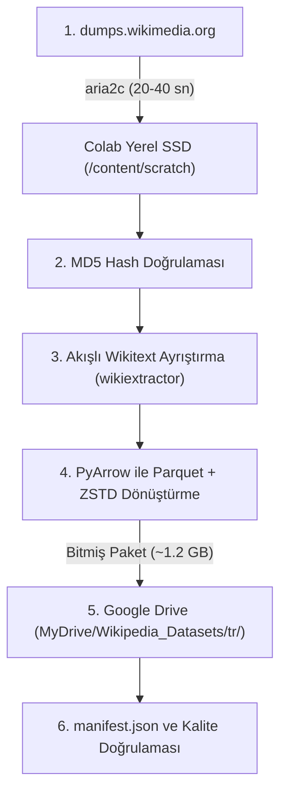

# Türkçe Wikipedia (trwiki) Dumps -> Colab -> Google Drive Paketleme Planı

Bu plan, resmi Wikimedia sunucularından Türkçe Wikipedia ham dökümünün (`trwiki-latest-pages-articles.xml.bz2`) Google Colab yerel belleğine indirilmesi, Wikitext sözdiziminden arındırılarak temizlenmesi, Apache Parquet (Zstandard) formatında sıkıştırılması ve "bitmiş paket" olarak Google Drive'a mühürlenmesi sürecini tanımlar.

---

## 1. Mimari Tasarım ve Veri Akışı



### Neden Colab Yerel Diski -> Drive Aktarımı?
* **Drive FUSE Korunması:** 14 GB'lık ham XML dosyasını ve yüz binlerce geçici dosyayı doğrudan Google Drive FUSE içine yazmak kilitlenmelere ve G/Ç gecikmelerine yol açar.
* **Optimal Akış:** Ham indirme ve ayrıştırma işlemi Colab'ın yüksek hızlı yerel sanal diskinde (`/content`) yapılır. Drive'a **yalnızca işlenmiş, temizlenmiş ve mühürlenmiş nihai Parquet paketi (~1.2 GB)** aktarılır. Bu aktarım 10-15 saniyede tamamlanır.

---

## 2. Aşamaların Detaylı Yürütme Planı

### Aşama 1: Ortam Hazırlığı ve Hızlı İndirme (Colab Yerel SSD)
* **Hedef:** `https://dumps.wikimedia.org/trwiki/latest/trwiki-latest-pages-articles.xml.bz2`
* **Doğrulama:** `https://dumps.wikimedia.org/trwiki/latest/trwiki-latest-md5sums.txt`
* **Araç:** `aria2c` (8 paralel bağlantı, kesintisiz indirme).
* **Konum:** `/content/scratch/trwiki-latest-pages-articles.xml.bz2` (Geçici Colab diski).
* **Süre:** Yaklaşık 20–40 saniye.

### Aşama 2: Bütünlük Denetimi (MD5 Hash Verification)
* Resmi `md5sums.txt` taranır. İndirilen dosyanın yerel MD5 özeti hesaplanarak karşılaştırılır. Eşleşmiyorsa işlem durdurulur.

### Aşama 3: Akışlı Wikitext Ayrıştırma (Wikitext -> Temiz JSON)
* **Araç:** `wikiextractor`
* **Filtreleme Kuralları:**
  * Şablonlar (`{{...}}`), bilgi kutuları ve HTML etiketleri metinden temizlenir.
  * Yalnızca ana maddeler (Namespace 0) alınır; yönlendirme (redirect) sayfaları elenir.
  * Çıktı: `id`, `url`, `title`, `text` alanlarını içeren JSONL akışı.

### Aşama 4: Parquet + Zstandard (ZSTD) Paketleme
* **Araç:** Python `pyarrow`
* **Şema:**
  * `id`: `string`
  * `url`: `string`
  * `title`: `string`
  * `text`: `string`
* **Sıkıştırma:** Zstandard (`compression="zstd"`, `compression_level=6`).
* **Parçalama (Chunking):** Yaklaşık 100.000 makalelik parçalar (örneğin 6 parça Parquet) halinde bölünür. Bu, GPU model eğitiminde çok kanallı okuma hızını maksimize eder.

### Aşama 5: Bitmiş Paketin Google Drive'a Mühürlenmesi
Google Drive üzerinde oluşturulacak dizin mimarisi:

```text
/content/drive/MyDrive/Wikipedia_Datasets/
└── tr/
    ├── data/
    │   ├── trwiki-part-00000.parquet
    │   ├── trwiki-part-00001.parquet
    │   ├── trwiki-part-00002.parquet
    │   ├── ...
    │   └── trwiki-part-00005.parquet
    ├── raw/                                  <- (İsteğe bağlı: ham döküm yedeği)
    │   ├── trwiki-latest-pages-articles.xml.bz2
    │   └── trwiki-latest-md5sums.txt
    └── manifest.json                         <- Metaveri ve veri seti karnesi
```

### Aşama 6: Kalite Doğrulaması ve Raporlama (`manifest.json`)
Oluşturulan `manifest.json` dosyası şunları içerir:
* Toplam makale sayısı (beklenen: ~650.000).
* Toplam metin boyutu ve sıkıştırılmış Parquet boyutu (~1.2 GB).
* Tahmini token sayısı (yaklaşık 150–200 milyon token).
* İşlem tarihi, SHA-256 sağlama toplamları ve rastgele 3 adet örnek makale doğrulaması.

---

## 3. Doğrulama ve Başarı Kriterleri
1. Ham dökümün MD5 doğrulaması %100 başarılı olmalı.
2. Parquet dosyaları bozulmadan okunabilmeli (`pyarrow.parquet.read_table`).
3. Google Drive'a aktarım hatasız tamamlanmalı.
4. Toplam makale adedi 600.000'in üzerinde olmalı.
