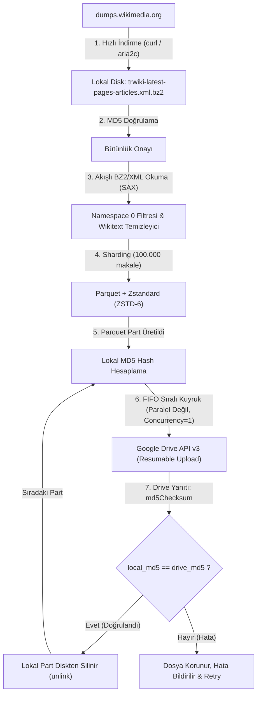

# Türkçe Wikipedia LLM Veri Hattı: Yerel Döküm Ayrıştırma, Parquet Paketleme ve Google Drive Sıralı Senkronizasyon Planı

## 1. Mimari Karar: Dump vs. Scraping / API

Wikipedia LLM ön-eğitim (pre-training) veri seti hazırlığı için kesin teknik karar: **Resmi Wikimedia XML Dumps** (`trwiki-latest-pages-articles.xml.bz2`).

### Karşılaştırma Matrisi

| Kriter | Scraping (HTML Bot) | Wikipedia REST API | Resmi XML Dumps (Seçilen) |
|---|---|---|---|
| **Erişim Hızı** | Çok Yavaş (~10-20 req/s, IP ban riski) | Sınırlı (Rate limit, 429 Too Many Requests) | Çok Hızlı (Tek oturumda 2.4 GB bz2 doğrudan indirilir) |
| **Tamamlanma Süresi** | ~650.000 madde için 4-7 gün | ~650.000 madde için 2-4 gün | İndirme: 3-5 dk, Ayrıştırma: 15-25 dk |
| **Veri Bütünlüğü** | Eksik sayfalar, ağ kopmaları, DOM değişiklikleri | Pagination sorunları, eksik yönlendirmeler | %100 eksiksiz veritabanı anlık görüntüsü |
| **Gereksiz Yük** | HTML, CSS, JavaScript, gezinme çubukları | JSON zarf overhead'i, API istek yükü | Yalnızca ham makale metni ve wikitext |
| **Endüstri Standardı** | LLM ön-eğitiminde kullanılmaz | Küçük sorgular için uygundur | LLaMA, Mistral, FineWeb, RedPajama standardı |

---

## 2. Sistem Mimarisi ve Veri Akışı

---

## 3. Bileşen Detayları

### 3.1. Döküm İndirici (`downloader.py`)
- Hedef: `https://dumps.wikimedia.org/trwiki/latest/trwiki-latest-pages-articles.xml.bz2`
- Sağlama toplamı: `https://dumps.wikimedia.org/trwiki/latest/trwiki-latest-md5sums.txt`
- İndirme tamamlandığında yerel dosyanın MD5 hash'i doğrulanır.

### 3.2. Akışlı Ayrıştırıcı ve Temizleyici (`cleaner.py`)
- Dev BZ2 dosyasını diskte uncompress etmeden doğrudan `bz2.BZ2File` üzerinden akışlı (streaming SAX) okur.
- Yalnızca `ns == 0` (ana maddeler) filtrelenir; kullanıcı sayfaları, şablonlar, tartışmalar ve yönlendirmeler (`#YÖNLENDİRME` / `#REDIRECT`) elenir.
- Wikitext temizliği: HTML etiketleri, bilgi kutuları, kaynakça ve kategori etiketleri ayıklanır; saf, yüksek kaliteli metin elde edilir.

### 3.3. Parquet Sharder & Sıkıştırıcı (`packer.py`)
- PyArrow ile tablo oluşturulur.
- Şema:
  - `id`: `string`
  - `url`: `string`
  - `title`: `string`
  - `text`: `string`
- Sıkıştırma: Zstandard (`compression="zstd"`, `compression_level=6`).
- Parçalama: Her 100.000 makalede bir (veya yapılandırılabilir eşik) `trwiki-part-0000X.parquet` dosyası üretilir.

### 3.4. Google Drive Sıralı Yükleme Kuyruğu (`drive_queue.py`)
- Kesinlikle paralel değil; sıralı (sequential, FIFO, concurrency = 1).
- Google Drive API v3 (Resumable Upload) kullanılır.
- İşlem Akışı:
  1. Part dosyası oluşturulur.
  2. Dosyanın yerel MD5 hash'i hesaplanır (`local_md5`).
  3. Dosya Drive'daki hedef klasöre yüklenir.
  4. Google Drive'ın döndürdüğü `md5Checksum` değeri alınır.
  5. `local_md5.lower() == drive_md5.lower()` karşılaştırması yapılır.
  6. Eşleşme sağlandıysa `os.remove(local_path)` ile yerel dosya anında silinir.
  7. Eşleşmezse dosya korunur, hata loglanır.

### 3.5. Google Drive Kimlik Doğrulama Yöntemi
- Google Cloud Console üzerinden oluşturulan OAuth 2.0 Client ID (`credentials.json`) kullanılır.
- İlk çalıştırmada terminal/tarayıcı üzerinden tek seferlik onay alınarak `token.json` oluşturulur.
- İsteğe bağlı olarak Google Service Account (`service_account.json`) desteği de sunulur.

---

## 4. Disk ve Bellek Tasarruf Analizi
- **Streaming Parsing:** 10 GB açılmış XML yerine bellek tüketimi 500 MB civarında sabit kalır.
- **Immediate Disk Cleanup:** Her part yüklendikçe yerel diskten silindiği için diskte aynı anda en fazla 1-2 adet Parquet dosyası (~200 MB) bulunur.
- Toplam yerel disk ihtiyacı: Sadece ham bz2 dökümü (~2.4 GB) + 1 part önbelleği (~200 MB). İşlem bittiğinde ham döküm de temizlenebilir.

---

## 5. Doğrulama ve Test Adımları
1. Küçük bir Wikipedia XML kesiti (1.000 makale) ile uçtan uca kuru çalışma (dry-run) testi.
2. Parquet şemasının ve Zstandard sıkıştırmasının `pyarrow.parquet.read_table` ile doğrulanması.
3. MD5 hash hesaplama ve doğrulama birim testleri.
4. Google Drive yükleme, hash teyidi ve dosya silme mantığının test edilmesi.
