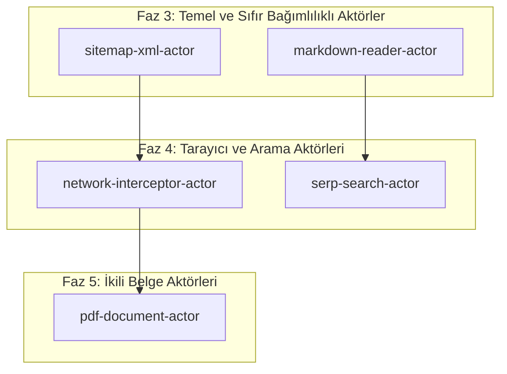

# Popüler Aktörler Araştırması ve Mimari Entegrasyon Planı

Bu belge, modern web kazıma, tarama ve otonom veri çıkarma ekosistemlerindeki (Apify, Firecrawl, Crawlee, Jina Reader, Scrapy) en yaygın ve katma değeri en yüksek aktör modellerinin teknik analizini ve **protokol-7** mikroservisine entegrasyonu için aşamalı uygulama planını tanımlar.

---

## 1. Ekosistem Analizi ve Aktör Değerlendirmesi

Mevcut durumda protokol-7 çekirdeğinde 4 aktör bulunmaktadır:
1. `cheerio-scraper` (Düşük gecikmeli statik HTML kazıma)
2. `playwright-browser` (Dinamik SPA ve JavaScript çalıştırmalı tarayıcı)
3. `api-extractor` (Sayfalama ve projeksiyon destekli REST API istemcisi)
4. `crawler` (BFS derinlik ve alan adı sınırlandırmalı HTML graf tarayıcısı)

Aşağıdaki 5 aktör, ekosistemdeki veri toplama ve LLM besleme ihtiyaçları doğrultusunda en yüksek verimliliği sağlayan mimari bileşenlerdir:

| Aday Aktör | Mekanizma / Protokol | Yeni Bağımlılık | Öncelik / Katma Değer |
|---|---|---|---|
| **`sitemap-xml-actor`** | `sitemap.xml`, `sitemap_index.xml` ve RSS/Atom akışlarının dekompresyonu (`zlib`) ve XML modunda Cheerio ile ayrıştırılması. | 0 (Mevcut araçlar) | **Kritik (P1)**: Graf taramaya kıyasla 100x daha az ağ/CPU ile eksiksiz URL envanteri çıkarır. |
| **`markdown-reader-actor`** | Sayfayı LLM girdi formatına damıtır; YAML frontmatter (başlık, yazar, tarih, URL, token tahmini) ve temiz GFM markdown üretir. | 0 (Mevcut araçlar) | **Kritik (P1)**: Firecrawl / Jina Reader standardında temiz prompt verisi sağlar. |
| **`network-interceptor-actor`** | Playwright network katmanını dinler (`page.on('response')`); arka plandaki tüm XHR / Fetch JSON yanıtlarını DOM'a dokunmadan doğrudan yakalar. | 0 (Mevcut araçlar) | **Yüksek (P2)**: Modern SPA'larda kırılgan CSS seçiciler yerine saf kurumsal API JSON verisini çeker. |
| **`serp-search-actor`** | DuckDuckGo / Google HTML arama sonuç sayfalarını sorgular; sıralama, başlık, hedef URL, alan adı ve metin özetlerini ayrıştırır. | 0 (Mevcut araçlar) | **Yüksek (P2)**: Otonom araştırma ajanlarının hedef URL bulmasını sağlar. |
| **`pdf-document-actor`** | HTTP üzerinden indirilen PDF ikili dosyalarının metin akışlarını, sayfa sınırlarını ve belge üstverilerini çıkarır. | 1 (`pdf-parse`) | **Orta (P3)**: Web üzerindeki rapor, makale ve dokümantasyon dosyalarının taranmasını sağlar. |

---

## 2. Aday Aktörlerin Teknik Şartnameleri

### A. `sitemap-xml-actor` (Sitemap & Feed Parser)
- **Teknik Gerekçe**: HTML link takibi ile büyük siteleri (ör. e-ticaret, dokümantasyon, haber arşivleri) taramak binlerce gereksiz HTTP isteğine ve döngülere yol açar. `sitemap.xml` tüm indekslenmiş URL'leri `lastmod`, `changefreq` ve `priority` bilgileriyle tek seferde sunar.
- **İşleyiş**:
  1. Verilen URL'yi (`targetUrl`) veya robots.txt içindeki `Sitemap:` yönergelerini sorgular.
  2. Gzip ile sıkıştırılmış sitemap'leri (`.xml.gz`) yerel `node:zlib` ile açar.
  3. `sitemapindex` tespit edilirse alt sitemap'leri `maxDepth` sınırına kadar özyinelemeli olarak çözer.
  4. `cheerio.load(xml, { xmlMode: true })` kullanarak bellek içi XML ayrıştırması yapar.
- **Çıktı Veri Yapısı (`SitemapResult`)**:
  ```typescript
  export interface SitemapUrlEntry {
    loc: string;
    lastmod?: string;
    changefreq?: "always" | "hourly" | "daily" | "weekly" | "monthly" | "yearly" | "never";
    priority?: number;
  }
  export interface SitemapResult {
    sitemapUrl: string;
    isIndex: boolean;
    totalUrls: number;
    subSitemaps?: string[];
    urls: SitemapUrlEntry[];
  }
  ```

---

### B. `markdown-reader-actor` (LLM Context Reader)
- **Teknik Gerekçe**: LLM'lerin web içeriğini tüketirken reklam, gezinme menüleri, çerez uyarıları ve biçimlendirme artıklarından arındırılmış, token maliyeti hesaplanmış metne ihtiyacı vardır.
- **İşleyiş**:
  1. `CheerioScraperActor` veya Playwright ile ham HTML'i alır.
  2. `ReadabilityExtractor` ve `StructuredExtractor` ile makale gövdesini ve tabloları GFM formatına dönüştürür.
  3. YAML frontmatter başlığı üretir (`title`, `author`, `publishedTime`, `sourceUrl`, `description`, `estimatedTokens`).
  4. Başlık hiyerarşisine (`#`, `##`, `###`) göre içindekiler tablosu (TOC) ve çapa linkleri ekler.
- **Çıktı Veri Yapısı (`MarkdownReaderResult`)**:
  ```typescript
  export interface MarkdownReaderResult {
    url: string;
    title: string;
    byline?: string;
    excerpt?: string;
    siteName?: string;
    publishedTime?: string;
    frontmatterYaml: string;
    contentMarkdown: string;
    fullDocumentMarkdown: string;
    estimatedTokenCount: number;
    characterCount: number;
    wordCount: number;
    tableOfContents: Array<{ level: number; text: string; slug: string }>;
  }
  ```

---

### C. `network-interceptor-actor` (API Traffic Sniffer)
- **Teknik Gerekçe**: Modern React/Next.js/Vue web siteleri sunucudan doğrudan JSON veri çeker ve tarayıcıda DOM'u oluşturur. DOM'u CSS seçicileriyle kazımak yerine ağ trafiğini dinleyip JSON yanıtlarını yakalamak 10 kat daha dayanıklıdır.
- **İşleyiş**:
  1. `BrowserPool` üzerinden izole bir sayfa açar.
  2. `page.on("response", async (response) => { ... })` ile gelen tüm ağ yanıtlarını dinler.
  3. `content-type: application/json` başlığı taşıyan veya filtre desenlerine (`urlPatterns: ["*api*", "*graphql*"]`) uyan istekleri süzer.
  4. Yanıt gövdesini JSON olarak ayrıştırır ve istek metot/URL bilgisiyle paketler.
- **Çıktı Veri Yapısı (`NetworkInterceptorResult`)**:
  ```typescript
  export interface InterceptedApiResponse {
    url: string;
    method: string;
    statusCode: number;
    headers: Record<string, string>;
    requestPayload?: unknown;
    responseJson: unknown;
    timestamp: number;
  }
  export interface NetworkInterceptorResult {
    pageUrl: string;
    totalCaptured: number;
    responses: InterceptedApiResponse[];
  }
  ```

---

### D. `serp-search-actor` (Search Engine SERP Extractor)
- **Teknik Gerekçe**: Otonom web ajanları hedef URL'yi önceden bilmez; konu veya anahtar kelime üzerinden araştırma yapar. Harici paralı SERP API'lerine bağımlılığı kaldırır.
- **İşleyiş**:
  1. DuckDuckGo HTML / lite arama uç noktasını (`https://html.duckduckgo.com/html/?q=...`) sorgular.
  2. Sonuç bloklarını (`.result`, `.result__body`) Cheerio ile ayrıştırır.
  3. Arama motoru izleme yönlendirme URL'lerini (tracking redirects) hedef ham URL'ye çözer (`UrlNormalizer`).
- **Çıktı Veri Yapısı (`SerpSearchResult`)**:
  ```typescript
  export interface SerpResultItem {
    rank: number;
    title: string;
    url: string;
    domain: string;
    snippet: string;
  }
  export interface SerpSearchResult {
    query: string;
    totalResults: number;
    items: SerpResultItem[];
  }
  ```

---

## 3. Aşamalı Uygulama Yol Haritası



### Aşama 1 (Faz 3): Sıfır Bağımlılıklı Çekirdek Aktörler (Tavsiye Edilen İlk Adım)
1. **`src/sitemap-xml-actor.ts`**:
   - Sitemap indeksleri ve URL listeleri çıkarma.
   - Gzip açma desteği (`node:zlib`).
2. **`src/markdown-reader-actor.ts`**:
   - YAML frontmatter ve token tahmini.
   - LLM odaklı GFM damıtma.
3. **`src/types.ts` & `src/actor-registry.ts`**:
   - `ActorType` union genişletmesi: `"sitemap-xml" | "markdown-reader"`.
   - Aktörlerin varsayılan registry'ye kaydı.
4. **Birim Testleri**:
   - `tests/sitemap-xml-actor.test.ts`
   - `tests/markdown-reader-actor.test.ts`

### Aşama 2 (Faz 4): Tarayıcı ve Ağ Aktörleri
1. **`src/network-interceptor-actor.ts`**:
   - `BrowserPool` yanıt dinleme ve filtreleme mekanizması.
2. **`src/serp-search-actor.ts`**:
   - DuckDuckGo HTML organik sonuç çıkarma motoru.
3. **Birim Testleri**:
   - `tests/network-interceptor-actor.test.ts`
   - `tests/serp-search-actor.test.ts`

---

## 4. Doğrulama Planı

### Otomatik Testler
```bash
# 1. Yeni aktörlerin tip sözleşmeleri
npm run typecheck

# 2. Mock HTTP sunucularıyla sitemap, markdown ve ağ aktörü testleri
npm test

# 3. Biome statik analizi
npm run lint

# 4. Connectome ve deterministik doğrulama hattı
npm run connectome
npm run verify
```

---

## 5. Kullanıcı Değerlendirmesi ve Karar Noktası

> [!IMPORTANT]
> - İlk olarak hangi aktör grubuyla başlamak istersiniz?
>   - **Seçenek A (Tavsiye Edilen)**: **Aşama 1 (Faz 3)** — `sitemap-xml-actor` ve `markdown-reader-actor`. Sıfır harici bağımlılık, anında yüksek katma değer ve LLM uyumluluğu.
>   - **Seçenek B**: **Aşama 2 (Faz 4)** — `network-interceptor-actor` ve `serp-search-actor`. SPA API yakalama ve web araması.
>   - **Seçenek C**: Tüm aktörlerin (Aşama 1 + 2) tek bir fazda planlanıp uygulanması.
