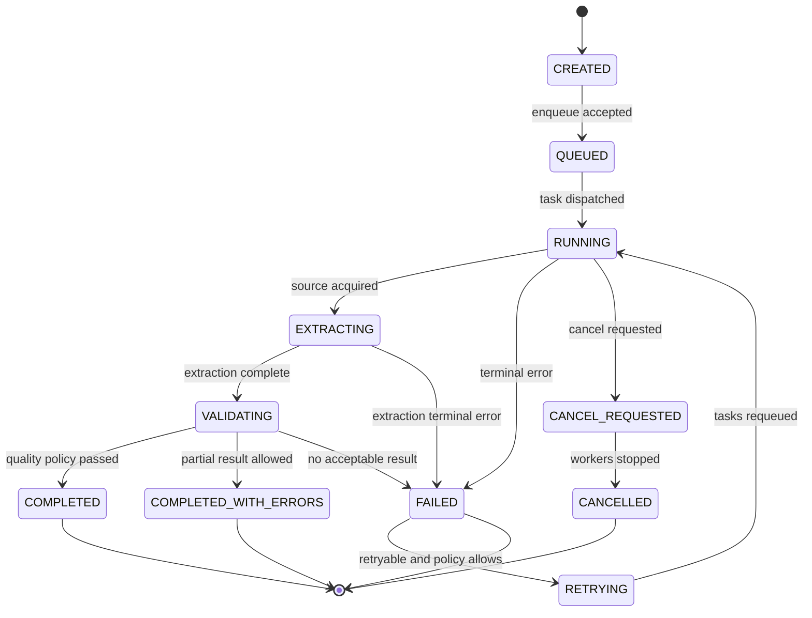
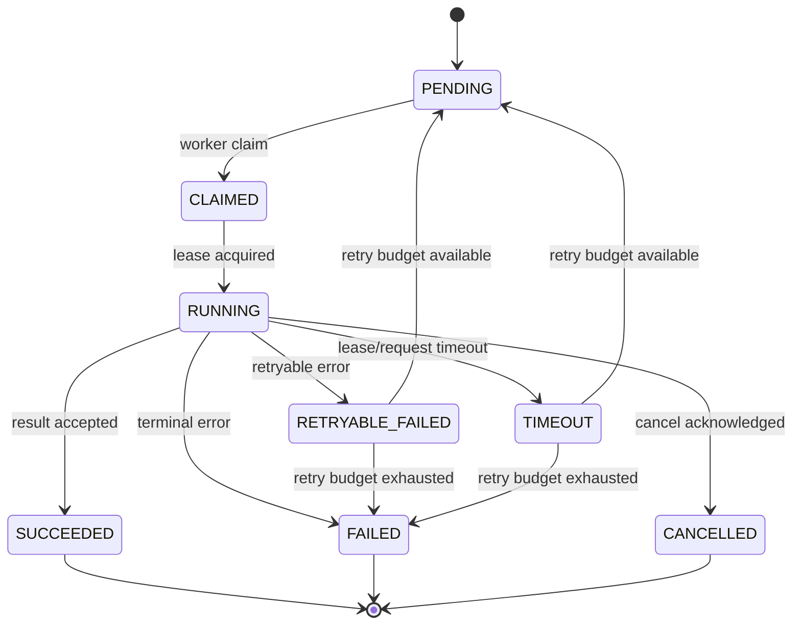
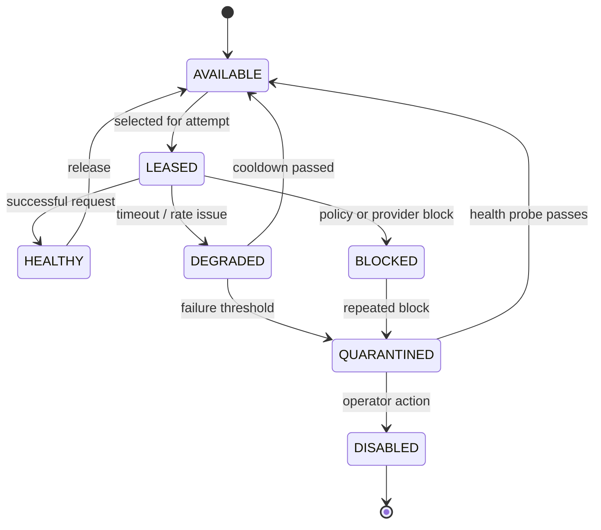

# 04 — Yaşam Döngüleri ve Durum Makineleri

**Sürüm:** 0.1.0  
**Durum:** Tasarım  
**Kapsam:** Job, Task, Worker, Proxy, Extraction ve Dataset durumları

## 1. Durum yönetimi ilkeleri

Durum, bir varlığın mevcut gerçeğini; event ise bu gerçeğe nasıl ulaşıldığını ifade eder. Sistem yalnızca mevcut `status` alanına güvenmemeli, kritik geçişleri değişmez olay veya audit kaydı olarak da saklamalıdır. Her geçiş bir aktör, zaman, neden ve korelasyon kimliği taşımalıdır.

Durum geçişleri yalnızca tanımlı geçiş tablosundaki yollarla yapılabilir. Aynı transition iki kez işlendiğinde sonuç değişmemeli; bu nedenle transition handler'ları idempotent olmalıdır. Worker ile orkestrator aynı kaydın sahibi olmamalı; worker gözlemini event olarak bildirir, iş durumuna son kararı orkestrator verir.

## 2. Job yaşam döngüsü



| Durum | Anlam | Giriş koşulu | Çıkış koşulu |
|---|---|---|---|
| `CREATED` | Job kaydı oluşturuldu | API/scheduler kabulü | Kuyruğa yazım |
| `QUEUED` | En az bir task kuyruğa alındı | Queue publish başarılı | Worker claim |
| `RUNNING` | Task yürütülüyor | Worker claim veya retry | Kaynak alındı, hata veya iptal |
| `EXTRACTING` | Ham veri çıkarım aşamasında | Fetch/browser sonucu var | Extraction tamamlandı veya hata |
| `VALIDATING` | Schema ve kalite kontrolleri sürüyor | Yapılandırılmış kayıt var | Dataset yazımı veya hata |
| `COMPLETED` | Beklenen iş kabul edilebilir sonuçla tamamlandı | Validation policy geçti | Terminal |
| `COMPLETED_WITH_ERRORS` | Kısmi sonuç var, bazı task'lar başarısız | Partial-result policy | Terminal |
| `FAILED` | Terminal hata oluştu | Retry yok veya tükendi | Retry veya terminal |
| `RETRYING` | Yeniden çalışma planlanıyor | Retry policy uygun | Task enqueue |
| `CANCEL_REQUESTED` | İptal sinyali gönderildi | Kullanıcı veya policy | Worker'lar durdu |
| `CANCELLED` | İş iptal edildi | Tüm aktif task'lar durdu | Terminal |

## 3. Task ve Attempt yaşam döngüsü

Task, bir job'ın yeniden yürütülebilir birimidir. Attempt ise o task'ın belirli bir çalıştırma denemesidir. Retry, aynı task üzerinde yeni attempt üretir; geçmiş attempt kaydı güncellenmez veya silinmez.



Worker claim işleminde görünürlük timeout/lease bulunmalıdır. Worker heartbeat kaybolduğunda task otomatik olarak hemen başarısız sayılmamalı; lease süresi dolduktan sonra güvenli biçimde yeniden kuyruğa alınmalıdır. Aynı task iki worker tarafından eşzamanlı alınırsa yalnızca geçerli lease sahibi sonucu kabul edilmelidir.

## 4. Worker yaşam döngüsü

| Durum | Açıklama | Sağlık kuralı |
|---|---|---|
| `STARTING` | Süreç açılıyor, bağımlılıklar kontrol ediliyor | Ready olmadan task alınmaz |
| `READY` | Task almaya hazır | Periyodik heartbeat zorunlu |
| `DRAINING` | Yeni task alınmıyor, mevcutler bitiriliyor | Deploy/scale-down sırasında kullanılır |
| `BUSY` | En az bir task yürütülüyor | Kapasite metrikle raporlanır |
| `UNHEALTHY` | Heartbeat veya bağımlılık kontrolü başarısız | Queue consumer durdurulur |
| `STOPPED` | Worker güvenli biçimde kapandı | Yeni task kabul edilmez |

Worker kaydı `type`, `version`, `capabilities`, `concurrency`, `lastHeartbeatAt` ve `buildId` alanlarını taşımalıdır. Health endpoint'i yalnızca process'in yaşadığını değil, queue, database ve browser runtime gibi kritik bağımlılıkların kullanılabilirliğini de raporlamalıdır.

## 5. Proxy ve provider yaşam döngüsü

Proxy Manager, tek bir proxy endpoint'ini kalıcı gerçeklik olarak değil, erişim planının bir parçası olarak görür. Provider'dan alınan lease, session veya endpoint bilgisi kullanımdan sonra secret olarak loglanmamalıdır.



Proxy health kararı tek response'a göre verilmemelidir. Provider, proxy type, ülke/şehir, hedef host, hata kodu, son başarılı zaman ve maliyet metrikleri ayrı boyutlarda tutulmalıdır. Sağlık hesaplama policy'si hedefe özgü ve açıklanabilir olmalı; otomatik strateji kararı için kullanılan her sinyal attempt metadata'sına yazılmalıdır.

## 6. Extraction ve validation yaşam döngüsü

| Aşama | Girdi | Çıktı | Hata örneği |
|---|---|---|---|
| `ACQUIRED` | HTTP response veya browser page | Ham içerik/artifact referansı | `FETCH_FAILED` |
| `PARSED` | HTML, JSON veya DOM | Parse edilmiş belge | `PARSER_ERROR` |
| `EXTRACTED` | Extraction planı | Aday kayıtlar | `EXTRACTION_EMPTY` |
| `NORMALIZED` | Aday kayıtlar | Tipi dönüştürülmüş kayıtlar | `NORMALIZATION_ERROR` |
| `VALIDATED` | Normalize kayıt + schema | Valid/invalid ayrımı | `SCHEMA_INVALID` |
| `PERSISTED` | Valid kayıtlar | Dataset version batch'i | `STORAGE_ERROR` |

AI extraction kullanılıyorsa model çıktısı doğrudan güvenilir kabul edilmemelidir. Çıktı önce JSON parse, schema validation, alan kalite kontrolü ve gerektiğinde kaynak konum kanıtı kontrolünden geçmelidir. Kanıt bulunmayan veya biçimsel olarak geçerli olsa da güven skoru düşük kayıtlar `needs_review` olarak işaretlenebilir.

## 7. Dataset version yaşam döngüsü

Dataset version oluşturma işlemi iki aşamalı commit modeli kullanmalıdır. Önce geçici batch'ler object storage ve staging tablosuna yazılır; bütünlük, kayıt sayısı ve kalite hesapları tamamlandıktan sonra version `PUBLISHED` yapılır. İş yarıda kalırsa version `ABORTED` olarak kapanır ve yarım çıktı varsayılan dataset sonucu olarak görünmez.

| Durum | Açıklama |
|---|---|
| `DRAFT` | Batch yazımı devam ediyor |
| `VALIDATING` | Kayıt, checksum ve kalite hesapları çalışıyor |
| `PUBLISHED` | API ve export için görünür |
| `ABORTED` | İş iptal edildi veya terminal hata aldı |
| `EXPIRED` | Retention policy nedeniyle erişimden kaldırıldı |

## 8. Retry ve backoff kuralları

Retry kararı hata kodu, HTTP sınıfı, provider cevabı, deneme sayısı, hedef policy'si ve maliyet bütçesine göre verilmelidir. Genel varsayılan olarak network timeout, geçici provider erişim hatası ve bazı sunucu hataları retry edilebilir; schema uyumsuzluğu, yetkisiz hedef, geçersiz URL ve policy ihlali terminal kabul edilir.

```text
backoff = min(baseDelay * 2^attempt + jitter, maxDelay)
```

Retry; proxy, session veya çalışma modunu değiştirmeyi gerektiriyorsa bu karar açık bir strategy event'i olarak kaydedilmelidir. Aynı stratejiyle sınırsız tekrar yapılması yasaktır. Job düzeyinde toplam retry bütçesi, task düzeyinde attempt bütçesinden ayrı izlenmelidir.

## 9. İptal ve kapanış

İptal edilen job için yeni task enqueue edilmemeli, aktif worker'lara cancellation sinyali gönderilmeli ve dış çağrılar makul timeout içinde sonlandırılmalıdır. Kapanış sırasında tamamlanmış artifact ve kayıtlar korunabilir; ancak job sonucu `CANCELLED` olduğu için otomatik olarak tamamlanmış dataset version olarak yayınlanmamalıdır.

## References

[1]: ../source/pasted_content.txt "Kullanıcı tarafından sağlanan sistem taslağı"
