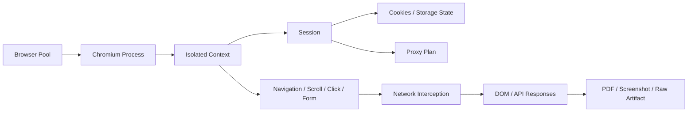

# 05 — Worker, Proxy ve Erişim Politikası

**Sürüm:** 0.1.0  
**Durum:** Tasarım  
**Kapsam:** HTTP Worker, Browser Worker, Proxy Manager, provider adapter'ları ve uyum sınırları

## 1. Amaç ve uyum sınırı

Worker katmanı, orkestrator tarafından verilen yürütme planını güvenli ve ölçülebilir biçimde uygular. Worker'lar hedef sistemlerin erişim koşullarını saldırgan biçimde aşmak için tasarlanmamalıdır. Hedefin kullanım şartları, robots/policy ayarları, yasal yetki, oran limitleri ve tenant konfigürasyonu yürütme öncesi değerlendirilir.

> **Zorunlu kural:** Sistem, izin verilmeyen hedefleri, kimlik doğrulama bariyerlerini veya CAPTCHA gibi insan doğrulamasını otomatik olarak aşmaya yönelik bir mod sunmamalıdır. Bir erişim kararı policy'ye aykırıysa retry yerine `POLICY_VIOLATION` veya `ACCESS_NOT_AUTHORIZED` terminal hatası üretilir.

## 2. Ortak Worker sözleşmesi

Her worker ortak bir execution interface uygulamalıdır:

```ts
interface WorkerHandler<TPayload, TResult> {
  readonly type: WorkerType;
  readonly version: string;
  canHandle(task: TaskEnvelope): boolean;
  execute(context: ExecutionContext, payload: TPayload): Promise<TResult>;
  cancel(attemptId: string): Promise<void>;
  health(): Promise<HealthStatus>;
}
```

`ExecutionContext` en az tenant, project, target, job, task, attempt, trace ve deadline bilgilerini taşımalıdır. Worker, gelen payload'dan tenant bağlamını değiştiremez. Her dış istek deadline, maksimum response boyutu, redirect sınırı, concurrency ve cancellation signal ile yürütülmelidir.

## 3. HTTP Worker

HTTP Worker, browser gerektirmeyen hedefler için varsayılan çalışma motorudur. Temel akış aşağıdaki gibidir:

```text
Target URL
  ↓
Policy validation
  ↓
Request plan
  ↓
Headers / cookies / auth reference
  ↓
Proxy Manager
  ↓
HTTP request
  ↓
Redirect + compression handling
  ↓
Response size / status / content-type checks
  ↓
Parser
  ↓
Extractor
```

### Desteklenen yetenekler

| Yetenek | MVP davranışı |
|---|---|
| GET/POST | Allowlist ve request body boyutu sınırı ile desteklenir |
| Headers | Yalnızca policy tarafından izin verilen başlıklar yazılabilir |
| Cookies | Secret değeri loglanmadan, süreli session bağlamında kullanılır |
| Redirects | Host allowlist doğrulaması her redirect'te tekrarlanır |
| Compression | Client kütüphanesi tarafından kontrollü açılır; decompressed size sınırı uygulanır |
| Timeout | Connect, response ve total deadline ayrı ölçülür |
| Retry | Hata taxonomy ve job budget tarafından yönetilir |
| Proxy | Proxy Manager planı olmadan doğrudan erişim yapılmaz; hedef policy'si karar verir |
| Rate limit | Target/tenant/provider boyutlarında uygulanır |
| Cache | Yalnızca policy izin verirse ve hassas veri içermiyorsa kullanılır |

HTTP Worker ham response body'sini bellekte sınırsız tutmamalıdır. Büyük response stream edilerek object storage'a yazılmalı, parser için boyut ve içerik türü uygunluğu doğrulanmalıdır. İçerik türü beklenmeyen veya tehlikeli parse davranışına sahip ise `UNSUPPORTED_CONTENT_TYPE` üretilir.

## 4. Browser Worker

Browser Worker, HTTP Worker'ın yetersiz kaldığı durumlarda devreye girer. Kullanım gerekçesi; JavaScript ile üretilen içerik, sayfa etkileşimi, izinli login/session akışı, cookie/localStorage bağlamı, network interception veya screenshot/PDF ihtiyacı olabilir.



Browser yaşam döngüsü şu sırayı izlemelidir: context oluşturma, session ve proxy policy yükleme, hedef navigasyonu, network ve resource policy kontrolü, yalnızca izinli page actions, veri yakalama, artifact yazımı ve context disposal. Tenant'lar arası context veya cookie state paylaşımı **MUST NOT** yapılır.

Browser action planı declarative olmalıdır. Örnek:

```json
{
  "actions": [
    { "type": "goto", "url": "https://example.com/products" },
    { "type": "waitForSelector", "selector": ".product-card", "timeoutMs": 10000 },
    { "type": "scroll", "amount": 1200 },
    { "type": "capture", "kind": "dom" }
  ]
}
```

Action listesi bir timeout, toplam adım limiti, navigation allowlist ve kaynak boyutu limiti ile çevrelenmelidir. Kullanıcıdan gelen selector veya script içeriği doğrudan ayrıcalıklı runtime'a çalıştırılmamalıdır; MVP'de serbest JavaScript çalıştırma özelliği kapsam dışıdır.

## 5. Strategy seçimi

Strategy Engine, kararını gözlemlenebilir ve tekrar üretilebilir kılmalıdır. MVP'de karar ağacı aşağıdaki gibi uygulanabilir:

```text
Target policy uygun mu?
  Hayır → POLICY_VIOLATION
  Evet
    ↓
Statik HTTP denenebilir mi?
  Evet → HTTP Worker
    ↓ başarısız / yetersiz içerik
Browser fallback izinli mi?
  Evet → Browser Worker
  Hayır → STRATEGY_EXHAUSTED
```

Strategy kararı; hedef, content-type, önceki attempt sonuçları, browser fallback flag'i, proxy policy'si ve maliyet bütçesini kullanabilir. AI destekli kararlar eklenirse model çıktısı yalnızca öneri olarak ele alınmalı; policy motoru tarafından doğrulanmadan worker çalıştırılmamalıdır.

## 6. ProxyProvider abstraction

Dış proxy sağlayıcıları çekirdek koda doğrudan bağlanmamalıdır. Önerilen arayüz:

```ts
interface ProxyProvider {
  readonly id: string;
  readonly capabilities: ProviderCapabilities;
  acquire(request: ProxyRequest): Promise<ProxyLease>;
  release(leaseId: string, result: LeaseResult): Promise<void>;
  health(scope?: HealthScope): Promise<ProviderHealth>;
  estimateCost(request: ProxyRequest): Promise<CostEstimate>;
}
```

Adapter örnekleri `BrightDataProvider`, `OxylabsProvider`, `ZyteProvider` ve `InternalProvider` olarak ayrılabilir. Bu adlar ürün konfigürasyonundaki provider türleridir; çekirdek servis bir provider'ın özel SDK veya response biçimini bilmemelidir.

### ProxyRequest

```json
{
  "targetHost": "example.com",
  "country": "TR",
  "city": null,
  "sessionMode": "ephemeral",
  "proxyClass": "datacenter",
  "purpose": "authorized_data_collection",
  "maxDurationMs": 30000
}
```

### Proxy seçim sinyalleri

| Sinyal | Kullanım |
|---|---|
| `targetRiskClass` | Düşük/orta/yüksek operasyonel hassasiyet sınıflandırması |
| `providerHealth` | Provider ve bölgesel sağlık durumu |
| `successRate` | Aynı hedef ve proxy sınıfındaki geçmiş başarı |
| `costPerRequest` / `costPerGB` | Maliyet bütçesi ve seçim optimizasyonu |
| `geoRequirements` | Tenant veya hedef gereksinimi |
| `stickySessionRequired` | Oturum devamlılığı ihtiyacı |
| `policyAllowedClasses` | İzin verilen proxy sınıfları |

Risk sınıfı, “anti-bot'u aşma olasılığı” gibi saldırı odaklı bir skor olmamalıdır. Operasyonel risk; hedefin beklenen trafik hassasiyeti, yasal/contractual izin, session gereksinimi, oran limiti ve hata maliyeti gibi uyumlu sinyallerle tanımlanmalıdır.

## 7. Erişim policy'si

Her Target aşağıdaki policy alanlarının bir alt kümesini taşımalıdır:

```json
{
  "respectRobots": true,
  "allowedHosts": ["example.com"],
  "allowedPorts": [443],
  "maxRequestsPerMinute": 60,
  "maxConcurrency": 4,
  "allowBrowser": true,
  "allowProxy": true,
  "allowedProxyClasses": ["datacenter", "isp"],
  "maxResponseBytes": 10485760,
  "denyPrivateNetworks": true,
  "retentionDays": 30
}
```

SSRF riskini azaltmak için hedef URL çözümlemesi sırasında loopback, link-local, private network, metadata endpoint ve beklenmeyen portlar reddedilmelidir. Redirect sonrasında yeni host ve IP policy ile yeniden değerlendirilmelidir. DNS rebinding riskine karşı çözümleme ve bağlantı arasındaki adres tutarlılığı korunmalıdır.

## 8. Erişim sonucu sınıflandırması

| Sonuç | Varsayılan işlem | Retry |
|---|---|---:|
| `SUCCESS` | Parse/extraction aşamasına ilerle | Hayır |
| `BLOCKED` | Policy ve yetki kontrolü; güvenli geri çekilme | Sınırlı |
| `RATE_LIMITED` | Retry-After ve hedef oran politikasına uy | Evet, bütçeli |
| `CAPTCHA` | Otomatik aşma yok; izinli manuel/operasyon yolu | Hayır |
| `TIMEOUT` | Backoff ve gerekirse kontrollü strategy değişimi | Evet, bütçeli |
| `SERVER_ERROR` | Hata sınıfına göre backoff | Sınırlı |
| `POLICY_VIOLATION` | İşlemi durdur | Hayır |
| `CREDENTIAL_ERROR` | Sırrı loglamadan credential health alarmı | Hayır |

## 9. İzolasyon ve kaynak sınırları

HTTP ve Browser worker process'leri ayrı ölçeklenebilmelidir. Browser task'ları CPU, memory, context sayısı, sayfa açma süresi ve toplam artifact boyutu ile sınırlandırılmalıdır. Worker crash olduğunda yarım attempt güvenli biçimde `TIMEOUT` veya `WORKER_LOST` olarak sonuçlandırılmalı ve retry policy tarafından değerlendirilmelidir.

## References

[1]: ../source/pasted_content.txt "Kullanıcı tarafından sağlanan sistem taslağı"
